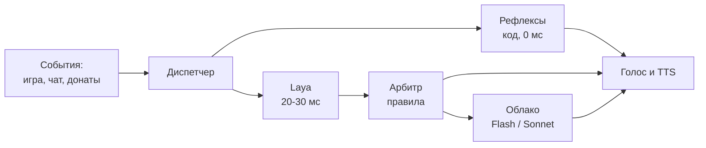
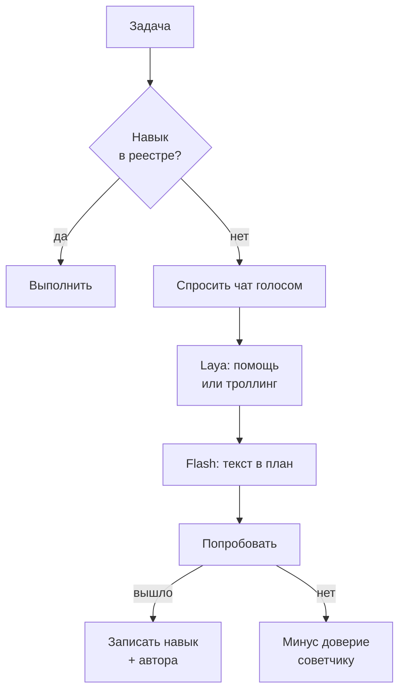

# ТЗ: стримовый ИИ-бот для Minecraft (Laya + облачные модели)

2026-09-21

## 1. Назначение

Автономный ИИ-бот, который играет в Minecraft в прямом эфире и разговаривает со зрителями голосом. Ключевая особенность — бот стартует нулём: он не умеет ничего, спрашивает чат, как выжить, и учится по ходу стримов. Навыки, страхи и привычки копятся между эфирами.

Система живёт внутри двух ограничений: домашнее железо (Mac mini M4, 16 ГБ) и бюджет $5–10 в час, в который расчёт укладывается с запасом в несколько раз.

Документ написан для себя как инженерный план: контракты данных, бюджеты задержек, порядок работ. Это не продуктовое ТЗ для заказчика.

Что **не** является целью: сильный игровой ИИ. Бот должен быть живым и интересным, а не эффективным. Медленное обучение и ошибки — замысел, а не дефект.

## 2. Целевой сценарий

Ценность бота — в дуге роста, которую зрители наблюдают и в которой участвуют. Поэтому сценарий описан как эволюция по стримам, и именно он задаёт требования к памяти и реестру навыков.

| Стрим | Что умеет бот | Что делает чат |
| --- | --- | --- |
| 1 | Ходит, боится всего, умирает от криперов | Объясняет базу: дерево, верстак, ночь |
| 2–3 | Собирает ресурсы, знает 10–15 навыков, узнаёт ники | Учит крафту, троллит, проверяет границы |
| 4–5 | Строит, ставит цели, помнит обиды и мемы | Спорит с ботом, зовёт его по имени |

Типичная минута эфира: бот копает, комментирует вслух, замечает в чате вопрос, бросает фразу-заполнитель с ником спрашивающего, отвечает по существу, возвращается к делу. При донате прерывает себя на полуслове.

Ключевая сцена, ради которой строится обучение: бот упирается в незнакомую задачу, честно говорит «я не знаю, как это», и просит чат объяснить. Получив совет, пробует и запоминает, кто научил.

## 3. Архитектура

Три слоя, разделённые по времени реакции, а не по функциям. Слой выбирается тем, сколько миллисекунд есть на решение.

**Слой 1 — рефлексы кодом.** Реакция на урон, падение, донат, смерть. Ноль задержки, никаких моделей. Даёт основную долю ощущения живости.

**Слой 2 — Laya локально.** Оценивает: отвечать ли на сообщение, насколько это срочно, какое игровое действие взять, можно ли произносить реплику. Выдаёт числа, не текст.

**Слой 3 — облачные модели.** Речь, стратегия, разбор провалов, запись памяти. Задержка секунды, поэтому вызывается редко и всегда под прикрытием заполнителя.

Решения Laya **комбинирует код**, а не модель. Арбитр с явными весами воспроизводим и чинится точечно; модель-арбитр отняла бы и то и другое.

## 4. Штат агентов

Агенты различаются ритмом, а не умом — поэтому почти не пересекаются по времени и не ждут друг друга.

| Агент | Ритм | Исполнитель | Задача |
| --- | --- | --- | --- |
| Диспетчер | 20 мс | Laya + код | Оценки и арбитраж |
| Рефлексы | 0 мс | код | Урон, донат, смерть |
| Голос | владеет микрофоном | одна модель | Все реплики в эфир |
| Наблюдатель | 30 с | Flash | Сводка происходящего |
| Социолог | по новому нику | Flash | Контекст зрителя |
| Архивариус | 30 с пачкой | Flash | Запись в память |
| Стратег | 60 с | Sonnet | Цели, разбор провалов |
| Цензор | перед эфиром | Laya | Гейт на произносимое |
| Казначей | постоянно | код | Учёт расходов, лимит |

Три правила, без которых штат разваливается:

1. **Один микрофон.** Говорит только Голос. Остальные производят кандидатов с приоритетом и дедлайном, но не речь.
2. **Один писатель на таблицу.** В память пишет только Архивариус, иначе гонки данных и противоречивые факты.
3. **Доска, а не переписка.** Общий стейт в памяти процесса, все читают, решает диспетчер. Обмен репликами между агентами запрещён — каждый стоит round-trip.

Критерий добавления нового агента: если его вывод не меняет ни одного решения бота, он добавляет только задержку и точку отказа.

## 5. Железо и размещение

Две машины: Minecraft-сервер на ноутбуке, всё остальное на Mac mini M4 (16 ГБ). Разнос убирает конкуренцию за память — Java-серверу нужно 6–8 ГБ, и рядом с моделями на одной машине он душит всё.

| Машина | Что крутится | Память |
| --- | --- | --- |
| Ноутбук | Minecraft-сервер, `-Xmx6G` жёстко | по машине |
| Mac mini M4 | Бот, Laya-MLX, TTS, SQLite, оркестратор | ~4–5 ГБ из 16 |

Бот живёт на mini, а не на ноутбуке: к Laya он должен ходить через localhost, а к серверу подключается обычным протоколом — в локалке это 1–2 мс.

Требования к настройке:

- Запретить сон на обеих машинах, автозапуск после сбоя питания на mini
- Статический IP или резервация по MAC для ноутбука
- Laya и TTS — резидентные процессы с прогретыми весами, не CLI-вызовы
- Целевая загрузка mini — 60–70%; при упоре в 16 ГБ macOS свопит молча, и это выглядит как проблема сети
- Логировать tick time сервера с первого дня, чтобы отличать троттлинг ноутбука от тупящего бота

Локальной большой модели места нет и не планируется: пропускная способность памяти базового M4 около 120 ГБ/с, а облачный слой стоит центы. Потребление mini — единицы ватт в простое, порядка €2–6 в месяц при круглосуточной работе.

## 6. Модели и стоимость

Бюджет $5–10 в час перекрыт в разы, поэтому деньги тратятся на ум верхнего слоя, а не на количество дешёвых моделей.

| Модель | Роль | Ставка за 1M (вход/выход) | ~Стоимость часа эфира |
| --- | --- | --- | --- |
| Laya (локально) | Диспетчер, цензор | — | €0 |
| DeepSeek V4.1 Flash | Рутина, черновики, память | $0.15 / $0.60 off-peak | ~$0.10 |
| Claude Sonnet 5 | Речь в эфир, стратегия | $2 / $10 | ~$1.25 |
| Claude Opus 5 | Не используется в v1 | $5 / $25 | ~$3 |

Пик DeepSeek — 01:00–04:00 и 06:00–10:00 UTC по будням, всё остальное вдвое дешевле. Вечерние стримы по голландскому времени всегда попадают в off-peak. Кэш-хит на префиксе стоит $0.003/M, поэтому карточка личности и описания инструментов должны быть неизменной головой промпта. Источники: [DeepSeek](https://deepseek.ai/pricing), [Claude](https://platform.claude.com/docs/en/about-claude/pricing).

**Гонка по дедлайну.** На важном вопросе Flash и Sonnet запускаются одновременно. Дедлайн — конец заполнителя (~1.5 с). Успел Sonnet — в эфир идёт он, нет — Flash. Опоздавший ответ выбрасывается, а не встраивается задним числом. Режет хвост p99, стоит двойных токенов, то есть по-прежнему центы.

**Единый голос.** Речь всегда пишет одна и та же модель. Sonnet при тирринге отдаёт тезис, а формулирует Голос — иначе зрители услышат, что в важные моменты у бота меняется манера.

**Казначей.** Стоимость каждого вызова пишется в SQLite, считается расход за сессию. Мягкий лимит на час: при превышении верхний слой падает на Flash и шлёт уведомление. Цель не экономия, а поимка петли — когда бот отвечает сам себе или ретраит в цикле, счёт растёт тихо. Лимит покрывает и межстримовых агентов раздела 14: их расход пишется в ту же таблицу `costs` с пометкой сессии.

### Проверка расчёта

База для оценок: ~90 вызовов верхнего слоя за 30 минут (60 плановых раз в 30 с плюс ~30 эскалаций), по 2000 входных и 300 выходных токенов на вызов — итого 180k / 27k.

| Модель | За 30 мин | С кэшем префикса |
| --- | --- | --- |
| DeepSeek Flash (off-peak) | ~$0.04 | центы |
| Haiku 4.5 | ~$0.31 | ~$0.23 |
| Sonnet 5 | ~$0.63 | ~$0.47 |
| Opus 5 | ~$1.58 | ~$1.15 |

База для сравнения: без среднего слоя, вызывая LLM каждые 0.5 с, получаем 3600 вызовов и ~7.2M входных токенов — около $20 за те же полчаса на Sonnet, и это ещё не считая того, что по задержке такая схема нерабочая. Отсюда и разделение на слои: Laya снимает 95% тиков за 30 мс и ноль денег.

Разовые расходы вне эфира: сбор датасета для файнтюна гнать на Flash и в фоне, не в реальном времени.

## 7. Бюджет латентности

Главная метрика — время до первого звука, а не до полного ответа. Полное время оптимизациями почти не меняется; меняется тишина, и именно её воспринимают как скорость.

| Этап | Цель p50 | Потолок p99 |
| --- | --- | --- |
| Сбор состояния в строку | 5 мс | 15 мс |
| Laya, батч до 32 | 25 мс | 40 мс |
| Арбитр | 1 мс | 5 мс |
| Рефлекс исполнен | 50 мс | 100 мс |
| Заполнитель из кэша WAV | 30 мс | 80 мс |
| **Первый звук** | **60 мс** | **150 мс** |
| Flash до первого предложения | 600 мс | 1200 мс |
| TTS первого предложения | 250 мс | 500 мс |
| **Осмысленная реплика** | **1.5 с** | **2.5 с** |

Приёмы, которыми эти числа достигаются, по убыванию эффекта: кэш WAV-заполнителей (−1.85 с до звука), стриминг TTS по предложениям (−0.9 с до смысла), параллельный сбор контекста через `Promise.all` (−0.25 с), кэш префикса промпта (−0.15 с), спекулятивный старт при высокой уверенности Laya (−0.3 с).

Честного ускорения смысловой части — около 25%. Остальное маскировка, и она решает.

Все числа выше — оценки, подлежащие замеру на первом же спайке. Логировать в SQLite время от прихода события до первого сэмпла звука; разброс на реальной сети может быть в полтора раза.

### Оптимизации второй очереди

Делаются после того, как основная схема работает и видно, где она упирается. Ни одна из них не меняет воспринимаемую скорость — они снижают нагрузку и хвост:

- **Кэш решений Laya по хешу сообщения.** «Привет» в чате пишут сто раз за стрим, считать его заново незачем
- **Дедупликация чата.** Laya кластеризует похожие сообщения, бот отвечает один раз на группу, а не пять раз подряд — это и дешевле, и звучит лучше
- **Гонка через двух провайдеров.** Один и тот же Flash напрямую и через посредника, побеждает первый ответивший; лечит разовые сетевые провалы
- **Прогрев кэша префикса в простое.** Пока бот молчит, дёшево обновить кэш, чтобы следующий реальный вызов пошёл по cache-hit

Общее правило: пока нет замеров с живого эфира, ни одна из этих оптимизаций не окупает усложнения.

## 8. Контракты данных

Модели взаимозаменяемы, схемы — нет. Контракты фиксируются до архитектуры; дальше любой модуль переписывается, не трогая остальные.

**Строка состояния игры** — короткий текст, не JSON, укладывается в 200 токенов: здоровье, время суток, биом, угрозы в радиусе 10 блоков, ключевой инвентарь, текущая цель.

**Решение Laya** — `{head, primitive, value, confidence, latency_ms}`, где primitive одно из `choice | score | noul`. Возвращается пачкой на весь батч.

**Событие на доске** — `{ts, source, type, actor, payload, priority, deadline}`. Source: `game | chat | donation | self`. Собственные реплики бота помечаются `self` и исключаются из входа диспетчера.

Таблицы SQLite:

| Таблица | Ключ | Поля |
| --- | --- | --- |
| `skills` | навык | статус, кто научил, дата, число успехов/провалов |
| `triggers` | сущность | эмоция, вес, число событий, дата последнего |
| `memes` | фраза | счётчик, дата последнего, автор |
| `viewers` | ник | доверие, факты, дата последнего визита |
| `costs` | id вызова | модель, токены, стоимость, латентность, сессия |
| `effects` | тип | значение, TTL, кто включил |
| `theories` | id | текст, статус, источники, дата |

Единственный писатель в `skills`, `triggers`, `memes`, `viewers` — Архивариус. `costs` пишет Казначей, `effects` — обработчик донатов и рулетки, `theories` заводит Наблюдатель, а статус им меняет Архивариус.

Веса эмоций и доверия **затухают со временем**: без распада через месяц бота пугает всё подряд, а доверие превращается в вечный кредит.

## 9. Характер и память

Характер — данные, а не промпт. Если держать его в тексте системного сообщения, он не эволюционирует; если в таблицах — растёт сам по ходу стримов.

**Карточка личности** (~300 токенов, всегда в кэшируемом префиксе): манера речи, слова-паразиты, базовые страхи. Постоянна, меняется только вручную.

**Таблица триггеров** — где живут «зелёные штуки бесят». Крипер убил → вес страха +1. После трёх смертей в промпт подмешивается строка вида «криперов ты ненавидишь, умирал от них 3 раза». Модель ничего не запоминает — запоминает база, и через неделю у бота настоящая история отношений с зелёным.

**Мемы** — фразы из чата со счётчиком и датой. Старые тухнут по времени, новые подхватываются. Раз в стрим Flash фоном просматривает лог и предлагает кандидатов на ручной аппрув.

**Отбор контекста важнее объёма.** В промпт идут 5–7 релевантных фактов, не тридцать. Отбор обычным SQL по свежести, весу эмоции и совпадению сущностей. Плюс короткий буфер последних 60 секунд игры и чата — свежее всегда ценнее длинного.

**Сжатие фоном.** Раз в минуту Наблюдатель сворачивает происходящее в пару строк. К важному моменту у верхней модели готова выжимка, а не сырой лог: и быстрее, и точнее.

## 10. Обучение с нуля

Самая ценная механика — и та, где схема ломается, если сделать её промптом. Flash и Sonnet знают Minecraft идеально, и просьба «не знай, что такое печка» протечёт при первом сложном вопросе.

**Решение структурное:** модель не выбирает игровые действия свободно. Она выбирает из реестра навыков, где открыто ровно то, что бот уже выучил. Незнание — ограничение API, а не просьба в промпте.

Проверка «знаю ли я это» — **лукап в таблице, не голова Laya**. Модель дала бы вероятность там, где есть точный ответ, и расходилась бы с реестром.

**Защита от троллинга.** Чат будет врать намеренно. Правила:

- Команда выполняется при подтверждении от двух зрителей либо от одного с доказанным доверием
- Жёсткий чёрный список необратимого: лава, прыжки с высоты, удаление мира — никогда, независимо от доверия
- Доверие затухает со временем, чтобы старые заслуги не давали вечный кредит

Открытый вопрос: пороги доверия уязвимы с двух сторон — тролли координируются на «двух подтверждениях», а новичок с хорошим советом не проходит. Настраивать на логах реального чата, не умозрительно.

## 11. Эфир: чат, озвучка, прерывания

**TTS.** Silero или Piper локально на mini, русские голоса, резидентный процесс. Синтез идёт по предложениям: режем поток модели по `.!?`, первое предложение уходит в звук, пока модель дописывает остальное. Конвейер держит очередь впереди воспроизведения.

**Звук в OBS** через BlackHole — виртуальное устройство. Голос отдельной дорожкой от звука игры, чтобы рулить громкостью независимо.

**Оверлеи.** Локальный HTTP-сервер на mini отдаёт страницы, OBS подключает их как browser source, обновления идут по WebSocket. Три независимых оверлея: наставники (раздел 15), прогресс-бар голосования и тайные мысли (раздел 16). Компонент общий, страницы разные — так любой оверлей включается и выключается отдельно.

**Заполнители.** Не пустышки вроде «интересный вопрос», а реакции с информацией, которой у обычного бота нет: ник и категория уже известны от Laya через 20 мс. Шаблоны по категориям: вопрос → «ага, вопрос от {ник}, щас»; бред → «так, анализирую, что за бред пишет {ник}»; совет → «{ник} что-то советует, слушаю». Статическая часть и ники постоянных зрителей — заранее синтезированные WAV, склейка по паузе.

Три правила заполнителей:

- Запускать только если ожидание больше ~600 мс, по последним замерам, не по среднему за всё время
- Не обещать результат («сейчас расскажу» — плохо, если ответ окажется односложным), описывать процесс
- Ротация с памятью на 5 минут, 10 вариантов на категорию; доля заполнителей в звучании не больше 30%

**Прерывания.** Решает не важность события само по себе, а разрыв с текущей репликой. Прерываем при превышении на 3 пункта приоритета. Донаты — хардкодом: мелкий дописывается в очередь, крупный рвёт. Обрыв = «не играй следующий кусок» плюс фейд 150–200 мс, никогда не посреди слова. В следующий промпт передаётся, на чём оборвались, чтобы модель написала переход.

Антидребезг: не чаще одного прерывания в 10–15 секунд, глубина вложенности — единица. Иначе бот не договорит ни одной мысли.

**Приоритеты нормализуются.** Score игровой головы и чатовой калиброваны по-разному — сравнивать сырые числа нельзя. Арбитр приводит их к общей шкале явными весами по доменам.

## 12. Риски и деградация

Известные дыры, каждая с решением в тексте выше:

| Риск | Решение |
| --- | --- |
| Модель протечёт знаниями игры | Реестр навыков как ограничение API |
| Два голоса — два характера | Речь всегда одной моделью |
| Несопоставимые приоритеты | Нормализация в арбитре |
| Петля: бот сказал → чат ожил → бот сказал | Пометка `self`, cooldown после реплики |
| Веса эмоций только растут | Распад со временем |
| Файнтюн Laya устаревает быстрее обучения | В Laya только неэволюционирующее: токсичность, язык, тип сообщения |
| Спекулятивные вызовы копят мусор | Считать долю выброшенных, порог по уверенности |

Режимы деградации — отдельное требование, а не аварийное поведение:

- **Нет интернета** → только рефлексы и навыки из реестра, заполнители из кэша, бот честно говорит, что связь пропала
- **Кончился бюджет часа** → верхний слой падает на Flash, уведомление автору
- **Laya не отвечает** → fallback на правила (ключевые слова, длина сообщения), не остановка бота
- **Отвалился сервер** → бот уходит в чат-режим, продолжает общаться без игры

Laya остаётся единой точкой отказа для триажа, поэтому правило-fallback обязателен в v1, а не потом.

## 13. Границы v1 и план работ

**В v1 входит:** Mineflayer, реестр навыков, DeepSeek Flash, TTS со стримингом, заполнители, базовый триаж чата, таблицы памяти, казначей.

**Out of scope для v1:** файнтюн Laya, мемы, система доверия зрителей, Sonnet на стратегии, гонка моделей, спекулятивные вызовы. Всё это встаёт поверх готовой основы.

Порядок работ:

- [ ] Спайк на замеры: Laya на mini, один вызов Flash, один синтез Silero, лог в SQLite → реальные p50/p99
- [ ] Зафиксировать контракты данных из раздела 8 до написания логики
- [ ] Собрать лог реального чата со своего стрима — на нём потом проверяются триаж и пороги
- [ ] Mineflayer + реестр навыков + Flash раз в 2 с + десяток хардкодных рефлексов
- [ ] TTS со стримингом по предложениям и кэш WAV-заготовок
- [ ] Заполнители по категориям от Laya
- [ ] Память: триггеры, навыки, зрители; Архивариус пачкой
- [ ] Жизненный цикл: старт, смерть, завершение стрима (раздел 17)
- [ ] Оверлей-компонент: HTTP + WebSocket, browser source в OBS
- [ ] Laya как диспетчер с батчингом, одна голова на триаж чата
- [ ] Голосования и эффекты с TTL (раздел 16)
- [ ] STT (Whisper на mini) → навязчивая идея с переубеждением
- [ ] Гонка Flash/Sonnet по дедлайну
- [ ] Инициатор, Режиссёр, Сторож (раздел 14)
- [ ] Летописец и Критик между стримами, recap в начале эфира
- [ ] Теории и тайные мысли
- [ ] Остальные головы Laya — по мере того, как видно, где она ошибается

Принцип очерёдности: сначала то, что даёт слышимый эффект (стриминг TTS и заполнители — половина воспринимаемой скорости за вечер работы), потом то, что снижает нагрузку. Роить имеет смысл то, что уже работает поодиночке.

## 14. Расширение штата

На критическом пути свободных мест нет — там каждый новый агент добавляет задержку. Расширение идёт в два времени, которые в разделах 4–7 не используются вовсе: простой во время эфира и промежуток между стримами.

### Во время эфира

| Агент | Ритм | Модель | Задача |
| --- | --- | --- | --- |
| Инициатор | 30 с тишины | Flash | Предлагает тему: вспомнить обиду, спросить чат, прокомментировать постройку |
| Режиссёр | постоянно | Laya | Метит моменты для клипов, пишет таймкоды в SQLite |
| Сторож | 5 с | код | Следит за p99, свопом, tick time; переключает режимы деградации |

Инициатор закрывает главную дыру текущей схемы: бот чисто реактивный, говорит только когда его дёрнули. Сторож исправляет баг документа — режимы деградации из раздела 12 описаны, но их никто не исполняет.

### Между стримами

Здесь работа идёт по логу эфира раз в неделю, поэтому можно ставить **Opus**: проход по трёхчасовому логу стоит меньше доллара.

| Агент | Ритм | Модель | Задача |
| --- | --- | --- | --- |
| Критик | после стрима | Opus | Находит, где бот был скучен и где повторялся; правит карточку личности и заполнители |
| Куратор навыков | раз в неделю | Opus | Чистит реестр, объединяет дубли, поднимает абстракцию |
| Летописец | после стрима | Opus | Сворачивает эфир в эпизод: «серия 4 — построил дом, поссорился с Адамом» |

### Где предел

После примерно двенадцати агентов каждый следующий скорее вредит. Ум бота упирается не в их количество, а в качество отбора контекста и силу верхней модели: рой делает бота **осведомлённее**, а не умнее.

Критерий для любого кандидата прежний — если его вывод не меняет ни одного решения бота, он добавляет только задержку и точку отказа. Отдельный комментатор, модератор и арбитр-модель этот тест не прошли: первые два дублируют Голос и Цензор, третий ломает воспроизводимость арбитража.

## 15. Развитие контента

Технически бот уже интересен; аудиторию растят три двигателя, и каждый опирается на агентов из раздела 14.

**Сюжет.** Летописец сворачивает эфир в эпизод, и в начале следующего бот голосом даёт recap: что было в прошлой серии. Это ритуал возвращения — зритель получает причину прийти снова, а не просто попасть на случайный стрим. Через месяц у бота набирается сезон с арками: «учился выживать», «строил дом», «война с криперами».

**Соучастие.** Зрители — не аудитория, а персонажи. Таблица `viewers` уже хранит, кто чему научил бота, поэтому на экран выводится оверлей: наставники с числом принятых советов, кому бот не доверяет, кто ввёл живущий мем. Вклад становится видимым, и за место в этой таблице начинают соревноваться.

**Клипы.** Режиссёр пишет таймкоды, отдельный скрипт режет записи и выкладывает шортсы. Это единственный канал открытия новой аудитории в схеме: стрим смотрят те, кто уже пришёл, шортсы приводят тех, кто не знал.

### Метрики эфира

Технические SLA раздела 7 ничего не говорят о том, интересно ли смотреть. Отдельный набор, который считает Критик по логу. Голос при этом обязан логировать длительность каждого произнесённого фрагмента — без этого доля эфира с голосом не вычисляется:

| Метрика | Ориентир |
| --- | --- |
| Доля эфира с голосом бота | 30–50% |
| Доля заполнителей в звучании | < 30% |
| Уникальных ников названо за час | > 15 |
| Инициатив бота (не ответов) | > 20 за час |
| Повторы фраз за стрим | < 5% реплик |

### Риск, который стоит держать в виду

Конфликт — сильный двигатель: бот с мнениями и обидами интереснее нейтрального. Но обида, привязанная к конкретному нику и растущая без распада, за несколько стримов превращается в травлю зрителя. Распад весов из раздела 8 и Цензор перед эфиром здесь не формальность, а то, что отделяет характер от токсичности.

## 16. Интерактив

Единый принцип: интерактив живёт в **слое эффектов с TTL**, а не в памяти. Таблица `effects` — `{тип, значение, до какой секунды, кто включил}`. Сборщик промпта читает её и подмешивает в карточку личности. Таблицы `triggers`, `skills`, `viewers` не трогаются никогда: донат покупает состояние, а не переписывает историю.

### Эффекты

| Тип | Примеры | Длительность |
| --- | --- | --- |
| Фобия | боится зелёного, воды, высоты | 5–10 мин |
| Диета | только овощи, только сырое | 10 мин |
| Речевой фильтр | древний человек, поэт, только вопросами, шёпот | 5–15 мин |
| Тик | называет всех «уважаемый», считает вслух | 10 мин |

Правило отбора: эффект меняет **предпочтения и манеру** — куда бот идёт, что ест, как говорит, — но не открывает и не закрывает навыки. Формулировка «не влияет на игру» неточна: фобия зелёного меняет маршруты, а диета меняет еду. Неприкосновенен именно реестр из раздела 10, поэтому прогресс эффектами не теряется и не приобретается.

Источника два — донат и бесплатная рулетка раз в 20–30 минут. Бесплатная обязательна: иначе на пустом чате механика мертва.

### Навязчивая идея

Единственное, что влияет на игру — и потому обратимое по замыслу. Запись: `{цель, стойкость 0–100, TTL}`. Бот искренне верит, что нужно добыть 66 земли, вслух обосновывает и строит под это планы.

Автор спорит голосом — для этого нужен STT (Whisper на mini), без него переубеждение идёт текстом из чата. Laya оценивает убедительность каждого аргумента и снимает стойкость. На нуле бот вслух отказывается от идеи и объясняет почему.

Оценка убедительности — единственная голова Laya, которой действительно нужен файнтюн: zero-shot она даст случайные числа. До файнтюна работает грубое правило (длина реплики, ключевые слова, явное «нет»), чего для v1 достаточно.

Ограничения: TTL не больше 15 минут; цель не может требовать необратимого (раздать вещи, прыгнуть в лаву); снимается сама, если переубеждения не было и время вышло. Под навязчивой идеей **обучение отключено** — бот может спрашивать чат, но новые навыки в реестр не пишутся, иначе туда попадёт мусор ради цели, которой через 15 минут не будет.

### Теории

Наблюдатель в простое берёт две-три записи из `skills` и `triggers` и склеивает вывод: «криперы зелёные, листья зелёные — значит листья тоже взрываются?» Часть теорий верные, часть абсурдные; фильтровать не надо, именно смесь читается как мышление.

Хранятся в `theories` со статусом. Зрители подтверждают или опровергают: подтверждённая становится навыком, опровергнутая остаётся байкой, которую бот иногда вспоминает.

### Голосования

Без LLM целиком. Laya раскладывает сообщения по корзинам, код считает, на экране прогресс-бар, окно 20–30 секунд, результат объявляется голосом. Стоимость нулевая, задержка в пределах SLA диспетчера.

### Тайные мысли

Отдельная ветка генерации в отдельный оверлей, в TTS не идёт. Голос **не должен видеть их в своём контексте** — иначе проговорится вслух. По той же причине тайные мысли **не пишутся в память ни в каком виде**: Архивариус их не получает, иначе завтра Голос прочитает их как обычный факт. Цензор проходит по ним всё равно: на экране в эфире их видят все.

Асимметрия в том, что зрители знают то, чего не знает автор, и начинают намекать в чате. Две оговорки: на записи автор их потом увидит, и зрители будут спойлерить нарочно — это часть механики, а не дефект.

## 17. Жизненный цикл эфира

Раздел закрывает состояния, которые в разделах 1–16 не описаны, хотя случаются каждый стрим.

### Старт

Порядок жёсткий: поднять Laya и TTS → проверить, что оба отвечают → подключиться к серверу → загрузить память → recap → игра.

Если Laya или TTS не поднялись, эфир **не начинается** — молчаливая деградация на старте хуже, чем задержка на минуту. Recap даёт Летописец по эпизоду прошлого стрима; если эпизода нет (первый эфир), бот коротко представляется и объясняет, что ничего не умеет.

### Смерть бота

Частейшее событие, поэтому поведение фиксируется явно:

- Рефлекс: крик из кэша WAV, 0 мс
- `triggers`: +1 к весу эмоции на убийцу
- `skills`: **не трогается** — навыки не теряются (исключение только в режиме хардкор-челленджа)
- Текущая цель сбрасывается, навязчивая идея снимается, эффекты остаются
- Голос комментирует смерть вне очереди
- Координаты смерти пишутся как факт; поход за вещами — отдельный навык в реестре

### Голосование и эфир

На время окна голосования прерывания заблокированы: само голосование имеет высокий приоритет и рваться не должно. Бот продолжает говорить, но новые кандидаты копятся в очереди. Результат объявляется вне очереди сразу после закрытия окна.

### Завершение

Стоп-команда → финальный флаш Архивариуса → Летописец пишет эпизод → Критик проходит по логу → Казначей выдаёт счёт за эфир. Только после этого процессы гасятся: эпизод нужен для recap следующего стрима, и потерять его на выходе значит порвать сюжетную цепочку.

## 18. Файнтюн Laya

Вне v1, но метод фиксируется здесь, потому что от него зависит, как собирать логи с самого начала.

**Зачем.** Zero-shot точность Laya на типизированных решениях — 0.362, то есть почти случайные числа. Это быстрая база под дообучение, а не готовый движок решений. Без файнтюна Laya годится только на грубые задачи: язык, токсичность, тип сообщения.

**Метод — дистилляция.** Первую неделю бот работает на одном облачном слое, а каждая пара «состояние → решение» пишется в лог. Дальше эти логи становятся обучающей выборкой: большая модель выступает учителем, Laya повторяет её решения за копейки. Поэтому формат строки состояния из раздела 8 должен быть зафиксирован до первого эфира — переучивать на разнородных логах дороже, чем собрать их правильно.

**Где обучать.** Локально на mini через MLX: 421M-энкодер дообучается за ночь, аренда GPU не нужна. Цикл «собрал логи → дообучил → проверил» стоит только электричества, и это главный аргумент за Laya в домашней схеме.

**Что дообучать в первую очередь:**

1. Триаж чата — отвечать / игнор / троллинг
2. Приоритет и прерывания
3. Оценка убедительности для навязчивой идеи (раздел 16)

**Чего не дообучать.** Всё, что эволюционирует вместе с ботом. Головы, обученные на логах первой недели, кодируют бота-новичка, а к пятой неделе он другой — переобучать придётся по расписанию. Поэтому в Laya остаётся неэволюционирующее, а меняющееся живёт в таблицах и промпте.
