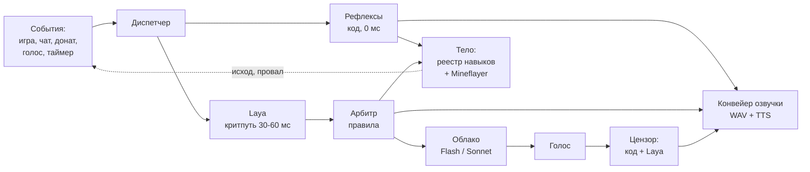
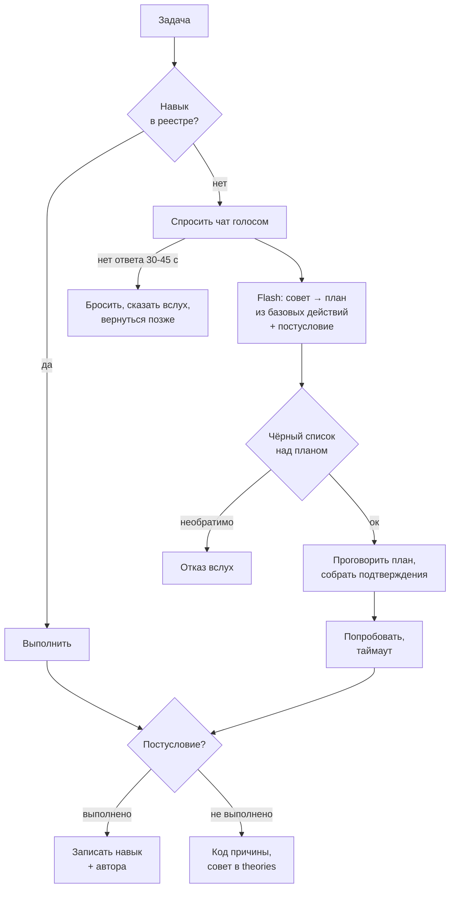

# ТЗ: стримовый ИИ-бот для Minecraft (Laya + облачные модели)

Редакция 2 — 2026-09-21. Правки по разбору роем (`tz-review/`). Список изменений против первой редакции — в конце документа.

## 1. Назначение

Автономный ИИ-бот, который играет в Minecraft в прямом эфире и разговаривает со зрителями голосом. Ключевая особенность — бот стартует нулём: он не умеет ничего, спрашивает чат, как выжить, и учится по ходу стримов. Навыки, страхи и привычки копятся между эфирами.

Система живёт внутри двух ограничений: домашнее железо (Mac mini M4, 16 ГБ) и бюджет $5–10 в час, в который расчёт укладывается с запасом в несколько раз.

Документ написан для себя как инженерный план: контракты данных, бюджеты задержек, порядок работ. Это не продуктовое ТЗ для заказчика.

Что **не** является целью: сильный игровой ИИ. Бот должен быть живым и интересным, а не эффективным. Медленное обучение и ошибки — замысел, а не дефект.

В описании канала и в оверлее постоянно висит строка о том, что персонаж — программа. Это не юридическая формальность: половина драматургии держится на том, что зрители знают, кого учат.

## 2. Целевой сценарий

Ценность бота — в дуге роста, которую зрители наблюдают и в которой участвуют. Поэтому сценарий описан как эволюция по стримам, и именно он задаёт требования к памяти и реестру навыков.

| Стрим | Что умеет бот | Что делает чат |
| --- | --- | --- |
| 1 | Ходит, боится всего, умирает от криперов | Объясняет базу: дерево, верстак, ночь |
| 2–3 | Собирает ресурсы, знает 10–15 навыков, узнаёт ники | Учит крафту, троллит, проверяет границы |
| 4–5 | Строит, ставит цели, помнит обиды и мемы | Спорит с ботом, зовёт его по имени |
| 6+ | Сезон закрывается эпизодом-итогом, следующий начинается с новой арки | Голосует за арку следующего сезона |

Типичная минута эфира: бот копает, комментирует вслух, замечает в чате вопрос, бросает фразу-заполнитель с ником спрашивающего, отвечает по существу, возвращается к делу. При донате прерывает себя на полуслове.

Ключевая сцена, ради которой строится обучение: бот упирается в незнакомую задачу, честно говорит «я не знаю, как это», и просит чат объяснить. Получив совет, пробует и запоминает, кто научил.

**Чтобы эта сцена была честной, нужны две вещи, которых в первой редакции не было.** Первое — бот с нуля умеет двигаться и махать рукой, иначе пробовать совет нечем (§10, базовые действия). Второе — план по совету собирает модель, которой запрещено дополнять недостающее: иначе успех попытки определяют знания Flash, а не качество совета, и наставником записывается случайный человек.

## 3. Архитектура

Три слоя, разделённые по времени реакции, а не по функциям. Слой выбирается тем, сколько миллисекунд есть на решение.

**Слой 1 — рефлексы кодом.** Реакция на урон, падение, донат, смерть. Ноль задержки, никаких моделей. Даёт основную долю ощущения живости.

**Слой 2 — Laya локально.** Оценивает: отвечать ли на сообщение, насколько это срочно, какого типа реплика, можно ли произносить. Выдаёт числа, не текст. Игровое действие Laya **не выбирает** — она даёт класс намерения из фиксированного набора, а конкретный навык подбирает код лукапом по реестру. Причина та же, по которой §10 не отдаёт модели проверку «знаю ли я это»: множество навыков растёт, а классификатор-энкодер обучается на закрытом наборе классов.

**Слой 3 — облачные модели.** Речь, стратегия, разбор провалов, запись памяти. Задержка секунды, поэтому вызывается редко и всегда под прикрытием заполнителя.

Решения Laya **комбинирует код**, а не модель. Арбитр с явными весами воспроизводим и чинится точечно; модель-арбитр отняла бы и то и другое. Веса живут константой в коде рядом с `WEIGHTS_VERSION`, номер версии пишется в `arbiter_log` вместе с сырыми скорами — иначе разбор «почему он меня перебил» упирается в то, что решение невоспроизводимо.

**Событие в полёте.** Пока по событию идёт облачный вызов, повторная эскалация по нему не создаётся: у события есть `state: idle | in_flight | done | stale` и `call_id`. Новые сообщения по той же теме дописываются в payload будущего промпта, а не порождают второй вызов. Без этого правила наплыв в чате превращается в веер параллельных вызовов, каждый из которых оплачен.

## 4. Штат агентов

Агенты различаются ритмом, а не умом — поэтому почти не пересекаются по времени и не ждут друг друга.

| Агент | Ритм | Исполнитель | Задача |
| --- | --- | --- | --- |
| Диспетчер | 20 мс | Laya + код | Оценки и арбитраж |
| Рефлексы | 0 мс | код | Урон, донат, смерть |
| Голос | владеет текстом в эфир | одна модель (см. §6) | Все реплики в эфир |
| Конвейер озвучки | владеет звуковым устройством | код | Единственный, кто пишет в BlackHole |
| Цензор | на каждой реплике и на каждом оверлее | код + Laya | Гейт на всё исходящее в эфир |
| Наблюдатель | 30 с | Flash | Сводка происходящего, теории |
| Социолог | по новому нику | Flash | Контекст зрителя |
| Архивариус | синхронно на событиях обучения, пачкой 30 с на остальном | Flash | Запись в память |
| Стратег | 60 с | Sonnet | Цели, разбор провалов, тезисы на доску |
| Сторож | 5 с, решение по окну 60 с | код | p95 латентности, своп, tick time, диск; переключает режимы §12 |
| Казначей | постоянно | код | Учёт расходов, скользящее окно 15 мин |

Три правила, без которых штат разваливается:

1. **Один автор речи и один владелец звука.** Текст в эфир пишет только Голос. Звуковое устройство держит Конвейер озвучки — он же играет WAV-заготовки рефлексов и заполнители, у которых автора-модели нет вовсе. Это разные роли: рефлекс не проходит через Голос, но и не пишет в BlackHole сам.
2. **Один писатель на таблицу в каждом режиме.** В эфире в `skills`, `triggers`, `memes`, `viewers`, `facts`, `deaths` пишет только Архивариус; `costs` — Казначей; `effects` — обработчик донатов и рулетки; `utterances` — Голос; `decisions` — диспетчер; `sessions` — код жизненного цикла. Между стримами в `episodes` пишет Летописец, в `theories` статус меняет Архивариус. Межстримовые агенты (§14) карточку личности и реестр не правят — они готовят патч, применяет его человек или Архивариус.
3. **Доска, а не переписка.** Общий стейт в памяти процесса плюс журнал событий с курсором для агентов с редким ритмом: агенту, который просыпается раз в 30 секунд, нужен не снимок, а то, что случилось за эти 30 секунд. Обмен репликами между агентами запрещён — каждый стоит round-trip.

Единственная синхронная связка в системе — речевой путь событие → Голос → Цензор → TTS. Наблюдатель, Социолог, Архивариус, Режиссёр, Сторож асинхронны и никого не ждут. Тезисы Стратега лежат на доске и читаются локально: последовательной цепочки из двух облачных вызовов на критическом пути нет нигде (см. §7).

Критерий добавления нового агента: если его вывод не меняет ни одного решения бота, он добавляет только задержку и точку отказа.

## 5. Железо и размещение

Две машины: Minecraft-сервер и зрительский клиент на ноутбуке, всё остальное на Mac mini M4 (16 ГБ). Разнос убирает конкуренцию за память и за GPU — Java-серверу нужно несколько гигабайт, а рендер картинки рядом с MLX душит Laya не по памяти, а по пропускной способности.

| Машина | Что крутится | Ресурс |
| --- | --- | --- |
| Ноутбук | Minecraft-сервер; **зрительский клиент** (второй аккаунт, spectator, привязан к боту) → NDI в OBS | Xmx по правилу ниже + GPU на рендер |
| Mac mini M4 | Бот, Laya-MLX, TTS, Whisper, SQLite, оркестратор, **OBS** | см. пофамильный бюджет |

**Источник картинки — полноправный компонент, а не настройка OBS.** Mineflayer безголовый: он не рендерит ни кадра и не издаёт ни звука, поэтому без отдельного клиента стрима физически нет. Клиент-спектатор стоит на ноутбуке рядом с сервером (ping 0), картинка идёт в OBS на mini по NDI. OBS остаётся на mini, потому что схема озвучки держится на BlackHole — локальном виртуальном устройстве macOS. `prismarine-viewer` в той же Node-сессии — режим деградации, когда ноутбук или клиент упали, а не основной путь.

Логика камеры — часть этого компонента, а не «как-нибудь настроим»: спектатор следует за ботом с плавным доводом и мёртвой зоной, отдельные планы на разговор с чатом и на бой. Переключение планов вешается на Режиссёра (§14), который и так метит моменты.

**Пофамильный бюджет памяти mini.** Живой документ, сверяется после спайка §13.

| Потребитель | ГБ |
| --- | --- |
| macOS | 3.0–3.5 |
| Laya-MLX (многоязычный чекпойнт, §18) | 0.7–0.9 |
| Whisper (грузится по VAD, не резидентно) | 0 / 1.0 |
| TTS + аудиобуферы | 0.4 |
| Node: бот, Mineflayer (view-distance 6–8), оркестратор | 1.0 |
| OBS + браузерный источник оверлеев (один на все страницы) | 0.8–1.0 |
| SQLite + WAL, HTTP/WS-сервер | 0.2 |
| **Итого** | **6.1–7.0 в покое, до 8.0 со Whisper** |

Строка «~4–5 ГБ» первой редакции описывала не машину, а часть перечисленного, и на ней легко принять неверное решение о размещении клиента.

Требования к настройке:

- Запретить сон на обеих машинах, автозапуск после сбоя питания на mini
- Статический IP или резервация по MAC для ноутбука
- Laya и TTS — резидентные процессы с прогретыми весами, не CLI-вызовы; Whisper поднимается по голосовой активности и выгружается через минуту тишины
- Xmx сервера задать правилом, а не константой: `Xmx = min(6 ГБ, ОЗУ ноутбука − ОС − 1.5 ГБ overhead JVM)`, `Xms = Xmx`, чтобы heap не дрейфовал
- Целевая загрузка mini — 60–70%; при упоре в 16 ГБ macOS свопит молча, и это выглядит как проблема сети
- Логировать tick time сервера с первого дня, чтобы отличать троттлинг ноутбука от тупящего бота
- **Диск — такое же ограничение, как память.** Записи эфиров съедают его за недели: нарезать шортсы в течение суток и удалять исходник, свободное место держит под наблюдением Сторож, порог — отдельный режим деградации §12
- Замеры p50/p99 §7 снимаются при работающем видеотракте. Иначе спайк измерит систему, которой не будет

Локальной большой модели места нет и не планируется: пропускная способность памяти базового M4 около 120 ГБ/с, а облачный слой стоит центы. Потребление mini — единицы ватт в простое, порядка €2–6 в месяц при круглосуточной работе.

## 6. Модели и стоимость

Бюджет $5–10 в час перекрыт в разы, поэтому деньги тратятся на ум верхнего слоя, а не на количество дешёвых моделей.

| Модель | Роль | Ставка за 1M (вход/выход) | ~Стоимость часа эфира |
| --- | --- | --- | --- |
| Laya (локально) | Диспетчер, цензор | — | €0 |
| DeepSeek V4.1 Flash | **Голос в v1**, рутина, черновики, память | $0.15 / $0.60 off-peak | ~$0.10 |
| Claude Sonnet 5 | Стратегия и тезисы; Голос со второго сезона | $2 / $10 | ~$1.25 |
| Claude Opus 5 | Только между стримами (§14) | $5 / $25 | — |

Пик DeepSeek — 01:00–04:00 и 06:00–10:00 UTC по будням, всё остальное вдвое дешевле. Вечерние стримы по голландскому времени всегда попадают в off-peak. Источники: [DeepSeek](https://api-docs.deepseek.com/quick_start/pricing), [Claude](https://platform.claude.com/docs/en/about-claude/pricing).

**Кто такой Голос — это контракт, а не деталь сборки.** От него зависят промпты, тюнинг манеры и цена часа, поэтому он назван явно. В v1 Голос — Flash: это согласуется с границами v1 (§13), даёт один RTT и держит латентность §7. Переход на Sonnet возможен, но только как разовое событие между сезонами, с новой версией карточки личности: смена модели Голоса — это смена манеры, и зрители её слышат. Внутри эфира Голос не меняется никогда, включая режимы деградации.

**Размышление выключается явно.** У Sonnet 5 и Opus 5 пропуск параметра `thinking` означает adaptive, а не «выключено». Thinking-токены тарифицируются как выходные и генерируются целиком до первого текстового токена — то есть стриминг по предложениям (главный приём §7) не начинается, пока модель не додумает. На горячем пути ставим `thinking: {type: "disabled"}` либо `adaptive` + `output_config: {effort: "low"}`. Adaptive остаётся Стратегу (ритм 60 с, вне критического пути) и межстримовым агентам §14, где думать и надо.

**Кэш префикса.** Кэшируется голова промпта: карточка личности, описания инструментов, открытый срез реестра навыков, постоянная часть формата строки состояния и 3–4 эталонных примера манеры. Цель — 1200–1500 токенов: минимальный кэшируемый блок у Claude составляет 1024 токена, и головы из одной карточки (~300) не хватит. Точка разрыва кэша стоит после головы; всё изменяемое — состояние, эффекты §16, реплики чата — идёт после неё (порядок сборки зафиксирован в §8).

**Гонка по дедлайну — одной моделью по двум каналам.** Важный вопрос уходит в Голос дважды: напрямую и через второго провайдера. Побеждает первый ответивший, единый голос не нарушается. Дедлайн — не константа, а формула: `конец фактической длительности склеенного заполнителя − p95(TTS первого предложения)`. Ветка «не успел никто» определена: играется вторая, «техническая» заготовка из кэша («так, я подвис»), и как только ответ приходит, он идёт в эфир с переходом. Гонка Flash против Sonnet из первой редакции убрана — она отменяла единый голос и на практике всегда проигрывалась Sonnet'ом из-за размышления.

**Казначей.** Стоимость каждого вызова пишется в `costs` с полем `ts` — без него оконное правило нечем считать. Окно — скользящие 15 минут, порог $1.25 (эквивалент $5/час), окно не оценивается первые 60 секунд эфира. Цель не экономия, а поимка петли: когда бот отвечает сам себе или ретраит в цикле, счёт растёт тихо.

**Деградация по деньгам — лестница с выходом, а не переключатель модели.** Замена модели Голоса запрещена (см. выше), поэтому экономим источником вызовов, а не их исполнителем:

| Ступень | Триггер | Что глушится | Возврат |
| --- | --- | --- | --- |
| 1 | окно > $1.25 | Инициатор §14 и эскалации верхнего слоя (~⅓ вызовов) | окно < $0.9 в течение 5 мин |
| 2 | окно > $2.5 | период верхнего слоя 30 с → 60 с | окно < $1.25 в течение 5 мин |
| 3 | окно > $5 или отказ провайдера | режим «облако недоступно» §12 | по §12 |

Ключи API лежат в Keychain и читаются на старте, в репозиторий и в логи не попадают. На стороне провайдера выставлен жёсткий месячный лимит — он страхует от бага, который переживёт все три ступени.

### Проверка расчёта

База для оценок: ~90 вызовов верхнего слоя за 30 минут (60 плановых раз в 30 с плюс ~30 эскалаций), по 2000 входных и 300 выходных токенов на вызов — итого 180k / 27k.

| Модель | За 30 мин | С кэшем префикса (голова 1200 токенов) |
| --- | --- | --- |
| DeepSeek Flash (off-peak) | ~$0.04 | центы |
| Haiku 4.5 | ~$0.31 | ~$0.23 |
| Sonnet 5 | ~$0.63 | ~$0.47 |
| Opus 5 | ~$1.58 | ~$1.15 |

База для сравнения: без среднего слоя, вызывая LLM каждые 0.5 с, получаем 3600 вызовов и ~7.2M входных токенов — около $20 за те же полчаса на Sonnet, и это ещё не считая того, что по задержке такая схема нерабочая. Отсюда и разделение на слои: Laya снимает 95% тиков и ноль денег.

Разовые расходы вне эфира: сбор датасета для файнтюна гнать на Flash и в фоне, не в реальном времени. Проход Opus по трёхчасовому логу — $1.5–3 при честном подсчёте токенов лога, и лог в контекст за один раз не влезает: Летописец и Критик работают по свёрткам Наблюдателя, а не по сырому логу.

## 7. Бюджет латентности

Главная метрика — время до первого звука, а не до полного ответа. Полное время оптимизациями почти не меняется; меняется тишина, и именно её воспринимают как скорость.

| Этап | Цель p50 | Потолок p99 |
| --- | --- | --- |
| Сбор состояния в строку | 5 мс | 15 мс |
| **Laya, критический путь** (тип + адресность, батч 1) | 30 мс | 60 мс |
| Арбитр | 1 мс | 5 мс |
| Рефлекс исполнен | 50 мс | 100 мс |
| Заполнитель из кэша WAV | 30 мс | 80 мс |
| **Первый звук** | **70 мс** | **160 мс** |
| Голос до первого предложения | 600 мс | 1200 мс |
| Цензор (код-слой) | 1 мс | 3 мс |
| TTS первого предложения | 250 мс | 500 мс |
| **Осмысленная реплика** | **1.5 с** | **2.5 с** |
| Laya, полный триаж (батч до 32) | 300 мс | 900 мс — **вне критического пути** |

Две строки Laya вместо одной — потому что 25 мс на батче 32 не подтверждаются замерами: на M4 это сотни миллисекунд. На критическом пути крутится батч из одного элемента ради ника и категории заполнителя; полный триаж чата идёт асинхронно и в бюджет первого звука не входит.

Строки для второй облачной модели в этой таблице нет намеренно. Цепочка «Sonnet даёт тезис → Голос формулирует» с критического пути убрана: Стратег кладёт установки на доску раз в 60 секунд, Голос читает их из промпта локально. Один RTT, единство голоса сохранено, правило «доска, а не переписка» не нарушено.

Приёмы, которыми эти числа достигаются, по убыванию эффекта: кэш WAV-заполнителей (−1.85 с до звука), стриминг TTS по предложениям (−0.9 с до смысла), параллельный сбор контекста через `Promise.all` (−0.25 с), кэш префикса промпта (−0.15 с).

Честного ускорения смысловой части — около 25%. Остальное маскировка, и она решает.

Все числа выше — оценки, подлежащие замеру на первом же спайке. Логировать в SQLite время от прихода события до первого сэмпла звука; разброс на реальной сети может быть в полтора раза. Сеть учитывается отдельной строкой: аплоад стрима и облачные вызовы делят один канал, и при 6 Мбит/с аплоада RTT до провайдера растёт.

### Оптимизации второй очереди

Делаются после того, как основная схема работает и видно, где она упирается:

- **Кэш решений Laya по хешу сообщения.** «Привет» в чате пишут сто раз за стрим
- **Дедупликация чата.** Laya кластеризует похожие сообщения, бот отвечает один раз на группу
- **Прогрев кэша префикса в простое**

Общее правило: пока нет замеров с живого эфира, ни одна из этих оптимизаций не окупает усложнения. Но обе первые ломают позиционное сопоставление ответа с событием — поэтому идентификаторы в контракте §8 введены сразу, а не вместе с оптимизациями.

## 8. Контракты данных

Модели взаимозаменяемы, схемы — нет. Контракты фиксируются до архитектуры; дальше любой модуль переписывается, не трогая остальные.

**Строка состояния игры** — короткий текст, не JSON, укладывается в 200 токенов: здоровье, время суток, биом, угрозы, ключевой инвентарь, текущая цель. Грамматика фиксирована, потому что на ней обучается Laya: не более 3 ближайших угроз в формате `<тип> <дист> <направление>`, остальное сворачивается в `+N прочих`; инвентарь — до 5 позиций по весу для текущей цели; цель пишется всегда и никогда не обрезается (она последняя в приоритете усечения, а не в строке).

**Событие на доске** — `{event_id, ts_sent, ts_recv, epoch, source, type, actor, payload, priority, deadline, state, call_id, visibility}`.

- `event_id` — ULID, выдаётся на входе Диспетчера до любого батчинга
- `ts_sent` — метка платформы, может быть null; `ts_recv` — когда событие увидел диспетчер
- `epoch` — монотонный счётчик игрового контекста; растёт при смерти, респауне, потере сервера. Кандидат с устаревшим epoch не озвучивается: иначе бот после смерти договаривает реплики из прошлой жизни
- `source: game | chat | donation | voice | timer | self`. Собственные реплики бота помечаются `self` и исключаются из входа диспетчера; `timer` — вход для Инициатора, рулетки и планировщика, без него фоновые агенты не имеют легального способа положить кандидата
- `visibility: air | overlay_only` — канал, а не пожелание. `overlay_only` не доходит ни до Голоса, ни до Архивариуса (см. тайные мысли, §16)
- `state: idle | in_flight | done | stale` и `call_id` — см. §3

**Вход Laya** — контракт, а не «то, что окажется под рукой»: `{event_id, kind, text, author_nick, author_trust, state_line, active_effects, obsession}`. Какая голова какие поля видит — таблица в реестре голов. Заморожен до первого эфира: переучивать на разнородных логах дороже, чем собрать их правильно.

**Решение Laya** — карта `{event_id: [decision, ...]}`, где `decision = {head, primitive, value, confidence, latency_ms, batch_id, model_rev}`, а `primitive` одно из `bool | choice | score`. Карта, а не список: кэш решений и дедупликация из §7 меняют длину ответа, и позиционное сопоставление молча сдвигает оценки. Инвариант на приёме — множество ключей ответа совпадает с множеством `event_id` батча; расхождение это WARN и fallback на правила, а не тихий сдвиг.

**Реестр голов Laya** — таблица «имя / primitive / диапазон value / домен нормализации», растущая. В v1 в ней четыре строки: триаж чата, приоритет, гейт Цензора, корзины голосования.

**Порядок сборки промпта** — тоже контракт, потому что от него зависит и кэш, и безопасность:

1. **Голова, кэшируется.** Карточка личности, описания инструментов, открытый срез реестра навыков, примеры манеры. Меняется только вручную между эфирами. Здесь cache breakpoint.
2. **Состояние.** Строка состояния, активные эффекты §16, тезисы Стратега, отобранные факты.
3. **Данные, а не инструкции.** Реплики зрителей и текст донатов, каждая строка с префиксом `<ник>:`, в явно обрамлённом блоке. Модель предупреждена в голове промпта, что этот блок — данные.

Таблицы SQLite:

| Таблица | Ключ | Поля |
| --- | --- | --- |
| `skills` | id | имя, статус, план (шаги из действий), предусловие, **постусловие**, таймаут, версия плана, число успехов/провалов |
| `skill_credits` | (навык, ник) | дата, исход — атрибуция многие-ко-многим, переживает слияние навыков |
| `actions` | имя | базовое действие: сигнатура, гварды. Неотчуждаемо, в обучении не участвует |
| `triggers` | (тип сущности, id сущности, эмоция) | вес, число событий, дата последнего |
| `memes` | фраза | счётчик, дата последнего, автор |
| `viewers` | (платформа, user_id) | display_name, доверие, структурированные факты, дата последнего визита |
| `facts` | id | тип, значение, координата, дата, вес, источник, сессия |
| `deaths` | id | ts, координаты, измерение, причина, убийца, drop_expires_at, сессия |
| `costs` | call_id | ts, сессия, event_id, модель, входные/кэшированные/выходные токены, стоимость, латентность, исход (`used / discarded_race / timeout / error`) |
| `effects` | id | тип, значение, начат_в, до какой секунды, кто включил, источник |
| `theories` | id | текст, статус, источники, дата |
| `sessions` | id | дата, старт, файл записи, старт записи, версия карточки, версия реестра, чем закончилась |
| `episodes` | id | сессия, номер, заголовок, тезисы, арка, статус |
| `clips` | id | сессия, ts_start, ts_end, причина, оценка |
| `utterances` | id | ts, длительность, вид (`filler / voice / reflex / announce / vote`), текст, event_id, был_прерван, сессия |
| `decisions` | id | ts, сессия, строка состояния, событие, решение, кем принято, модель, confidence, латентность, исход |
| `arbiter_log` | id | ts, сырые скоры по доменам, версия весов, порог, победитель, было ли прерывание |
| `persona_versions` | id | текст, автор правки, дата, статус (`pending / active / retired`) |

`viewers` ключуется неизменяемым `user_id` платформы, а не ником: ники меняются, а доверие при этом обнуляться не должно. `utterances` пишет Голос — без него доля эфира с голосом и доля заполнителей из §15 не вычисляются. `decisions` пишет диспетчер — это обучающая выборка §18, и она должна собираться с первого эфира.

**Эксплуатация базы — часть контракта.** `PRAGMA journal_mode=WAL` и `synchronous=NORMAL` с первого дня. Схема версионируется таблицей `schema_version`, миграции — нумерованные скрипты, каждый одной транзакцией, снапшот **до** миграции, а не только после эфира. При завершении (§17) — `VACUUM INTO` в датированный файл, 10 последних копий, одна сразу на ноутбук: вторая машина уже есть и уже в сети.

Веса эмоций и доверия **затухают** — но по эфирному времени, а не по календарю: множитель за каждую проведённую сессию. Иначе месяц без стримов стирает арку, ради которой всё строится. Координаты и факты о мире не затухают вовсе — они не эмоции.

## 9. Характер и память

Характер — данные, а не промпт. Если держать его в тексте системного сообщения, он не эволюционирует; если в таблицах — растёт сам по ходу стримов.

**Карточка личности** (~300 токенов внутри кэшируемой головы): манера речи, слова-паразиты, базовые страхи. Меняется только вручную и только между стримами; во время эфира неизменна — это требование кэша префикса из §6. Хранится нумерованными версиями в `persona_versions` со статусами `pending / active / retired`: Критик (§14) кладёт правку как предложение, применяет её человек, откат — смена статуса.

**Эффекты не трогают карточку.** Активные строки `effects` подмешиваются отдельным блоком **после** точки разрыва кэша. Первая редакция подмешивала их в карточку, и каждый донат инвалидировал кэш, на котором построена смета §6.

**Таблица триггеров** — где живут «зелёные штуки бесят». Крипер убил → вес страха +1. После трёх смертей в промпт подмешивается строка вида «криперов ты ненавидишь, умирал от них 3 раза». Модель ничего не запоминает — запоминает база, и через неделю у бота настоящая история отношений с зелёным.

**Мемы** — фразы из чата со счётчиком и датой. Старые тухнут по времени, новые подхватываются. Раз в стрим Flash фоном просматривает лог и предлагает кандидатов на ручной аппрув.

**Отбор контекста важнее объёма.** В промпт идут 5–7 релевантных фактов, не тридцать. Факты берутся из `facts`, `triggers`, `viewers` и `deaths` обычным SQL по свежести, весу эмоции и совпадению сущностей; сущности в сообщении размечает не модель, а словарь имён мобов, блоков, мест и ников — тот же, что питает стоп-лист Цензора. Плюс короткий буфер последних 60 секунд игры и чата.

**Память не принимает свободный текст из чата.** Архивариус пишет в `viewers` только структурированные записи из закрытого списка: `{вид: научил | пошутил | соврал | представился, сущность, ссылка на событие}`. Это разом закрывает и засорение памяти, и самый опасный вид инъекции — тот, который переживает эфир и всплывает завтра как «факт».

**Сжатие фоном.** Раз в 30 секунд Наблюдатель сворачивает происходящее в пару строк. К важному моменту у верхней модели готова выжимка, а не сырой лог.

## 10. Обучение с нуля

Самая ценная механика — и та, где схема ломается, если сделать её промптом. Flash и Sonnet знают Minecraft идеально, и просьба «не знай, что такое печка» протечёт при первом сложном вопросе.

**Решение структурное:** модель не выбирает игровые действия свободно. Она выбирает из реестра навыков, где открыто ровно то, что бот уже выучил. Незнание — ограничение API, а не просьба в промпте.

**Два уровня, а не один.** Первая редакция начинала с пустого реестра, и попробовать первый же совет было нечем.

- **Базовые действия** (`actions`) — неотчуждаемое ядро, доступно с первой секунды, навыком не считается и в `skills` не пишется: идти к координате, повернуться, ломать блок, ставить блок, подобрать предмет, открыть контейнер, съесть, атаковать. Восемь строк. Бот умеет шевелиться, но не знает, что из этого складывается.
- **Навыки** (`skills`) — композиции действий, каждая выучена у конкретного человека. «Незнание» живёт здесь.

Проверка «знаю ли я это» — **лукап в таблице, не голова Laya**. Модель дала бы вероятность там, где есть точный ответ.

**Flash в узле «совет → план» — транслятор, а не решатель.** На вход только текст совета, список базовых действий и открытые навыки: ни истории чата, ни подсказок Стратега. Низкая температура, явный запрет дополнять недостающее, и выход разделён на `шаги_из_совета` и `шаги_добавленные`. Если второе непусто — это не успех, а недосказанность: бот говорит «ты не сказал, сколько досок» и просит уточнить. Дороже по числу неудачных попыток, но по §1 это ровно то, что нужно. JS-код навыков модель не пишет никогда — только план из существующих действий.

**Постусловие — часть записи навыка, и его пишет тот же вызов.** Это проверяемое состояние мира, а не суждение модели: предмет появился в инвентаре, блок нужного типа стоит в целевой координате, координата достигнута. Проверяет код слоя 1 — он уже слушает игровые события ради рефлексов и не стоит ни токена. Исход кладётся на доску событием `source: game, type: skill_attempt_result` и уходит Архивариусу. Без таймаута попытка «копай до 11 уровня» висит вечно, поэтому таймаут обязателен и хранится рядом с планом.

Исход трёхзначный, а не бинарный: `помогло` (+доверие), `не сработало` (доверие не трогаем, совет уходит в `theories` как неподтверждённый), `прервано` (смерть, потеря сервера — не считается ничем). Код причины провала отличает `postcondition_failed` от `plan_invalid` и `interrupted`: иначе минус доверия получает человек, давший верный совет боту, который криво его исполнил.

**У вопроса чату есть состояние и срок.** `{навык, задан_в, попыток, статус: ждёт | отвечен | брошен}`. Ветка неблокирующая: бот продолжает играть и говорить, пока ждёт. Окно 30–45 секунд, привязано к тику Наблюдателя. Если никто не ответил — бот говорит об этом вслух и возвращается к задаче позже. Молчаливое зависание в ожидании совета — это мёртвый эфир.

**Защита от троллинга.** Чат будет врать намеренно. Правила:

- Подтверждается не текст, а **разобранный план**: бот проговаривает его с коротким номером («план 7: рубить дерево рукой — кто за?»), дальше подтверждением считается попадание сообщения в корзину «за» тем же механизмом, что голосования §16. Один голос на аккаунт, окно фиксированное
- Выполняется при двух подтверждениях либо от одного с доказанным доверием
- Жёсткий чёрный список необратимого — лава, прыжки с высоты, раздача вещей, удаление мира — проверяется **над собранным планом и гвардами в исполнителе**, а не над текстом реплики: необратимость собирается из разрешённых шагов, и текстовый фильтр её не видит
- Доверие затухает по эфирному времени

Открытый вопрос: пороги доверия уязвимы с двух сторон — тролли координируются на «двух подтверждениях», а новичок с хорошим советом не проходит. Настраивать на логах реального чата, не умозрительно.

## 11. Эфир: чат, озвучка, прерывания

**Источник чата.** Адаптер платформы — такой же обязательный компонент, как Mineflayer, и в первой редакции его не было вовсе. Исходящее соединение, анонимное чтение для v1, авто-реконнект с экспоненциальной паузой, дроп дубликатов по id сообщения, импорт банов штатных модераторов из того же соединения, ручной игнор-лист. Нормализует входящее в событие §8 и пишет всё входящее в SQLite — этот же лог закрывает пункт плана «собрать лог реального чата».

**TTS.** Silero или Piper локально на mini, русские голоса, резидентный процесс. Синтез идёт по предложениям: режем поток модели по `.!?`, первое предложение уходит в звук, пока модель дописывает остальное. Правило нарезки дополнено бюджетом: сплиттер знает, сколько миллисекунд заполнителя осталось, и режет под этот остаток — требование не «250 мс», а «первый чанк зазвучал раньше, чем кончился заполнитель».

**Нормализация текста перед синтезом — обязательный шаг, а не пожелание.** Общий для обоих путей, и для текста модели, и для шаблонов: числа прописью с падежом, латиница практической транскрипцией, эмодзи и разметка выкидываются, длина реплики ограничена. Без него русский синтез выдаёт мусор ровно на том, из чего состоит половина реплик, — на никах и числах.

**Звук в OBS** через BlackHole. Голос отдельной дорожкой от звука игры (звук игры приходит со зрительского клиента вместе с картинкой, §5), микрофон автора — третьей дорожкой: без неё зрители услышат половину спора при переубеждении §16.

**Оверлеи.** Локальный HTTP-сервер на mini отдаёт страницы, OBS подключает их одним browser source, обновления идут по WebSocket. Страницы: наставники (§15), прогресс-бар голосования, тайные мысли (§16), техническое состояние, панель оператора (§17). Один браузерный процесс вместо пяти экономит память mini. Полный снапшот состояния сервер шлёт первым WS-кадром при подключении, reconnect с экспоненциальной паузой — иначе browser source молча замерзает после первого разрыва и этого никто не замечает до конца эфира.

**Заполнители.** Не пустышки вроде «интересный вопрос», а реакции с информацией, которой у обычного бота нет: ник и категория известны от Laya через 30 мс. Шаблоны по категориям: вопрос → «ага, вопрос от {ник}, щас»; бред → «так, анализирую, что за бред пишет {ник}»; совет → «{ник} что-то советует, слушаю». Плюс четвёртая, техническая категория — «так, я подвис», «о, вернулось»: она единственная озвучивается, когда облако недоступно.

Четыре правила заполнителей:

- **Запускать безусловно**, как только событие ушло на облачный слой. Правило первой редакции («если ожидание больше ~600 мс») требует знать будущее, а 600 мс — это как раз медиана ожидания, то есть в половине случаев заполнитель не сработал бы
- Но не на каждого кандидата: заполнитель привязан к микрофону, а не к событию. Если Голос уже говорит или в очереди есть кандидат, который зазвучит раньше, заполнителя нет. Три вопроса подряд дают один заполнитель с групповой формулировкой
- Ник берётся из WAV-кэша; при промахе (а новый зритель — это и есть главный случай) синтезируется на лету, если укладывается в 80 мс, иначе играется вариант шаблона без обращения по имени. Шаблоны формулируются так, чтобы читаться естественно и без ника
- Не обещать результат, описывать процесс. Ротация с памятью на 5 минут, 10 вариантов на категорию; доля заполнителей в звучании не больше 30%, считается по `utterances`

**Прерывания.** Решает не важность события сама по себе, а разрыв с текущей репликой. Вместо четырёх правил, которые в первой редакции спорили друг с другом, — таблица разрешения: состояние (обычное / окно голосования / антидребезг горячий) × класс кандидата (рефлекс-WAV, крупный донат, мелкий донат, комментарий смерти, результат голосования, обычный) → `рвать | следующим | в очередь | отбросить`.

- Порог арбитражного прерывания — превышение на 3 пункта нормализованного приоритета
- Антидребезг — не чаще одного арбитражного прерывания в 10–15 с, глубина вложенности 1
- Смерть и крупный донат рвут всегда, включая окно голосования, но не чаще раза в 10–15 с: донаты, попавшие в окно, склеиваются в одно объявление, а не теряются и не рвут по отдельности
- Граница «мелкий / крупный» задана в валюте, иначе пункт нереализуем
- Обрыв = «не играй следующий кусок» плюс фейд 150–200 мс, никогда не посреди слова. В следующий промпт передаётся, на чём оборвались

**Cooldown после реплики** (тот, которым §12 закрывает петлю «бот сказал → чат ожил → бот сказал») определён числом: 6–8 секунд, в которые чатовые кандидаты с упоминанием ника бота или повтором его же слов получают −5 к приоритету. Штраф, не блокировка.

**Приоритеты нормализуются.** Score игровой головы и чатовой калиброваны по-разному. Арбитр приводит их к общей шкале явными весами по доменам.

## 12. Риски и деградация

| Риск | Решение |
| --- | --- |
| Модель протечёт знаниями игры **в действиях** | Реестр навыков как ограничение API (§10) |
| Модель протечёт знаниями игры **в речи** | Позитивное ограничение входа: Голос видит только открытые навыки и факты; стоп-лист перед TTS генерируется из закрытых навыков (§12, гейт) |
| Инъекция из чата в речь и в память | Блок «данные, не инструкции» в промпте; структурированная запись в память (§9) |
| Два голоса — два характера | Голос назван явно и не меняется внутри эфира (§6) |
| Несопоставимые приоритеты | Нормализация в арбитре |
| Петля: бот сказал → чат ожил → бот сказал | Пометка `self` плюс cooldown 6–8 с числом (§11) |
| Один зритель захватывает микрофон | Глобальный интервал между ответами на чат 6–10 с |
| Веса эмоций только растут | Распад по эфирному времени (§8) |
| Файнтюн Laya устаревает быстрее обучения | Разделение голов по горизонту жизни (§18) |
| Спекулятивные вызовы копят мусор | `costs.outcome`, считать долю `discarded_race` |
| Потеря базы | WAL, миграции со снапшотом, кросс-бэкап на ноутбук (§8) |
| Диск кончился посреди эфира | Наблюдение Сторожа, режим ниже |

**Гейт на речь** делается кодом и позитивным ограничением, а не запретами в промпте: формулировка «не упоминай печку» сама подсказывает печку. Сборщик кладёт Голосу только имена открытых навыков; перед TTS идёт regex-проход по стоп-листу, который генерируется из закрытой части реестра автоматически.

**Режимы деградации — таблица, а не проза.** У каждого режима есть владелец (Сторож), сигнал, порог входа, порог выхода и минимальная выдержка: без порога выхода режимы флаппингуют в эфире, а без выдержки бот дёргается между ними каждые пять секунд.

| Режим | Сигнал | Вход | Выход | Выдержка |
| --- | --- | --- | --- | --- |
| Облако деградировало | p95 времени до первого токена | > 2× потолка §7 на 3 вызовах | < потолка на 5 вызовах | 60 с |
| Облако недоступно | доля ошибок / таймауты | > 30% за 60 с | < 5% за 60 с | 120 с |
| Нет интернета | нет ни одного успешного вызова | 90 с | первый успешный | 60 с |
| Laya не отвечает | p99 её ответа | > 2× потолка §7 | в потолке 60 с | 60 с |
| Нет TTS | процесс не отвечает | 2 таймаута подряд | прогрет | 30 с |
| Отвалился сервер | дисконнект Mineflayer | событие | reconnect удался | — |
| Мало диска | свободно на mini | < 20 ГБ | > 40 ГБ | — |

Поведение в режимах:

- **Облако деградировало** → период верхнего слоя 60 с, эскалации выключены, бот больше комментирует и меньше отвечает
- **Облако недоступно / нет интернета** → только рефлексы и навыки из реестра, заполнители из кэша; бот честно говорит, что связь пропала — технической категорией WAV, потому что сказать это облачной моделью нечем
- **Laya не отвечает** → fallback на правила (ключевые слова, длина, адресность), не остановка бота
- **Нет TTS** → автоперезапуск процесса, до прогрева бот живёт на кэше WAV и текстовом оверлее
- **Отвалился сервер** → reconnect с backoff 2/5/10/30 с; на входе реплика из кэша, на выходе одна фраза возвращения, память не перечитывается, `epoch` увеличивается. Если reconnect не удался за 5 минут — чат-режим
- **Мало диска** → запись останавливается, бот сообщает об этом автору в панель оператора

Laya остаётся точкой отказа не только для триажа, но и для гейта Цензора — поэтому жёсткая часть цензуры (стоп-лист, лимит длины, запрет на ники не из чата, запрет на повтор последней фразы) живёт в коде и работает всегда, а Laya-голова добавляет к ней мягкую оценку. Правило-fallback обязателен в v1, а не потом.

## 13. Границы v1 и план работ

**В v1 входит:** Mineflayer, базовые действия и реестр навыков, адаптер чата и донатов, видеотракт, DeepSeek Flash как Голос, TTS со стримингом и нормализацией, заполнители, базовый триаж чата, Цензор, таблицы памяти с бэкапами, казначей, Сторож с режимами деградации.

**Out of scope для v1:** файнтюн Laya, мемы, система доверия зрителей, Sonnet как Голос, спекулятивные вызовы, кэш решений и дедупликация.

Три вещи переехали в v1 против первой редакции, потому что без них v1 не замыкается: **Цензор** (иначе бот произносит ники без всякого гейта), **Сторож** (иначе режимы §12 описаны, но никем не исполняются) и **гонка по двум каналам** (иначе хвост p99 ничем не срезан). Система доверия остаётся вне v1 — но ветка «минус доверия» в §10 тогда просто инкрементит счётчик, и это записано явно, чтобы ветка не выглядела мёртвой.

Порядок работ:

- [ ] Спайк на замеры: Laya на mini, один вызов Flash, один синтез Silero, лог в SQLite → реальные p50/p99. Отдельно замерить клиент-спектатор: RSS, CPU, влияние на p99 Laya
- [ ] Зафиксировать контракты данных из §8 до написания логики: событие, вход и выход Laya, порядок сборки промпта
- [ ] Видеотракт: клиент-спектатор, NDI, OBS, логика камеры
- [ ] Адаптер чата и донат-алертов: подключение, нормализация в событие, реконнект, лог в SQLite. Он же собирает тот самый лог реального чата
- [ ] Mineflayer + базовые действия + реестр навыков + Flash раз в 2 с + десяток хардкодных рефлексов
- [ ] TTS со стримингом, нормализатором текста и кэшем WAV-заготовок
- [ ] Цензор: код-слой стоп-листа перед TTS
- [ ] Заполнители по категориям от Laya
- [ ] Память: триггеры, навыки, зрители, факты; Архивариус; WAL, миграции, бэкапы
- [ ] Жизненный цикл: старт, смерть, возврат в идущий эфир, завершение (§17)
- [ ] Оверлей-компонент: HTTP + WebSocket, снапшот при подключении, browser source в OBS
- [ ] Панель оператора: снять реплику, стоп речи, статус
- [ ] Laya как диспетчер с батчингом, одна голова на триаж чата
- [ ] Сторож и режимы деградации таблицей
- [ ] Режим прогона по файлу: второй адаптер источника событий читает записанный лог вместо платформы. Smoke-тест полного пути перед каждым стартом
- [ ] Голосования и эффекты с TTL (§16)
- [ ] STT (Whisper на mini) → навязчивая идея с переубеждением
- [ ] Гонка по двум каналам
- [ ] Инициатор, Режиссёр (§14)
- [ ] Летописец и Критик между стримами, recap в начале эфира
- [ ] Нарезка клипов по таймкодам Режиссёра
- [ ] Теории и тайные мысли
- [ ] Остальные головы Laya — по мере того, как видно, где она ошибается

Принцип очерёдности: сначала то, что даёт слышимый эффект, потом то, что снижает нагрузку. Роить имеет смысл то, что уже работает поодиночке.

## 14. Расширение штата

На критическом пути свободных мест нет. Расширение идёт в два времени, которые в §4–7 не используются: простой во время эфира и промежуток между стримами.

### Во время эфира

| Агент | Ритм | Модель | Задача |
| --- | --- | --- | --- |
| Инициатор | 45 с без реплики Голоса | Flash | Предлагает тему: вспомнить обиду, спросить чат, прокомментировать постройку |
| Режиссёр | по событиям | код | Метит моменты: таймкод + код причины в `clips` |

Инициатор закрывает главную дыру: бот чисто реактивный, говорит только когда его дёрнули. Порог считается от последней реплики **Голоса**, а не от тишины в чате — иначе при живом чате он не сработает ни разу, а при мёртвом сработает поверх заполнителя.

Режиссёр — код, а не голова Laya: «интересность» эволюционирует вместе с ботом, а Laya по §18 держит только неэволюционирующее. Поводы для метки перечислимы и без модели: смерть, первый успех навыка, крупный донат, всплеск сообщений в чате, результат голосования, снятие обсессии.

Сторож переехал в v1 (§13).

### Между стримами

Здесь работа идёт по свёрткам Наблюдателя раз в неделю, поэтому можно ставить **Opus**.

| Агент | Ритм | Модель | Задача |
| --- | --- | --- | --- |
| Критик | после стрима | Opus | Находит, где бот был скучен и где повторялся; **предлагает** правку карточки, правит заполнители |
| Куратор навыков | раз в неделю | Opus | Сливает точные дубли, помечает мёртвые навыки |
| Летописец | после стрима | Opus | Сворачивает эфир в эпизод: «серия 4 — построил дом, поссорился с Адамом» |

Три ограничения, без которых межстримовые агенты тихо ломают то, что накоплено в эфире:

- **Критик карточку не пишет**, а кладёт версию со статусом `pending`. Применяет человек. Иначе §9 («меняется только вручную») и §14 говорят противоположное, а откатить нечем
- **Куратор не обобщает.** Слияние допустимо, только если объединённый навык исполняется тем же множеством действий и не открывает ни одной новой ветки. Всё, что расширяет покрытие, уходит в `theories` как гипотеза — и тогда расширение проходит через чат, то есть работает на §2, а не против неё
- **Атрибуция переживает слияние**, потому что живёт в `skill_credits`, а не полем в `skills`. Иначе оверлей наставников §15 обнуляется еженедельно
- Если Критик правит заполнители, их WAV-кэш пересинтезируется тем же шагом — иначе в эфир пойдут старые звуки под новыми текстами

### Где предел

После примерно двенадцати агентов каждый следующий скорее вредит. Ум бота упирается не в их количество, а в качество отбора контекста и силу верхней модели: рой делает бота **осведомлённее**, а не умнее.

Критерий для любого кандидата прежний. Отдельный комментатор, модератор и арбитр-модель его не прошли: первые два дублируют Голос и Цензор, третий ломает воспроизводимость арбитража.

## 15. Развитие контента

**Сюжет.** Летописец сворачивает эфир в эпизод, и в начале следующего бот голосом даёт recap. Через месяц у бота набирается сезон с арками.

**Соучастие.** Зрители — персонажи. На экран выводится оверлей: наставники с числом принятых советов, авторы живущих мемов. Отрицательная сторона показывается **агрегатом без ников** («бот сейчас скептичен к трём советчикам»): поимённый список недоверия — это готовый инструмент травли, и Цензор его не отловит, потому что оверлей идёт мимо речи.

**Клипы.** Режиссёр пишет таймкоды в `clips`, отдельный скрипт режет записи и выкладывает шортсы. Таймкоды привязываются к файлу через `sessions.recording_started_ts` — старт записи внесён явным шагом в порядок §17, иначе таймкод не переводится в позицию в файле. Это единственный канал открытия новой аудитории, поэтому нарезка стоит в плане работ (§13), а не «когда-нибудь».

### Метрики эфира

Считает Критик по `utterances` и `sessions`. Голос логирует каждую произнесённую реплику — без этого ни одна из долей не вычисляется.

| Метрика | Ориентир |
| --- | --- |
| Доля эфира с голосом бота | 30–50% |
| Доля заполнителей в звучании | < 30% |
| Уникальных ников названо за час | > 15 при активном чате |
| Инициатив бота (не ответов) | > 20 за час |
| Повторы фраз за стрим | < 5% реплик |

Ориентиры по никам и инициативам масштабируются к аудитории: на первых стримах с тремя зрителями «15 уникальных ников» недостижимо по построению, и это не деградация.

### Риск, который стоит держать в виду

Конфликт — сильный двигатель: бот с мнениями и обидами интереснее нейтрального. Но обида, привязанная к конкретному нику и растущая без распада, за несколько стримов превращается в травлю зрителя. Распад весов (§8), агрегированный оверлей и Цензор здесь не формальность, а то, что отделяет характер от токсичности.

## 16. Интерактив

Единый принцип: интерактив живёт в **слое эффектов с TTL**, а не в памяти. Сборщик промпта читает `effects` и подмешивает активные строки отдельным блоком после точки разрыва кэша. Таблицы `triggers`, `skills`, `viewers` не трогаются никогда: донат покупает состояние, а не переписывает историю.

### Эффекты

| Тип | Примеры | Длительность |
| --- | --- | --- |
| Фобия | боится зелёного, воды, высоты | 5–10 мин |
| Диета | только овощи, только сырое | 10 мин |
| Речевой фильтр | древний человек, поэт, только вопросами, шёпот | 5–15 мин |
| Тик | называет всех «уважаемый», считает вслух | 10 мин |

Правило отбора: эффект меняет **предпочтения и манеру**, но не открывает и не закрывает навыки. Формулировка «не влияет на игру» неточна: фобия зелёного меняет маршруты, а диета меняет еду. Неприкосновенен именно реестр (§10).

Ключ таблицы — суррогатный `id`, а не тип: иначе второй донат того же типа молча убивает первый, за который уже заплатили. Активны все строки одновременно, конфликтующие эффекты складываются как есть — противоречивое поведение здесь фича. Истечение TTL — не самоисчезновение: сборщик фильтрует по `до какой секунды`, а тик истечения ведёт тот же обработчик донатов и рулетки, он же объявляет окончание вслух.

Речевые фильтры реализуются текстом промпта, а не просодией: выбранный TTS интонацией не управляет, поэтому «шёпот» — это лексика и длина фраз, а не громкость.

Источника два — донат и бесплатная рулетка. Интервал рулетки 40–60 минут, а не 20–30: при коротком интервале бот находится под эффектом почти всё время, и донат перестаёт что-либо покупать.

### Навязчивая идея

Единственное, что влияет на игру — и потому обратимое по замыслу. Запись: `{цель, стойкость 0–100, TTL}`. Бот искренне верит, что нужно добыть 66 земли, вслух обосновывает и строит под это планы.

Автор спорит голосом — для этого нужен STT (Whisper на mini), без него переубеждение идёт текстом из чата. События приходят с `source: voice`, триаж чата их не смотрит, и перед диспетчером стоит эхо-фильтр: Голос логирует каждую произнесённую реплику с длительностью, и совпадение по времени и тексту отбрасывается — иначе бот переубедит сам себя своим же TTS.

Laya оценивает убедительность каждого аргумента и снимает стойкость. Это единственная голова, которой действительно нужен файнтюн: zero-shot она даст случайные числа. До файнтюна работает грубое правило (длина реплики, ключевые слова, явное «нет»), чего для v1 достаточно.

Ограничения: TTL не больше 15 минут; цель не может требовать необратимого; снимается сама по истечении. Две новые оговорки:

- **Наложение.** Пока идея активна, новый донат с идеей сравнивается по стойкости: выше — вытесняет с объяснением вслух, равна или ниже — встаёт в очередь. Между идеями обязательная пауза, иначе двенадцать донатов за стрим держат бота под обсессией весь эфир
- **Обучение не отключается, а карантинится.** Под обсессией навык пишется со статусом `pending` и ссылкой на id обсессии; при снятии Архивариус промоутит его в `active`, если постусловие выполнилось. Полное отключение, как в первой редакции, теряет совет зрителя молча — а это ровно та сцена, ради которой всё строится

### Теории

Наблюдатель в простое берёт две-три записи из `skills` и `triggers` и склеивает вывод: «криперы зелёные, листья зелёные — значит листья тоже взрываются?» Часть теорий верные, часть абсурдные; фильтровать не надо, именно смесь читается как мышление.

Теории адресуемы: каждая выводится на оверлей с коротким номером, и зрители ссылаются на номер. Подтверждённая теория **не становится навыком напрямую** — это обходило бы и реестр, и проверку исполнимости, и защиту от троллинга. Она переходит в статус «гипотеза» и встаёт в очередь на обычную ветку §10: план → подтверждение → попытка → постусловие → запись. Опровергнутая остаётся байкой, которую бот иногда вспоминает.

### Голосования

Без LLM целиком, и в v1 без Laya тоже: при открытии голосования код компилирует для каждой корзины набор токенов — номер, слово-опция и короткий список синонимов, заданный вместе с вопросом. Считает код. Laya подключается к корзинам только после файнтюна.

Правила счётчика: один голос на аккаунт, последнее сообщение в окне перекрывает предыдущие, вне окна не считается; кворум — минимум 2 уникальных аккаунта, иначе окно закрывается отменой вслух («никто не ответил, значит решаю сам»); ничья разрешается случайным выбором с объявлением. Окно 20–30 секунд, на экране прогресс-бар, результат объявляется голосом.

### Тайные мысли

Отдельная ветка генерации в отдельный оверлей, в TTS не идёт. Запрет — свойство канала, а не привычка одного агента: события помечены `visibility: overlay_only`, и такие события не доходят ни до Голоса, ни до Архивариуса, ни в лог, который читают Летописец и Критик. Без этого мысль утекает длинным путём — лог → эпизод → recap → Голос произносит её вслух на следующем стриме как обычный факт.

Цензор проходит по ним всё равно: на экране в эфире их видят все.

Асимметрия в том, что зрители знают то, чего не знает автор, и начинают намекать в чате. Две оговорки: на записи автор их потом увидит, и зрители будут спойлерить нарочно — это часть механики, а не дефект.

## 17. Жизненный цикл эфира

### Старт

Порядок жёсткий: поднять Laya и TTS → **smoke-тест полного пути** (один вызов облака, один синтез, одна запись в базу, проверка остатка бюджета и ключей) → начать запись и записать `sessions.recording_started_ts` → подключиться к чату → подключиться к серверу → загрузить память → recap → игра.

Если что-то из проверяемого не поднялось, эфир **не начинается** — молчаливая деградация на старте хуже, чем задержка на минуту. Проверяется не только локальное: облако, ключи и чат отваливаются ровно так же, а обнаружить это на третьей минуте эфира дороже.

Recap даёт Летописец по эпизоду прошлого стрима. Окно recap'а идёт с заблокированными прерываниями — той же формулировкой, что у голосования; рефлексы в это окно пишутся в `triggers` и в лог, но не озвучиваются. Если эпизода нет, бот коротко представляется и объясняет, что ничего не умеет.

### Возврат в идущий эфир

Процесс падает — это не гипотеза, а вопрос времени. В `sessions` держится признак открытой сессии со временем старта: если на старте процесса открытая сессия есть и с её начала прошло меньше трёх часов, это возврат, а не холодный старт. Тогда recap пропускается, память и `effects` подхватываются как есть, `epoch` увеличивается, бот говорит одну фразу возвращения, запись продолжается в тот же файл.

### Аварийное управление

Две операции, обе через панель оператора на уже существующем HTTP+WebSocket-сервере, обе как рефлекс слоя 1 без участия моделей:

- **Снять реплику** — механика обрыва §11: не играть следующий кусок, фейд 150–200 мс
- **MUTE** — Конвейер озвучки перестаёт писать в BlackHole, бот продолжает играть и писать в память. Снимается той же кнопкой

У автономного говорящего бота в прямом эфире это не удобство, а обязательное требование.

### Смерть бота

Частейшее событие, поэтому поведение фиксируется явно:

- Рефлекс: крик из кэша WAV, 0 мс
- `triggers`: +1 к весу эмоции на убийцу
- `skills`: **не трогается** — навыки не теряются (исключение только в режиме хардкор-челленджа)
- Текущая цель сбрасывается, навязчивая идея снимается, эффекты остаются
- `epoch` увеличивается: кандидаты из очереди, собранные до смерти, не озвучиваются
- Голос комментирует смерть вне очереди
- Запись в `deaths`: координаты, причина, убийца и `drop_expires_at` — вещи исчезают через 5 минут, и без этого поля «поход за вещами» превращается в поход за пустотой. Сам поход — отдельный навык в реестре; пока он не выучен, бот просто говорит, где умер

### Голосование и эфир

На время окна голосования прерывания заблокированы, кроме двух: смерть и крупный донат рвут всегда — те же два события, что живут в нулевом слое. Остальные кандидаты копятся. Результат объявляется вне очереди сразу после закрытия окна.

### Завершение

Первым шагом — закрыть вход, а не флашить: стоп → Голос дописывает текущую фразу и больше не принимает кандидатов, игровые действия и вызовы верхнего слоя останавливаются, подписки на чат и донаты снимаются → прощальная реплика → финальный флаш Архивариуса → остановка записи, `sessions` закрывается → Летописец пишет эпизод → Критик проходит по свёрткам → Казначей выдаёт счёт → бэкап базы. Только после этого процессы гасятся.

Постстрим-конвейер асинхронный и с ретраями: падение вызова Летописца не должно рвать сюжетную цепочку, ради которой он и написан. Если эпизод не собрался, он помечается черновиком и досчитывается перед следующим стартом.

## 18. Файнтюн Laya

Вне v1, но метод фиксируется здесь, потому что от него зависит, как собирать логи с самого начала.

**Чекпойнт.** Многоязычный `laya-multilingual` (mmBERT-base, 322M, контекст 1024), а не англоязычный 421M на ModernBERT-large: бот русскоязычный, и английский чекпойнт для этой роли не подходит. Замена выигрывает по всем осям сразу — меньше параметров, 7.4 мс p50 против 13.4, пик памяти 688 МиБ против 944, контекст вдвое длиннее.

**Зачем.** Zero-shot точность Laya на типизированных решениях — 0.362 против 0.318 у случайного выбора и 0.461 у константного предсказателя, то есть **ниже тривиального**. После файнтюна на своём сплите — 0.766. Это быстрая база под дообучение, а не готовый движок решений. Без файнтюна Laya годится только на грубые задачи: язык, токсичность, тип сообщения, адресность.

Одного числа мало, чтобы понять, стал ли файнтюн лучше, поэтому критерий приёмки задан таблицей:

| Голова | Задача | Метрика | Baseline | Цель |
| --- | --- | --- | --- | --- |
| Тип сообщения | 5 классов | macro-F1 | правило по ключевым словам (§12) | бьёт правило на замороженном сплите |
| Адресность | бинарная | F1 | упоминание ника | бьёт правило |
| Токсичность | бинарная | recall при фикс. precision | стоп-лист | бьёт стоп-лист |
| Убедительность | регрессия 0–100 | корреляция с разметкой автора | длина + «нет» | > 0.5 |

Baseline — не случайный выбор, а то, что голова реально вытесняет: правило-fallback из §12. Голова уезжает в прод, только если бьёт своё правило.

**Метод — дистилляция.** Каждая пара «состояние → решение» пишется в `decisions` с полями `decided_by` (`teacher_flash | teacher_sonnet | laya | rule_fallback | arbiter`), `model_version`, `prompt_version`. Дальше эти логи становятся обучающей выборкой. Провенанс обязателен: без него через месяц нельзя отделить решения учителя от решений ученика, и Laya обучается на собственных ошибках.

Отдельной «первой недели на одном облачном слое» не будет — это противоречит и границам v1, и смете §6. Учительские решения собираются штатно: в v1 верхний слой и так принимает все эскалации, а на плановых тиках диспетчер раз в N событий дублирует своё решение облачным вызовом и пишет обе записи. Объём под контролем: `decisions` ротируется по числу сессий, строка состояния хранится целиком только для семплированной доли.

**Где обучать.** Локально на mini через MLX: 322M-энкодер дообучается за ночь, аренда GPU не нужна. Цикл «собрал логи → дообучил → проверил по таблице выше → выкатил» стоит только электричества.

**Что дообучать в первую очередь:**

1. Тип сообщения, адресность, токсичность, язык — стабильные головы, обучаются один раз
2. Приоритет — эволюционирующая голова, обучается с пометкой версии и переобучается по расписанию
3. Оценка убедительности для навязчивой идеи (§16)

Решение «отвечать или игнорировать» Laya не принимает: она даёт признаки, решение собирает арбитр по весам (§3). Так эволюционирующая часть остаётся в коде и таблицах, а в модели живёт только то, что не меняется вместе с ботом.

---

## Что изменилось против редакции 1

Крупное:

1. **§5, §11 — появился видеотракт.** Mineflayer безголовый, и в первой редакции стрим было не из чего собрать.
2. **§10 — появились базовые действия и постусловие навыка.** Реестр начинался пустым (пробовать совет нечем) и не мог пополниться (сигнал «получилось» никто не производил).
3. **§6 — Голос назван явно** (Flash в v1), цепочка «Sonnet → Голос» убрана с критического пути, гонка переделана на одну модель по двум каналам, добавлено `thinking: disabled`.
4. **§8 — контракты получили идентификаторы** (`event_id`, `epoch`, `call_id`, `state`), вход Laya описан, добавлено 10 таблиц, зафиксирован порядок сборки промпта, добавлена эксплуатация базы.
5. **§9, §16 — карточка личности развязана**: версионируется, эффекты подмешиваются после точки кэша.
6. **§12 — режимы деградации стали таблицей** с владельцем, порогами входа и выхода и выдержкой; добавлен гейт на речь и защита от инъекций.
7. **§13 — границы v1 пересобраны**: Цензор, Сторож, адаптер чата, видеотракт, бэкапы и клипы переехали в v1.
8. **§17 — добавлены MUTE, возврат в идущий эфир, закрытие входа при завершении**, инвалидация очереди по `epoch`.
9. **§18 — сменён чекпойнт Laya** на многоязычный 322M, добавлена таблица критериев приёмки, план дистилляции переписан под v1.

Мелкое — по разделам в `tz-review/s01.md … s18.md`.
