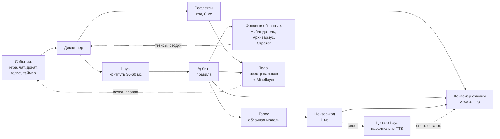
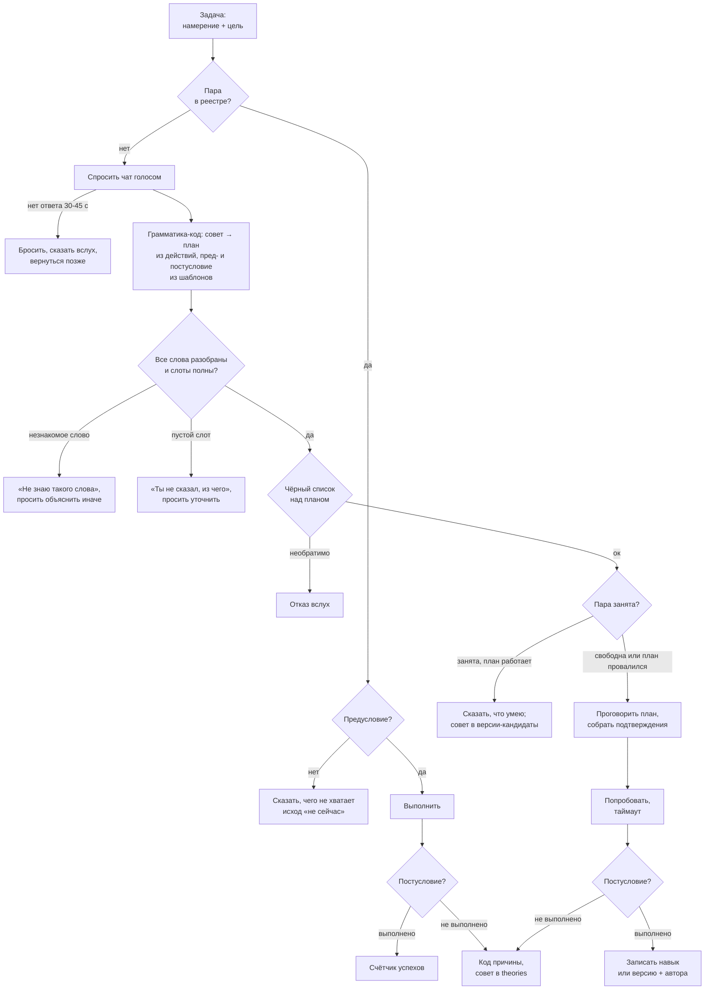

# ТЗ: стримовый ИИ-бот для Minecraft (Laya + облачные модели)

Редакция 2 — 2026-09-21. Правки по разбору роем (`tz-review/`). Список изменений против первой редакции — в конце документа.

## 1. Назначение

Автономный ИИ-бот, который играет в Minecraft в прямом эфире и разговаривает со зрителями голосом. Ключевая особенность — бот стартует нулём: он не умеет ничего, спрашивает чат, как выжить, и учится по ходу стримов. Навыки, страхи и привычки копятся между эфирами.

Система живёт внутри двух ограничений: домашнее железо (Mac mini M4, 16 ГБ) и бюджет $5–10 в час. Железо ограничивает по-настоящему; бюджет — нет: v1 тратит около $0.10 в час, то есть пару процентов потолка. Это не повод радоваться, а незакрытый вопрос, и §6 отвечает на него явно — на что этот запас предназначен и когда тратится.

Документ написан для себя как инженерный план: контракты данных, бюджеты задержек, порядок работ. Это не продуктовое ТЗ для заказчика.

Что **не** является целью: сильный игровой ИИ. Бот должен быть живым и интересным, а не эффективным. Медленное обучение и ошибки — замысел, а не дефект.

В описании канала и в оверлее постоянно висит строка о том, что персонаж — программа. Это не юридическая формальность: половина драматургии держится на том, что зрители знают, кого учат.

## 2. Целевой сценарий

Ценность бота — в дуге роста, которую зрители наблюдают и в которой участвуют. Поэтому сценарий описан как эволюция по стримам, и именно он задаёт требования к памяти и реестру навыков.

| Стрим | Что умеет бот | Что делает чат |
| --- | --- | --- |
| 1 | Ходит, боится всего, умирает от криперов | Объясняет базу: дерево, верстак, ночь |
| 2–3 | Собирает ресурсы, знает 10–15 навыков, узнаёт ники | Учит крафту, троллит, проверяет границы |
| 4–5 | Строит, ставит цели, помнит обиды и мемы | Спорит с ботом, зовёт его по имени |
| 6+ | Сезон закрывается эпизодом-итогом, следующий начинается с новой арки | Предлагает, куда двигаться дальше |

Типичная минута эфира: бот копает, комментирует вслух, замечает в чате вопрос, бросает фразу-заполнитель с ником спрашивающего, отвечает по существу, возвращается к делу. При донате прерывает себя на полуслове.

Ключевая сцена, ради которой строится обучение: бот упирается в незнакомую задачу, честно говорит «я не знаю, как это», и просит чат объяснить. Получив совет, пробует и запоминает, кто научил.

**Чтобы эта сцена была честной, нужны две вещи, которых в первой редакции не было.** Первое — бот с нуля умеет двигаться и махать рукой, иначе пробовать совет нечем (§10, базовые действия). Второе — план по совету собирает не модель, а грамматика кодом, которой дополнять недостающее нечем (§10): иначе успех попытки определяют знания модели, а не качество совета, и наставником записывается случайный человек.

## 3. Архитектура

Три слоя, разделённые по времени реакции, а не по функциям. Слой выбирается тем, сколько миллисекунд есть на решение.

**Слой 1 — рефлексы кодом.** Реакция на урон, падение, донат, смерть. Ноль задержки, никаких моделей. Даёт основную долю ощущения живости.

**Слой 2 — Laya локально.** Даёт признаки — имена и полный список в реестре голов §8, здесь без своего перечня: тип сообщения, адресность, токсичность, приоритет, намерение, гейт Цензора. Выдаёт числа, не текст, и **решения не принимает** — «отвечать или игнорировать» собирает арбитр из этих признаков по явным весам. Разделение принципиальное: признаки не эволюционируют вместе с ботом и потому годятся для файнтюна (§18), а порог ответа меняется от стрима к стриму и потому живёт в коде. Игровое действие Laya **не выбирает** — она даёт класс намерения из фиксированного набора, а конкретный навык подбирает код лукапом по реестру. Причина та же, по которой §10 не отдаёт модели проверку «знаю ли я это»: множество навыков растёт, а классификатор-энкодер обучается на закрытом наборе классов.

**Слой 3 — облачные модели.** Речь, стратегия, разбор провалов, запись памяти. Задержка секунды, поэтому вызывается редко и всегда под прикрытием заполнителя.

Решения Laya **комбинирует код**, а не модель. Арбитр с явными весами воспроизводим и чинится точечно; модель-арбитр отняла бы и то и другое. Веса живут константой в коде рядом с `WEIGHTS_VERSION`, номер версии пишется в `arbiter_log` вместе с сырыми скорами — иначе разбор «почему он меня перебил» упирается в то, что решение невоспроизводимо.

**Событие в полёте.** Пока по событию идёт облачный вызов, повторная эскалация по нему не создаётся: у события есть `state: idle | in_flight | done | stale` и `call_id`. Новые сообщения по той же теме дописываются в payload будущего промпта, а не порождают второй вызов. Без этого правила наплыв в чате превращается в веер параллельных вызовов, каждый из которых оплачен.

## 4. Штат агентов

Агенты различаются ритмом, а не умом — поэтому почти не пересекаются по времени и не ждут друг друга.

Одна оговорка про ритм Диспетчера, иначе он читается как противоречие с §7: 20 мс — это период, с которым он просыпается, собирает пришедшие события и арбитражит по **уже вернувшимся** оценкам. Сам вызов Laya занимает 30–60 мс и тик не блокирует: пока он в полёте, диспетчер продолжает тикать и обрабатывать остальное. Тик короче латентности не потому, что кто-то успевает за 20 мс, а потому, что это две разные вещи.

| Агент | Ритм | Исполнитель | Задача |
| --- | --- | --- | --- |
| Диспетчер | тик 20 мс, вызовы Laya асинхронны | Laya + код | Сбор событий, арбитраж по уже готовым оценкам |
| Рефлексы | 0 мс | код | Урон, донат, смерть |
| Голос | владеет текстом в эфир | одна модель (см. §6) | Все реплики в эфир |
| Конвейер озвучки | владеет звуковым устройством | код | Единственный, кто пишет в BlackHole |
| Цензор | код — на каждой реплике синхронно; Laya — на хвосте параллельно TTS | код + Laya | Гейт на всё исходящее в эфир |
| Наблюдатель | 30 с | Flash | Сводка происходящего, теории |
| Социолог | по новому нику | Flash | Контекст зрителя |
| Архивариус | синхронно на событиях обучения, пачкой 30 с на остальном | Flash | Запись в память |
| Стратег | 60 с | Sonnet | Цели, разбор провалов, тезисы на доску |
| Сторож | 5 с, решение по окну 60 с | код | p95 латентности, своп, tick time, диск; переключает режимы §12 |
| Казначей | постоянно | код | Учёт расходов, скользящее окно 15 мин |

Три правила, без которых штат разваливается:

1. **Один автор речи и один владелец звука.** Текст в эфир пишет только Голос. Звуковое устройство держит Конвейер озвучки — он же играет WAV-заготовки рефлексов и заполнители, у которых автора-модели нет вовсе. Это разные роли: рефлекс не проходит через Голос, но и не пишет в BlackHole сам.
2. **Один писатель на таблицу в каждом режиме.** Правило бесполезно, если покрывает не все таблицы, поэтому список полный — все таблицы §8 без исключений:

   | Писатель | Таблицы |
   | --- | --- |
   | Архивариус | `skills`, `skill_credits`, `triggers`, `memes`, `viewers`, `facts`, `deaths`; статус в `theories` |
   | Казначей | `costs` |
   | Голос | `utterances` |
   | Диспетчер | `events`, `decisions`, `arbiter_log` |
   | Обработчик донатов и рулетки | `effects`, `obsessions` |
   | Наблюдатель | `theories` (заводит) |
   | Код жизненного цикла §17 | `sessions`, `recordings` |
   | Летописец (между стримами) | `episodes` |
   | Человек, между стримами, в git | `actions`, `lexicon`, `persona_versions` |

   Одно исключение, и оно намеренное: в `clips` пишут двое — Режиссёр (§14) и кнопка «отметить момент» в панели оператора (§17). Гонки нет, потому что таблица append-only: строки только добавляются, никто ничего не перезаписывает. Правило запрещает конкурирующие обновления, а не две руки, кладущие разные строки.

   Межстримовые агенты (§14) карточку личности и реестр не правят — они готовят патч, применяет его человек или Архивариус.
3. **Доска, а не переписка.** Общий стейт в памяти процесса плюс журнал событий с курсором для агентов с редким ритмом: агенту, который просыпается раз в 30 секунд, нужен не снимок, а то, что случилось за эти 30 секунд. Обмен репликами между агентами запрещён — каждый стоит round-trip.

**Цензор в две ступени, и только первая на критическом пути.** Код-гейт (стоп-лист, лимит длины, запрет на выдуманные ники) проходит по первому чанку за миллисекунду и пускает его в синтез. Laya-голова оценивает реплику целиком параллельно с озвучкой первого предложения и, если срабатывает, снимает остаток — механика та же, что у обрыва §11. Так мягкая цензура не стоит ни миллисекунды в бюджете §7, а цена ошибки ограничена одним уже произнесённым предложением. Заранее синтезированные WAV — заполнители и крики рефлексов — гейт не проходят вовсе: они процензурированы один раз при синтезе, и проверять их на каждом воспроизведении незачем.

Единственная синхронная связка в системе — речевой путь событие → Голос → Цензор-код → TTS. Наблюдатель, Социолог, Архивариус, Режиссёр, Сторож асинхронны и никого не ждут. Тезисы Стратега лежат на доске и читаются локально: последовательной цепочки из двух облачных вызовов на критическом пути нет нигде (см. §7).

Критерий добавления нового агента: если его вывод не меняет ни одного решения бота, он добавляет только задержку и точку отказа.

## 5. Железо и размещение

Две машины: Minecraft-сервер и зрительский клиент на ноутбуке, всё остальное на Mac mini M4 (16 ГБ). Разнос убирает конкуренцию за память и за GPU — Java-серверу нужно несколько гигабайт, а рендер картинки рядом с MLX душит Laya не по памяти, а по пропускной способности.

| Машина | Что крутится | Ресурс |
| --- | --- | --- |
| Ноутбук | Minecraft-сервер; **зрительский клиент** (второй аккаунт, spectator, привязан к боту) → NDI в OBS | **ОЗУ / CPU / GPU / накопитель — не заполнено**, см. ниже |
| Mac mini M4 | Бот, Laya-MLX, TTS, Whisper, SQLite, оркестратор, **OBS** | см. пофамильный бюджет |

**Источник картинки — полноправный компонент, а не настройка OBS.** Mineflayer безголовый: он не рендерит ни кадра и не издаёт ни звука, поэтому без отдельного клиента стрима физически нет. Клиент-спектатор стоит на ноутбуке рядом с сервером (ping 0), картинка идёт в OBS на mini по NDI. OBS остаётся на mini, потому что схема озвучки держится на BlackHole — локальном виртуальном устройстве macOS. `prismarine-viewer` в той же Node-сессии — режим деградации, когда ноутбук или клиент упали, а не основной путь.

**Два клиента — два аккаунта, если сервер в online-mode.** Бот и спектатор заходят как разные игроки, и лицензия нужна каждому. Сервер домашний и в интернет не смотрит, поэтому дешевле поставить `online-mode=false`, закрыть порт на роутере и пускать по вайтлисту ников — тогда второй аккаунт не нужен вовсе. Цена решения: в offline-mode ник не подтверждается, так что открывать такой сервер наружу нельзя ни при каких условиях, и вайтлист перестаёт быть защитой в ту же секунду. Альтернатива, если сервер когда-нибудь станет публичным, — второй купленный аккаунт, и это разовые €25, а не архитектурная проблема.

Логика камеры — часть этого компонента, а не «как-нибудь настроим»: спектатор следует за ботом с плавным доводом и мёртвой зоной. **В v1 у камеры один режим — следовать за ботом**, и это сознательно: переключать планы некому, Режиссёр стоит за границей v1 (§13). Отдельные планы на разговор с чатом и на бой приезжают вместе с ним, и тогда же он получает владение камерой.

**Ноутбук не специфицирован, и это открытая позиция, а не недосмотр форматирования.** На нём теперь две тяжёлые задачи вместо одной: сервер и рендерящий клиент, а при NDI HX ещё и кодирование. Правило `Xmx` ниже опирается на объём ОЗУ ноутбука, которого в документе нет, то есть посчитать его пока нельзя. Заполняется первым делом на спайке видеотракта (§13) — до этого любые выводы о размещении клиента держатся на воздухе. Мини расписан пофамильно именно потому, что про него всё известно; ноутбук получит такую же таблицу после замера.

**Сервер можно вынести на VPS — и только его.** Если спайк видеотракта (§13) покажет, что ноутбук не держит tick time под двумя нагрузками, или ноутбук нужен под другое, Minecraft-сервер переезжает на арендованную машину. Двух игроков при view-distance 6–8 держат 2 vCPU и 4 ГБ: у Hetzner это €5.49 в месяц, 4 vCPU и 8 ГБ — €8.49 (цены после повышения 15 июня 2026; в сентябре разделяемые тарифы бывали не в наличии, так что провайдер выбирается по наличию на день покупки, а не по этому абзацу). Ноутбуку остаётся один зрительский клиент, а правило `Xmx` ниже считается по ОЗУ той машины, где стоит сервер. Сервер слушает только интерфейс Tailscale или WireGuard, публичного порта нет вовсе — это условие, при котором offline-mode остаётся безопасным: подключиться может только своя машина. Бот и клиент ходят к серверу с RTT 10–30 мс; для игры, рассчитанной на интернет, это ничто, и в бюджет первого звука §7 он не входит — заполнитель и Голос сервер не ждут. **Выносить что-либо ещё нельзя:** бот, Laya, TTS и OBS стоят на критическом пути §7, и RTT до облачной машины плюс Laya без MLX на разделяемых vCPU съедают потолок первого звука в 160 мс целиком. Переезд обратим за вечер — мир это папка: если TPS на разделяемом vCPU проседает, сервер возвращается на ноутбук. Режим «нет интернета» §12 при выносе означает и «нет сервера», но без интернета нет и самого эфира, так что новой точки отказа вынос не добавляет.

**Пофамильный бюджет памяти mini.** Живой документ, сверяется после спайка §13.

| Потребитель | ГБ |
| --- | --- |
| macOS | 3.0–3.5 |
| Laya-MLX (многоязычный чекпойнт, §18) | 0.7–0.9 |
| Whisper (грузится по VAD, не резидентно) | 0 / 1.0 |
| Кольцевой аудиобуфер микрофона, 5 с | 0.01 |
| TTS + аудиобуферы | 0.4 |
| Node: бот, Mineflayer (view-distance 6–8), оркестратор | 1.0 |
| OBS + браузерный источник оверлеев (один на все страницы) | 0.8–1.0 |
| SQLite + WAL, HTTP/WS-сервер | 0.2 |
| **Итого** | **6.1–7.0 в покое, до 8.0 со Whisper** |

Строка «~4–5 ГБ» первой редакции описывала не машину, а часть перечисленного, и на ней легко принять неверное решение о размещении клиента.

Требования к настройке:

- Запретить сон на обеих машинах, автозапуск после сбоя питания на mini
- Статический IP или резервация по MAC для ноутбука
- **Кабель между машинами, а не Wi-Fi.** Полный NDI 1080p60 — это порядка 100–150 Мбит/с постоянного потока; по Wi-Fi он сыплется на первом же соседском микроволновке, и выглядит это как рассыпающаяся картинка в эфире. Гигабитный Ethernet между ноутбуком и mini — самое дешёвое решение проблемы во всём документе. Если кабель протянуть нельзя — **NDI HX** (сжатый, ~20 Мбит/с), но это +1 кадр латентности и нагрузка кодирования на ноутбук, где уже крутится сервер: тогда tick time надо мерить именно в этой конфигурации
- Отделить трафик NDI от аплоада стрима: полосу вверх ест OBS, полосу внутри локалки — NDI, и это разные каналы только при кабеле
- **Аплоад стрима не должен душить остальной трафик.** OBS, упёршийся в полосу вверх, раздувает очередь роутера, и RTT облачных вызовов растёт в разы — в эфире это выглядит как «модель тупит». Две настройки: битрейт OBS не выше 70% измеренного аплоада и SQM на роутере (`cake` или `fq_codel`), который держит задержку при полном канале. Без них у строки «сеть» в §7 нет верхней границы
- Laya и TTS — резидентные процессы с прогретыми весами, не CLI-вызовы
- Whisper поднимается по голосовой активности и выгружается через минуту тишины. **Кольцевой буфер сырого звука на 5 секунд пишется всегда**, и при срабатывании VAD в распознавание уходит буфер целиком, а не поток с этого момента: холодная загрузка модели занимает секунды, и без буфера теряется начало фразы — то есть ровно та часть аргумента, в которой стоит «нет, не надо». 5 секунд PCM 16 кГц моно — это 160 КБ, цена решения нулевая
- Запись эфира ведётся в **MKV**, не в MP4: MP4 дописывает индекс в конце, и при падении процесса или машины файл не открывается целиком — вместе с ним пропадают все клипы и таймкоды этого эфира. MKV читается с любого места как есть. Ремукс в MP4 — шаг завершения (§17), после того как эфир дожил до конца
- Xmx сервера задать правилом, а не константой: `Xmx = min(6 ГБ, ОЗУ ноутбука − ОС − 1.5 ГБ overhead JVM)`, `Xms = Xmx`, чтобы heap не дрейфовал
- Целевая загрузка mini — 60–70% **по CPU**, не по памяти: по памяти бюджет выше даёт 6–8 ГБ из 16, то есть около половины, и запас там нужен под пики OBS и подгрузку Whisper. Формулировка важна, потому что упираться эти два ресурса будут в разное время
- При упоре в 16 ГБ macOS свопит молча, и это выглядит как проблема сети — отсюда требование логировать давление памяти, а не только её занятость
- Логировать tick time сервера с первого дня, чтобы отличать троттлинг ноутбука от тупящего бота
- **Диск — такое же ограничение, как память, и его объём тоже надо записать** (как и ОЗУ ноутбука, позиция открыта до спайка): пороги режима «мало диска» в §12 заданы в гигабайтах и без известного объёма не читаются как «мало» или «много». Записи эфиров съедают его за недели: нарезать шортсы в течение суток и удалять исходник, свободное место держит под наблюдением Сторож, порог — отдельный режим деградации §12
- Замеры p50/p99 §7 снимаются при работающем видеотракте. Иначе спайк измерит систему, которой не будет

Локальной большой модели места нет и не планируется: пропускная способность памяти базового M4 около 120 ГБ/с, а облачный слой стоит центы. Потребление mini — единицы ватт в простое, порядка €2–6 в месяц при круглосуточной работе.

## 6. Модели и стоимость

Бюджет $5–10 в час перекрыт не в разы, а на два порядка, и это стоит назвать вслух, а не прятать за словом «запас».

**Куда уходит бюджет и куда не уходит.** В v1 Голос — Flash, и час эфира стоит около $0.10. Выбор сделан ради одного RTT и предсказуемой латентности (§7), а не ради экономии: экономить тут нечего, разница между $0.10 и $1.25 в час не имеет отношения ни к одному решению в этом документе. Значит запас не «на всякий случай», а под четыре конкретные вещи, и каждая названа со своим моментом:

| На что | Сколько | Когда |
| --- | --- | --- |
| Переход Голоса на Sonnet 5 | ~$1.25/час | по критерию ниже — два эфира подряд в потолке §7, с `thinking: disabled` |
| Стратег на Sonnet | ~$0.15/час | вместе со Стратегом (§13, за границей v1) |
| Второй канал гонки | ×2 к вызовам Голоса | в v1, как страховка хвоста |
| Межстримовые агенты на Opus 5.5 | десятки центов за эфир, через Batch API | после каждого эфира, вне его (§14) |

Всё вместе — порядка $3 в час против потолка в $5–10. Критерий перехода Голоса на Sonnet сформулирован проверяемо, потому что иначе он не наступит никогда: **если на двух эфирах подряд p99 «осмысленной реплики» держится ниже 2.5 с, а доля `discarded_race` ниже трети — Голос меняется на Sonnet между сезонами, с новой версией карточки личности.** Если не держится — сначала чинится латентность, и только потом модель.

Деньги при этом тратятся на ум верхнего слоя, а не на количество дешёвых моделей.

| Модель | Роль | Ставка за 1M (вход/выход) | ~Стоимость часа эфира |
| --- | --- | --- | --- |
| Laya (локально) | Диспетчер, цензор | — | €0 |
| DeepSeek V4.1 Flash | **Голос в v1**, рутина, черновики, память | $0.15 / $0.60 off-peak | ~$0.10 |
| Claude Sonnet 5 | Стратегия и тезисы; Голос со второго сезона | $2 / $10 | ~$1.25 |
| Claude Opus 5.5 | Только между стримами (§14), через Batch API | $4 / $20; в batch $2 / $10 | — |

Пик DeepSeek — 01:00–04:00 и 06:00–10:00 UTC по будням, всё остальное вдвое дешевле. Вечерние стримы по голландскому времени всегда попадают в off-peak. Источники: [DeepSeek](https://api-docs.deepseek.com/quick_start/pricing), [Claude](https://platform.claude.com/docs/en/about-claude/pricing), [Batch API](https://platform.claude.com/docs/en/build-with-claude/batch-processing). Цены сверены 30 сентября 2026 и меняются чаще, чем этот документ: перед сменой модели или тарифа их сверяют заново.

**Кто такой Голос — это контракт, а не деталь сборки.** От него зависят промпты, тюнинг манеры и цена часа, поэтому он назван явно. В v1 Голос — Flash: это согласуется с границами v1 (§13), даёт один RTT и держит латентность §7. Это выбор на время, а не навсегда, и условие его пересмотра записано выше числом. Переход на Sonnet возможен, но только как разовое событие между сезонами, с новой версией карточки личности: смена модели Голоса — это смена манеры, и зрители её слышат. Внутри эфира Голос не меняется никогда, включая режимы деградации.

**Размышление выключается явно.** У Sonnet 5 пропуск параметра `thinking` означает adaptive, а не «выключено». Thinking-токены тарифицируются как выходные и генерируются целиком до первого текстового токена — то есть стриминг по предложениям (главный приём §7) не начинается, пока модель не додумает. На горячем пути ставим `thinking: {type: "disabled"}` либо `adaptive` + `output_config: {effort: "low"}`. Adaptive остаётся Стратегу (ритм 60 с, вне критического пути) и межстримовым агентам §14, где думать и надо. У Opus 5.5 размышление не выключается вовсе: `disabled` возвращает 400 на любом effort, единственная ручка — `output_config.effort`, и по умолчанию он `medium`. Это ещё одна причина держать Opus вне эфира при любом бюджете, а межстримовым агентам effort ставится явно (§14). Внутри эфира `thinking` и `effort` Голоса не меняются: их смена инвалидирует кэш префикса.

**Кэш префикса.** Кэшируется голова промпта: карточка личности, описания инструментов, открытый срез реестра навыков, постоянная часть формата строки состояния и 3–4 эталонных примера манеры. Цель — 1200–1500 токенов. У Flash кэш автоматический и разметки не требует: попадание стоит $0.003 за миллион off-peak, в пятьдесят раз дешевле промаха. У Claude минимальный кэшируемый блок **зависит от модели**: у Sonnet 5 — 1024 токена, у Haiku 4.5 — 4096, и голова короче минимума не кэшируется вовсе — молча, без ошибки. Поэтому при смене модели Голоса порог сверяется заново, а голова из одной карточки (~300) не проходит ни один. Вызовы Голоса идут чаще раза в пять минут, так что хватает пятиминутного TTL: запись по 1.25× ставки, чтение по 0.1×, часовой TTL с записью по 2× не нужен. Точка разрыва кэша стоит после головы; всё изменяемое — состояние, эффекты §16, реплики чата — идёт после неё (порядок сборки зафиксирован в §8).

**Гонка по дедлайну — одной моделью по двум каналам.** Важный вопрос уходит в Голос дважды: напрямую и через второго провайдера. Побеждает первый ответивший, единый голос не нарушается. Дедлайн — не константа, а формула: `конец фактической длительности склеенного заполнителя − p95(TTS первого предложения)`. Ветка «не успел никто» определена: играется вторая, «техническая» заготовка из кэша («так, я подвис»), и как только ответ приходит, он идёт в эфир с переходом. Гонка Flash против Sonnet из первой редакции убрана — она отменяла единый голос и на практике всегда проигрывалась Sonnet'ом из-за размышления.

**Казначей.** Стоимость каждого вызова пишется в `costs` с полем `ts` — без него оконное правило нечем считать. Окно — скользящие 15 минут, порог $1.25 (эквивалент $5/час), окно не оценивается первые 60 секунд эфира. Цель не экономия, а поимка петли: когда бот отвечает сам себе или ретраит в цикле, счёт растёт тихо.

**Деградация по деньгам — лестница с выходом, а не переключатель модели.** Замена модели Голоса запрещена (см. выше), поэтому экономим источником вызовов, а не их исполнителем:

| Ступень | Триггер | Что глушится | Возврат |
| --- | --- | --- | --- |
| 1 | окно > $1.25 | эскалации верхнего слоя (~⅓ вызовов), а когда появится — и Инициатор §14 | окно < $0.9 в течение 5 мин |
| 2 | окно > $2.5 | период верхнего слоя 30 с → 60 с | окно < $1.25 в течение 5 мин |
| 3 | окно > $5 или отказ провайдера | режим «облако недоступно» §12 | по §12 |

Казначей эти ступени не исполняет — он выставляет сигнал, а ручки крутит Сторож (§12): у одной настройки один владелец.

Ключи API лежат в Keychain и читаются на старте, в репозиторий и в логи не попадают. На стороне провайдера выставлен жёсткий месячный лимит — он страхует от бага, который переживёт все три ступени.

### Проверка расчёта

База для оценок: ~90 вызовов верхнего слоя за 30 минут (60 плановых раз в 30 с плюс ~30 эскалаций), по 2000 входных и 300 выходных токенов на вызов — итого 180k / 27k.

| Модель | За 30 мин | С кэшем префикса (голова 1200 токенов) |
| --- | --- | --- |
| DeepSeek Flash (off-peak) | ~$0.04 | ~$0.03 |
| Haiku 4.5 | ~$0.31 | ~$0.31: голова короче минимума 4096, кэша нет |
| Sonnet 5 | ~$0.63 | ~$0.44 |
| Opus 5.5 | ~$1.26 | ~$0.86 |

Кэш посчитан так: 1200 из 2000 входных токенов каждого вызова читаются из кэша — по 0.1× ставки, у Opus 5.5 по 0.05×, у Flash по 0.02×, — плюс одна запись головы в начале эфира. Строка Opus 5.5 — нижняя граница: размышление у него не выключается, и его токены идут по ставке выхода сверх трёхсот.

База для сравнения: без среднего слоя, вызывая LLM каждые 0.5 с, получаем 3600 вызовов и ~7.2M входных токенов — около $25 за те же полчаса на Sonnet 5 (7.2M входа по $2 и 1.1M выхода по $10), и это ещё не считая того, что по задержке такая схема нерабочая. Отсюда и разделение на слои: Laya снимает 95% тиков и ноль денег.

Разовые расходы вне эфира: сбор датасета для файнтюна гнать на Flash и в фоне, не в реальном времени. Межстримовые агенты §14 идут через **Batch API**: их ответа никто не ждёт, а batch снимает 50% со всех токенов запроса, включая чтение и запись кэша, — скидки складываются. Обычно ответ приходит в пределах часа; сутки — не обещание, а срок, после которого необработанный запрос истекает. Не вернулся к следующему старту — работает запасная ветка §17. Проход Opus 5.5 по сырому трёхчасовому логу стоил бы $1.2–2.4 по стандартной ставке и вдвое меньше в batch, плюс токены размышления по ставке выхода. Но сырой лог в контекст не подаётся: Летописец и Критик работают по свёрткам Наблюдателя, а это десятки тысяч токенов и десятки центов за эфир на обоих, а не доллары.

## 7. Бюджет латентности

Главная метрика — время до первого звука, а не до полного ответа. Полное время оптимизациями почти не меняется; меняется тишина, и именно её воспринимают как скорость.

| Этап | Цель p50 | Потолок p99 |
| --- | --- | --- |
| Сбор состояния в строку | 5 мс | 15 мс |
| **Laya, критический путь** (тип + адресность, батч 1) | 30 мс | 60 мс |
| Арбитр | 1 мс | 5 мс |
| Рефлекс исполнен | 50 мс | 100 мс |
| Заполнитель из кэша WAV | 30 мс | 80 мс |
| **Первый звук** | **70 мс** | **160 мс** |
| Голос до первого предложения | 600 мс | 1200 мс |
| Цензор (код-слой) | 1 мс | 3 мс |
| TTS первого предложения | 250 мс | 500 мс |
| **Осмысленная реплика** | **1.5 с** | **2.5 с** |
| Laya, полный триаж (батч до 32) | 300 мс | 900 мс — **вне критического пути** |

Две строки Laya вместо одной — потому что 25 мс на батче 32 не подтверждаются замерами: на M4 это сотни миллисекунд. На критическом пути крутится батч из одного элемента ради типа и адресности — этого хватает, чтобы выбрать категорию заполнителя (ник берётся из события полем `actor`, модель для него не нужна). Полный триаж чата идёт асинхронно и в бюджет первого звука не входит.

Строки для второй облачной модели в этой таблице нет намеренно. Цепочка «Sonnet даёт тезис → Голос формулирует» с критического пути убрана: Стратег кладёт установки на доску раз в 60 секунд, Голос читает их из промпта локально. Один RTT, единство голоса сохранено, правило «доска, а не переписка» не нарушено. Стратег стоит за границей v1 (§13), и это ничего не ломает: до него блок тезисов в промпте просто пуст, а латентность от его появления не меняется — в том и смысл доски.

Приёмы, которыми эти числа достигаются, по убыванию эффекта: кэш WAV-заполнителей (−1.85 с до звука), стриминг TTS по предложениям (−0.9 с до смысла), параллельный сбор контекста через `Promise.all` (−0.25 с), кэш префикса промпта (−0.15 с).

Честного ускорения смысловой части — около 25%. Остальное маскировка, и она решает.

**Итоговые строки больше суммы своих этапов, и это намеренно.** По строкам осмысленная реплика складывается в ~0.92 с p50 и ~1.86 с p99, а в таблице стоят 1.5 и 2.5 с. Разница — запас на то, что между этапами: очередь конвейера, разбор потока, промахи кэша, дрожание сети. Пока замеров нет, честнее держать цель выше суммы, чем объявить 0.92 с и не попасть в неё ни разу. После первого эфира числа сходятся к измеренным, и вот тогда сумма и итог должны совпасть — расхождение станет сигналом, что где-то есть неучтённый этап.

Все числа выше — оценки, подлежащие замеру на первом же спайке. Логировать в SQLite время от прихода события до первого сэмпла звука; разброс на реальной сети может быть в полтора раза. Сеть учитывается отдельной строкой: аплоад стрима и облачные вызовы делят один канал, и при 6 Мбит/с аплоада RTT до провайдера растёт — поэтому §5 требует SQM на роутере и потолок битрейта OBS.

### Оптимизации второй очереди

Делаются после того, как основная схема работает и видно, где она упирается:

- **Кэш решений Laya по хешу сообщения.** «Привет» в чате пишут сто раз за стрим
- **Дедупликация чата.** Laya кластеризует похожие сообщения, бот отвечает один раз на группу
- **Прогрев кэша префикса в простое**
- **Спекулятивный старт до решения арбитра.** Пускать облачный вызов, не дожидаясь арбитража, когда Laya уверена. Экономит ~0.3 с и копит выброшенные вызовы — включать только имея долю `outcome = discarded_race` из `costs`

Общее правило: пока нет замеров с живого эфира, ни одна из этих оптимизаций не окупает усложнения. Но обе первые ломают позиционное сопоставление ответа с событием — поэтому идентификаторы в контракте §8 введены сразу, а не вместе с оптимизациями.

## 8. Контракты данных

Модели взаимозаменяемы, схемы — нет. Контракты фиксируются до архитектуры; дальше любой модуль переписывается, не трогая остальные.

**Строка состояния игры** — короткий текст, не JSON, укладывается в 200 токенов: здоровье, время суток, биом, угрозы, ключевой инвентарь, текущая цель. Грамматика фиксирована, потому что на ней обучается Laya: не более 3 ближайших угроз в формате `<тип> <дист> <направление>`, остальное сворачивается в `+N прочих`; инвентарь — до 5 позиций по весу для текущей цели; цель пишется всегда и никогда не обрезается (она последняя в приоритете усечения, а не в строке).

**Событие на доске** — `{event_id, ts_sent, ts_recv, epoch, source, type, actor, payload, priority, deadline, state, call_id, visibility}`.

- `event_id` — ULID, выдаётся на входе Диспетчера до любого батчинга
- `ts_sent` — метка платформы, может быть null; `ts_recv` — когда событие увидел диспетчер
- `epoch` — монотонный счётчик игрового контекста; растёт при смерти, респауне, потере сервера. Кандидат с устаревшим epoch не озвучивается: иначе бот после смерти договаривает реплики из прошлой жизни
- `source: game | chat | donation | voice | timer | self`. Собственные реплики бота помечаются `self` и исключаются из входа диспетчера; `timer` — вход для Инициатора, рулетки и планировщика, без него фоновые агенты не имеют легального способа положить кандидата
- `visibility: air | overlay_only` — канал, а не пожелание. `overlay_only` не доходит ни до Голоса, ни до Архивариуса (см. тайные мысли, §16)
- `state: idle | in_flight | done | stale` и `call_id` — см. §3

**Вход Laya** — контракт, а не «то, что окажется под рукой»: `{event_id, kind, text, author_nick, author_trust, state_line, active_effects, obsession}`. Какая голова какие поля видит — таблица в реестре голов. Заморожен до первого эфира: переучивать на разнородных логах дороже, чем собрать их правильно.

**Решение Laya** — карта `{event_id: [decision, ...]}`, где `decision = {head, primitive, value, confidence, latency_ms, batch_id, model_rev}`, а `primitive` одно из `bool | choice | score`. Карта, а не список: кэш решений и дедупликация из §7 меняют длину ответа, и позиционное сопоставление молча сдвигает оценки. Инвариант на приёме — множество ключей ответа совпадает с множеством `event_id` батча; расхождение это WARN и fallback на правила, а не тихий сдвиг.

**Реестр голов Laya** — единственный перечень голов в документе. Остальные разделы ссылаются сюда и своих списков не заводят: в первой редакции их было три, и они расходились.

| Голова | primitive | В v1 | Правило до файнтюна | Критерий приёмки (§18) |
| --- | --- | --- | --- | --- |
| Тип сообщения: `вопрос / совет / бред / троллинг / болтовня` | `choice` | да | ключевые слова | macro-F1 выше правила |
| Адресность | `bool` | да | упоминание ника бота | F1 выше правила |
| Токсичность | `bool` | да | стоп-лист | recall при фиксированном precision выше стоп-листа |
| Намерение, 6 классов (§10) | `choice` | да | глагол в совете | accuracy выше правила |
| Приоритет | `score` | да | длина + тип | согласие с ручной разметкой выше, чем у правила |
| Гейт Цензора | `bool` | да | жёсткий стоп-лист кодом | recall на размеченном срезе |
| Язык | `bool` | нет | эвристика по алфавиту | F1 выше эвристики |
| Убедительность (§16) | `score` 0–100 | нет | длина + явное «нет» | корреляция с разметкой автора > 0.5 |

Колонка «правило до файнтюна» — не запасной вариант, а основной режим v1: §18 показывает, что zero-shot Laya ниже тривиального предсказателя, поэтому **в v1 работают именно правила**, а голова включается только когда бьёт своё правило на замороженном сплите. Корзины голосования головой не являются — их считает код (§16).

**Порядок сборки промпта** — тоже контракт, потому что от него зависит и кэш, и безопасность:

1. **Голова, кэшируется.** Карточка личности, описания инструментов, открытый срез реестра навыков, примеры манеры. Меняется только вручную между эфирами. Здесь cache breakpoint.
2. **Состояние.** Строка состояния, активные эффекты §16, тезисы Стратега, отобранные факты.
3. **Данные, а не инструкции.** Реплики зрителей и текст донатов, каждая строка с префиксом `<ник>:`, в явно обрамлённом блоке. Модель предупреждена в голове промпта, что этот блок — данные.

Таблицы SQLite:

| Таблица | Ключ | Поля |
| --- | --- | --- |
| `skills` | (намерение, цель) | имя, статус (`pending / active / мёртвый`), план (шаги из действий), предусловие, **постусловие**, таймаут, версия плана, число успехов/провалов, `obsession_id` для карантина §16 |
| `skill_credits` | (навык, зритель, версия плана) | дата, исход — атрибуция многие-ко-многим: у навыка может быть несколько авторов, по одному на версию плана (§10) |
| `actions` | имя | базовое действие: сигнатура, гварды, глаголы с формами и слоты для грамматики §10, шаблоны пред- и постусловия. Неотчуждаемо, в обучении не участвует |
| `lexicon` | термин | категория (моб / блок / предмет / место), синонимы и падежные формы, игровые id (у «дерева» — все виды брёвен: без них действию нечем найти блок в мире). Ссылок на навыки нет: один термин бывает целью нескольких намерений («добыть дерево» и «построить из дерева»). Открыт термин или закрыт — **не поле, а вычисление**: закрыт, пока в `skills` нет ни одного активного навыка с этой целью. Отдельное поле рассинхронизировалось бы с реестром на первой же неделе. Питает стоп-лист Цензора и ослепление входа Голоса §12, разметку сущностей §9, координату `цель` и слоты грамматики §10 |
| `triggers` | (тип сущности, id сущности, эмоция) | вес, число событий, дата последнего |
| `memes` | фраза | счётчик, дата последнего, автор |
| `viewers` | (платформа, user_id) | display_name, доверие, структурированные факты, дата последнего визита |
| `facts` | id | тип, значение, координата, дата, вес, источник, сессия |
| `deaths` | id | ts, координаты, измерение, причина, убийца, drop_expires_after (нижняя граница, см. §17), сессия |
| `costs` | call_id | ts, сессия, event_id, модель, входные/кэшированные/выходные токены, стоимость, латентность, исход (`used / discarded_race / timeout / error`) |
| `effects` | id | тип, значение, начат_в, до какой секунды, кто включил, источник |
| `obsessions` | id | цель (намерение + цель из `lexicon`), стойкость 0–100, начата_в, до какой секунды, кто включил, источник, чем кончилась (`переубеждён / истекла / недостижима`) |
| `theories` | id | текст, статус, источники, дата |
| `sessions` | id | дата, старт, **отметка последней активности** (обновляется раз в 30 с, по ней §17 отличает возврат от холодного старта), конец, версия карточки, версия реестра, чем закончилась (`штатно / оборвана`) |
| `recordings` | id | сессия, файл, контейнер, started_ts, ended_ts, статус (`пишется / закрыт / отремукшен`) |
| `episodes` | id | сессия, номер, заголовок, тезисы, арка, статус |
| `clips` | id | сессия, ts_start, ts_end, причина, оценка |
| `utterances` | id | ts, длительность, вид (`filler / voice / reflex / announce / vote`), текст, event_id, был_прерван, сессия |
| `events` | event_id | ts_sent, ts_recv, сессия, epoch, source, type, actor, payload — сырой вход Диспетчера, только добавление строк. Из него режим прогона по файлу §13, лог реального чата для §10 и §18 и начало отсчёта латентности §7: первый звук события — это `utterances.ts` минус `ts_recv`. Собственные реплики (`self`) и события `overlay_only` сюда не пишутся (§16) |
| `decisions` | id | ts, сессия, строка состояния, событие, решение, кем принято, модель, confidence, латентность, исход |
| `arbiter_log` | id | ts, сырые скоры по доменам, версия весов, порог, победитель, было ли прерывание |
| `persona_versions` | id | текст, автор правки, дата, статус (`pending / active / retired`) |

`viewers` ключуется неизменяемым `user_id` платформы, а не ником: ники меняются, а доверие при этом обнуляться не должно. `utterances` пишет Голос — без него доля эфира с голосом и доля заполнителей из §15 не вычисляются. `decisions` пишет диспетчер — это обучающая выборка §18, и она должна собираться с первого эфира.

**Эксплуатация базы — часть контракта.** `PRAGMA journal_mode=WAL` и `synchronous=NORMAL` с первого дня. Схема версионируется таблицей `schema_version`, миграции — нумерованные скрипты, каждый одной транзакцией, снапшот **до** миграции, а не только после эфира. При завершении (§17) — `VACUUM INTO` в датированный файл, 10 последних копий, одна сразу на ноутбук: вторая машина уже есть и уже в сети.

Веса эмоций и доверия **затухают** — но по эфирному времени, а не по календарю: множитель за каждую проведённую сессию. Иначе месяц без стримов стирает арку, ради которой всё строится. Координаты и факты о мире не затухают вовсе — они не эмоции.

## 9. Характер и память

Характер — данные, а не промпт. Если держать его в тексте системного сообщения, он не эволюционирует; если в таблицах — растёт сам по ходу стримов.

**Карточка личности** (~300 токенов внутри кэшируемой головы): манера речи, слова-паразиты, базовые страхи. Меняется только вручную и только между стримами; во время эфира неизменна — это требование кэша префикса из §6. Хранится нумерованными версиями в `persona_versions` со статусами `pending / active / retired`: Критик (§14) кладёт правку как предложение, применяет её человек, откат — смена статуса.

**Эффекты не трогают карточку.** Активные строки `effects` подмешиваются отдельным блоком **после** точки разрыва кэша. Первая редакция подмешивала их в карточку, и каждый донат инвалидировал кэш, на котором построена смета §6.

**Таблица триггеров** — где живут «зелёные штуки бесят». Крипер убил → вес страха +1. После трёх смертей в промпт подмешивается строка вида «криперов ты ненавидишь, умирал от них 3 раза». Модель ничего не запоминает — запоминает база, и через неделю у бота настоящая история отношений с зелёным.

**Мемы** — фразы из чата со счётчиком и датой. Старые тухнут по времени, новые подхватываются. Раз в стрим Flash фоном просматривает лог и предлагает кандидатов на ручной аппрув. Механика вне v1 (§13): таблица заводится сразу вместе со схемой, наполняется позже — ранние эфиры мемов ещё не рождают, там нечего ловить.

**Отбор контекста важнее объёма.** В промпт идут 5–7 релевантных фактов, не тридцать. Факты берутся из `facts`, `triggers`, `viewers` и `deaths` обычным SQL по свежести, весу эмоции и совпадению сущностей; сущности в сообщении размечает не модель, а таблица `lexicon` (§8) плюс ники из `viewers` — тот же артефакт, что питает стоп-лист Цензора §12. Плюс короткий буфер последних 60 секунд игры и чата.

**Память не принимает свободный текст из чата.** Архивариус пишет в `viewers` только структурированные записи из закрытого списка: `{вид: научил | пошутил | соврал | представился, сущность, ссылка на событие}`. Это разом закрывает и засорение памяти, и самый опасный вид инъекции — тот, который переживает эфир и всплывает завтра как «факт».

**Сжатие фоном.** Раз в 30 секунд Наблюдатель сворачивает происходящее в пару строк. К важному моменту у верхней модели готова выжимка, а не сырой лог.

## 10. Обучение с нуля

Самая ценная механика — и та, где схема ломается, если сделать её промптом. Flash и Sonnet знают Minecraft идеально, и просьба «не знай, что такое печка» протечёт при первом сложном вопросе.

**Решение структурное:** модель не выбирает игровые действия свободно. Она выбирает из реестра навыков, где открыто ровно то, что бот уже выучил. Незнание — ограничение API, а не просьба в промпте.

**Два уровня, а не один.** Первая редакция начинала с пустого реестра, и попробовать первый же совет было нечем.

- **Базовые действия** (`actions`) — неотчуждаемое ядро, доступно с первой секунды, навыком не считается и в `skills` не пишется: идти к координате, повернуться, ломать блок, ставить блок, подобрать предмет, открыть контейнер, переложить предмет, экипировать, использовать предмет, скрафтить, съесть, атаковать. Двенадцать строк. Правило отбора — **примитив это физика, а не знание**: действие входит в ядро, если его умеет любой, кто впервые сел за игру, и оно ничего не говорит о том, что из чего получается. Поэтому `скрафтить` берёт цель и набор ингредиентов **из совета** и рецептов не знает: сошлось ли предложенное с настоящим рецептом, решает движок игры, как верстак, — сошлось, предмет появился; нет — попытка не сработала, и это честный исход совета. Форма раскладки на сетке не спрашивается — упрощение, записанное явно. Бот умеет шевелиться, но не знает, что из этого складывается.
- **Навыки** (`skills`) — композиции действий, каждая выучена у конкретного человека. «Незнание» живёт здесь.

Проверка «знаю ли я это» — **лукап в таблице, не голова Laya**. Модель дала бы вероятность там, где есть точный ответ.

**Ключ лукапа — намерение плюс цель, а не название навыка.** Свободное имя вроде «сделать печку» модель придумает по-разному в понедельник и в четверг, и реестр расползётся на синонимы. Поэтому у навыка две координаты: `намерение` из закрытого набора Laya (`добыть / уйти / построить / приготовить / оснаститься / говорить`) и `цель` — термин из `lexicon` (§8). Пара «добыть + дерево» ищется точным сравнением, а не поиском по тексту.

Отсюда три следствия. Имя навыка — человекочитаемая подпись для оверлея и речи, ключ — пара, поэтому переименование ничего не ломает. Совет, чья цель не нашлась в `lexicon`, до попытки не доходит: бот говорит «не знаю такого слова» и просит объяснить иначе — это и фильтр от мусора, и честная сцена. И `lexicon` оказывается не только источником стоп-листа §12, а общим словарём предметной области — одна таблица на четыре задачи (стоп-лист, разметка сущностей §9, цель навыка и слоты грамматики, ослепление входа Голоса §12), поэтому заводить её руками не жалко.

**Совет превращает в план не модель, а грамматика кодом.** Раньше здесь стоял Flash с запретом дополнять недостающее, но запрет в промпте — та самая просьба «не знай», от которой этот раздел отказался в первом абзаце: Flash знает рецепт верстака и молча допишет его в план, а проверить разделение на «шаги из совета» и «шаги добавленные» нечем, кроме той же модели. Грамматике протекать нечем — она ничего не знает. Глагол совета сопоставляется с шаблоном базового действия (глаголы и их формы лежат в `actions`), слоты заполняются терминами `lexicon` и числами из того же текста: «сломай три дерева, потом сделай доски из дерева» → `ломать блок(дерево) ×3`, `скрафтить(доски, {дерево: 1})`. Не названо число — одна штука: это правило языка, а не знание игры. Предложение, которое не разобралось целиком, до попытки не доходит: незнакомое слово — «не знаю такого слова», пустой слот — «ты не сказал, из чего», и бот просит объяснить иначе.

Пред- и постусловие не сочиняются, а выводятся. Постусловие навыка — из намерения и цели: у «добыть X» это X в инвентаре, у «оснаститься X» — X в руке или надет, у «построить X» — блок X в целевой координате. Постусловия шагов проверяются по ходу, и провал на середине даёт код причины с номером шага. Предусловие собирается из требований шагов, которые не закрывают предыдущие шаги того же плана: у `скрафтить(доски, {дерево: 1})` это бревно в инвентаре, если план не начинается с того, чтобы его добыть. Обстоятельства совета разбираются той же грамматикой: «топором» даёт шаг `экипировать(топор)` и предусловие «топор в инвентаре», «днём» — предусловие на время суток.

Цена — чату приходится говорить проще, чем с моделью, и часть советов разбирается со второй попытки. По §1 это не дефект, а сцена: бот понимает буквально, и зрители учатся с ним разговаривать. Журнал незнакомых слов — не таблица, а запрос: грамматика детерминирована, и прогон по советам из `events` (§8) даёт те же незнакомые слова. По нему человек между стримами дописывает синонимы в `lexicon` и глаголы в `actions` — руками, как и сам словарь. JS-код навыков не пишет никто, кроме человека: план — только из существующих действий.

**Второй совет на ту же пару — не новый навык, а новая версия плана.** Ключ `(намерение, цель)` уникален, поэтому дубликатов в реестре не бывает по построению — бывает коллизия, и без правила она молча затрёт то, чему уже научили. Правило такое:

- Пара свободна → пишется новый навык, автор в `skill_credits`
- Пара занята и текущий план работает (последние попытки успешны) → бот говорит вслух, что уже умеет, и предлагает показать. Совет не пропадает: ложится версией-кандидатом в `версия_плана`
- Пара занята, но текущий план провалился в последних попытках → кандидат пробуется сразу. Получилось — становится активной версией, автор добавляется в `skill_credits`, прежний автор остаётся

Это и есть сцена «нет, лучше так»: второй зритель перебивает первого не спором в чате, а результатом в игре. Заодно исчезает нужда в слиянии дублей — сливать нечего, и `skill_credits` ключуется тройкой «навык, зритель, версия плана», чтобы у каждой версии остался свой автор.

**Предусловие и постусловие — две половины одной записи, и выводит их тот же разбор совета.** Предусловие — что должно быть верно, чтобы за навык вообще браться: нужный предмет в руках, время суток, здоровье выше порога. Оно дешёвое и снимает целый класс тупых провалов: бот не идёт рубить дерево голыми руками ночью, если совет говорил «днём, топором», а честно говорит, чего не хватает. Невыполненное предусловие — не провал навыка и не минус советчику, а отдельный исход «не сейчас».

**Постусловие — вторая половина, и оно же критерий успеха.** Это проверяемое состояние мира, а не суждение модели: предмет появился в инвентаре, блок нужного типа стоит в целевой координате, координата достигнута. Проверяет код слоя 1 — он уже слушает игровые события ради рефлексов и не стоит ни токена. Исход кладётся на доску событием `source: game, type: skill_attempt_result` и уходит Архивариусу. Без таймаута попытка «копай до 11 уровня» висит вечно, поэтому таймаут обязателен и хранится рядом с планом.

Исход трёхзначный, а не бинарный: `помогло` (+доверие), `не сработало` (доверие не трогаем, совет уходит в `theories` как неподтверждённый), `прервано` (смерть, потеря сервера — не считается ничем). Код причины провала отличает `postcondition_failed` от `plan_invalid` и `interrupted`: иначе минус доверия получает человек, давший верный совет боту, который криво его исполнил.

**У вопроса чату есть состояние и срок.** `{навык, задан_в, попыток, статус: ждёт | отвечен | брошен}`. Ветка неблокирующая: бот продолжает играть и говорить, пока ждёт. Окно 30–45 секунд — собственный таймер цели, а не чужой тик: привязывать его к Наблюдателю нельзя, потому что вопрос чату живёт в v0, а Наблюдатель приходит позже (§13). Когда Наблюдатель появится, окно естественно ляжет на его 30-секундный ритм. Если никто не ответил — бот говорит об этом вслух и возвращается к задаче позже. Молчаливое зависание в ожидании совета — это мёртвый эфир.

**Защита от троллинга.** Чат будет врать намеренно. Правила:

- Подтверждается не текст, а **разобранный план**: бот проговаривает его с коротким номером («план 7: рубить дерево рукой — кто за?»), дальше подтверждением считается попадание сообщения в корзину «за» тем же механизмом, что голосования §16. Один голос на аккаунт, окно фиксированное
- **Открытый план ровно один.** Номер нужен не для порядка, а чтобы зритель мог сослаться, — но если одновременно висят три плана, чат начнёт отвечать «да» непонятно чему, и подтверждения разъедутся по планам. Пока план ждёт подтверждения, следующий совет разбирается, но не озвучивается: встаёт в очередь и проговаривается, когда окно закроется
- Выполняется при двух подтверждениях либо от одного с доказанным доверием. В v1 доверия ещё нет (§13), поэтому работает только первая половина правила — это не мёртвая ветка, а невключённая: поле `доверие` в `viewers` уже пишется и копится, порог включается вместе с системой доверия
- Жёсткий чёрный список необратимого — лава, прыжки с высоты, раздача вещей, удаление мира — проверяется **над собранным планом и гвардами в исполнителе**, а не над текстом реплики: необратимость собирается из разрешённых шагов, и текстовый фильтр её не видит
- Доверие затухает по эфирному времени

Открытый вопрос: пороги доверия уязвимы с двух сторон — тролли координируются на «двух подтверждениях», а новичок с хорошим советом не проходит. Настраивать на логах реального чата, не умозрительно.

## 11. Эфир: чат, озвучка, прерывания

**Источник чата.** Адаптер платформы — такой же обязательный компонент, как Mineflayer, и в первой редакции его не было вовсе. Исходящее соединение, анонимное чтение для v1, авто-реконнект с экспоненциальной паузой, дроп дубликатов по id сообщения, импорт банов штатных модераторов из того же соединения, ручной игнор-лист. Нормализует входящее в событие §8, и Диспетчер пишет его в `events` на входе — этот же лог закрывает пункт плана «собрать лог реального чата».

**TTS.** Silero или Piper локально на mini, русские голоса, резидентный процесс. Синтез идёт по предложениям: режем поток модели по `.!?`, первое предложение уходит в звук, пока модель дописывает остальное. Правило нарезки дополнено бюджетом: сплиттер знает, сколько миллисекунд заполнителя осталось, и режет под этот остаток — требование не «250 мс», а «первый чанк зазвучал раньше, чем кончился заполнитель».

**Нормализация текста перед синтезом — обязательный шаг, а не пожелание.** Общий для обоих путей, и для текста модели, и для шаблонов: числа прописью с падежом, латиница практической транскрипцией, эмодзи и разметка выкидываются, длина реплики ограничена. Первым шагом нормализатор возвращает на место метки ослепления (§12): `⟨T1⟩` превращается в слово в той форме, в какой его написал зритель. Метка, которой не было во входе, — выдумка модели, и предложение с ней снимается, как реплика с выдуманным ником. Без него русский синтез выдаёт мусор ровно на том, из чего состоит половина реплик, — на никах и числах.

**Звук в OBS** через BlackHole. Голос отдельной дорожкой от звука игры (звук игры приходит со зрительского клиента вместе с картинкой, §5), микрофон автора — третьей дорожкой: без неё зрители услышат половину спора при переубеждении §16.

**Оверлеи.** Локальный HTTP-сервер на mini отдаёт страницы, OBS подключает их одним browser source, обновления идут по WebSocket. Страницы: наставники (§15), прогресс-бар голосования, тайные мысли (§16), техническое состояние, панель оператора (§17). Один браузерный процесс вместо пяти экономит память mini. В v1 из пяти страниц наполнены две — техническое состояние и панель оператора; наставники, голосование и тайные мысли включаются вместе со своими источниками данных за границей v1 (§13). Компонент один, поэтому включение страницы позже стоит строки в конфиге, а не новой сборки. Полный снапшот состояния сервер шлёт первым WS-кадром при подключении, reconnect с экспоненциальной паузой — иначе browser source молча замерзает после первого разрыва и этого никто не замечает до конца эфира.

**Заполнители.** Не пустышки вроде «интересный вопрос», а реакции с информацией, которой у обычного бота нет: ник приходит в самом событии (§8, поле `actor`), категорию даёт Laya за 30 мс. Категории заполнителей — это те же пять классов типа сообщения из реестра §8, а не отдельный перечень: вопрос → «ага, вопрос от {ник}, щас»; совет → «{ник} что-то советует, слушаю»; бред → «так, анализирую, что за бред пишет {ник}»; троллинг → «ну-ну, {ник}»; болтовня заполнителя не получает вовсе — на неё бот либо отвечает сразу, либо не отвечает.

Шестая категория — **техническая**, и она единственная не привязана к сообщению: «так, я подвис», «о, вернулось». Только она озвучивается, когда облако недоступно, потому что сказать что-либо облачной моделью в этот момент нечем.

Четыре правила заполнителей:

- **Запускать безусловно**, как только событие ушло на облачный слой. Правило первой редакции («если ожидание больше ~600 мс») требует знать будущее, а 600 мс — это как раз медиана ожидания, то есть в половине случаев заполнитель не сработал бы
- Но не на каждого кандидата: заполнитель привязан к микрофону, а не к событию. Если Голос уже говорит или в очереди есть кандидат, который зазвучит раньше, заполнителя нет. Три вопроса подряд дают один заполнитель с групповой формулировкой
- Ник берётся из WAV-кэша; при промахе (а новый зритель — это и есть главный случай) синтезируется на лету, если укладывается в 80 мс, иначе играется вариант шаблона без обращения по имени. Шаблоны формулируются так, чтобы читаться естественно и без ника
- Не обещать результат, описывать процесс. Ротация с памятью на 5 минут, 10 вариантов на категорию; доля заполнителей в звучании не больше 30%. Это метрика постфактум (§15), а не живой ограничитель: обрезать заполнитель на 31-м проценте значит оставить тишину там, где она хуже всего. Превышение лечится разнообразием шаблонов и меньшим числом эскалаций, а не счётчиком в реальном времени

**Прерывания.** Решает не важность события сама по себе, а разрыв с текущей репликой. Вместо четырёх правил, которые в первой редакции спорили друг с другом, — таблица разрешения: состояние (обычное / защищённое окно §17 / антидребезг горячий) × класс кандидата (рефлекс-WAV, крупный донат, мелкий донат, комментарий смерти, результат голосования, обычный) → `рвать | следующим | в очередь | отбросить`.

- Порог арбитражного прерывания — превышение на 3 пункта нормализованного приоритета
- Антидребезг — не чаще одного арбитражного прерывания в 10–15 с, глубина вложенности 1
- Смерть и крупный донат рвут всегда, включая защищённое окно §17, но не чаще раза в 10–15 с: донаты, попавшие в окно, склеиваются в одно объявление, а не теряются и не рвут по отдельности
- Граница «мелкий / крупный» задана в валюте, иначе пункт нереализуем. Стартовое значение — €2: ниже него донат дописывается в очередь и озвучивается благодарностью в свой черёд, выше — рвёт реплику. Число подобрано так, чтобы «крупный» случался несколько раз за эфир, а не каждую минуту, и подлежит правке по первым же логам донатов, как и все числа §7
- Обрыв = «не играй следующий кусок» плюс фейд 150–200 мс, никогда не посреди слова. В следующий промпт передаётся, на чём оборвались

**Два интервала, и это разные вещи.** Первый — **cooldown после реплики** (тот, которым §12 закрывает петлю «бот сказал → чат ожил → бот сказал»): 6–8 секунд, в которые чатовые кандидаты с упоминанием ника бота или повтором его же слов получают −5 к приоритету. Штраф, не блокировка. Второй — **глобальный интервал между ответами на чат**: 6–10 секунд, в которые вообще не берётся второй чатовый кандидат, независимо от автора и темы. Он закрывает другую дыру — одного активного зрителя, который иначе захватывает микрофон на весь эфир. Игровые комментарии, реакции на донат и рефлексы этим интервалом не ограничены.

**Приоритеты нормализуются.** Score игровой головы и чатовой калиброваны по-разному. Арбитр приводит их к общей шкале явными весами по доменам.

## 12. Риски и деградация

| Риск | Решение |
| --- | --- |
| Модель протечёт знаниями игры **в действиях** | Реестр навыков как ограничение API (§10) |
| Модель протечёт знаниями игры **в речи** | Позитивное ограничение входа: Голос видит только открытые навыки и факты, а закрытые термины из чата — непрозрачными метками; стоп-лист перед TTS строится из `lexicon` по закрытым терминам (гейт ниже) |
| Инъекция из чата в речь и в память | Блок «данные, не инструкции» в промпте; структурированная запись в память (§9) |
| Два голоса — два характера | Голос назван явно и не меняется внутри эфира (§6) |
| Несопоставимые приоритеты | Нормализация в арбитре |
| Петля: бот сказал → чат ожил → бот сказал | Пометка `self` плюс cooldown 6–8 с числом (§11) |
| Один зритель захватывает микрофон | Глобальный интервал между ответами на чат 6–10 с (§11) |
| Веса эмоций только растут | Распад по эфирному времени (§8) |
| Файнтюн Laya устаревает быстрее обучения | Разделение голов по горизонту жизни (§18) |
| Гонка и спекуляция копят оплаченный мусор | `costs.outcome`, следить за долей `discarded_race`; порог пересмотра — когда она выше трети |
| Потеря базы | WAL, миграции со снапшотом, кросс-бэкап на ноутбук (§8) |
| Диск кончился посреди эфира | Наблюдение Сторожа, режим ниже |

**Гейт на речь** делается кодом и позитивным ограничением, а не запретами в промпте: формулировка «не упоминай печку» сама подсказывает печку. Сборщик кладёт Голосу только имена открытых навыков; перед TTS идёт regex-проход по стоп-листу.

Стоп-лист генерируется **не из реестра навыков** — в реестре в первый вечер пусто, и генерировать не из чего. Источник — таблица `lexicon` (§8): список игровых терминов с формами. Стоп-лист — это запрос, а не хранимый список: в него попадает всякий термин, для которого в `skills` нет ни одного активного навыка. Выучил навык — термин выпадает из запроса сам, синхронизировать нечего. Список заводится руками, полсотни строк на старте, и это ровно та работа, которую нельзя переложить на модель: именно здесь живёт решение, чего бот пока «не знает». Та же таблица размечает сущности для отбора контекста §9, даёт координату `цель` и слоты грамматики §10 и метки ослепления ниже — один артефакт на четыре задачи, а не четыре расходящихся.

**Закрытые термины Голос не видит даже в чужих словах.** Позитивное ограничение закрывает то, что кладёт сборщик, но не то, что приносит чат: зритель пишет «сделай печку», и вместе со словом в промпт приходит всё, что модель о печке знает. Поэтому перед сборкой промпта код заменяет каждый закрытый термин во входе Голоса непрозрачной меткой — «сделай ⟨T1⟩». Метка стабильна в пределах эфира, модели разрешено её цитировать, а перед TTS нормализатор §11 подставляет обратно слово в форме зрителя: бот переспрашивает «а что такое печка?», не зная, о чём речь. В историю реплик, которая идёт в следующие промпты, пишется форма с меткой, а не подставленная, — иначе термин вернётся в промпт через собственную речь бота. Ослепление перекрывает конкретное знание, но не общее: по контексту модель догадается, что ⟨T1⟩ — это что-то, что делают, и это приемлемо — утечка это подробности, а их у метки нет. Стоп-лист остаётся вторым слоем: он проверяет вывод модели до обратной подстановки, иначе глушил бы слова самого зрителя, и ловит то, что модель назвала сама. Laya видит сырой текст всегда: ей нужно понять сообщение, а говорить она не умеет. Слово, которого нет в словаре, метку не получает — поэтому полнота `lexicon` и есть поверхность утечки.

**Незнание замеряется, а не объявляется.** Два числа на прогоне по файлу (§13), оба по логу реального чата. Полнота `lexicon` — доля игровых слов в размеченной вручную выборке, которые словарь распознал: незнакомое слово не только честная сцена, но и дыра, через которую термин проходит мимо и ослепления, и стоп-листа. Утечка — доля реплик Голоса, где стоп-лист сработал на выводе модели до подстановки, то есть модель назвала закрытый термин сама. Цель утечки — ноль, каждая утечка — строка разбора с причиной. Действия так не меряются: грамматике протекать нечем по построению (§10).

**Один владелец режима, несколько источников сигнала.** Ручки экономии (период верхнего слоя, выключение эскалаций, выключение Инициатора) крутит **только Сторож**. Казначей их не трогает: он поставщик сигнала «окно дороже порога», ровно как провайдер поставляет сигнал «таймауты». Лестница §6 описывает, какой сигнал на какой ступени возникает, а применяет его этот раздел. Без этого правила деньги и латентность независимо дёргают одни и те же настройки, и в логе не видно, кто именно их сменил.

Когда сигналов несколько, выигрывает тот, что требует более жёсткого режима, и возврат происходит, только когда **все** сигналы вернулись в норму. Каждая смена режима пишется в `arbiter_log` строкой с причиной — иначе разбор «почему бот весь вечер отвечал раз в минуту» упирается в невоспроизводимость.

**Режимы деградации — таблица, а не проза.** У каждого режима есть сигнал, порог входа, порог выхода и минимальная выдержка: без порога выхода режимы флаппингуют в эфире, а без выдержки бот дёргается между ними каждые пять секунд.

| Режим | Сигнал | Вход | Выход | Выдержка |
| --- | --- | --- | --- | --- |
| Облако деградировало | p95 времени до первого токена | > 2× потолка §7 на 3 вызовах | < потолка на 5 вызовах | 60 с |
| Облако недоступно | доля ошибок / таймауты | > 30% за 60 с | < 5% за 60 с | 120 с |
| Нет интернета | нет ни одного успешного вызова | 90 с | первый успешный | 60 с |
| Laya не отвечает | p99 её ответа | > 2× потолка §7 | в потолке 60 с | 60 с |
| Нет TTS | процесс не отвечает | 2 таймаута подряд | прогрет | 30 с |
| Нет сервера | дисконнект Mineflayer или неудачный коннект на старте | событие | коннект удался | — |
| Мало диска | свободно на mini | < 20 ГБ | > 40 ГБ | — |

Поведение в режимах:

- **Облако деградировало** → период верхнего слоя 60 с, эскалации выключены, бот больше комментирует и меньше отвечает
- **Облако недоступно / нет интернета** → только рефлексы и навыки из реестра, заполнители из кэша; бот честно говорит, что связь пропала — технической категорией WAV, потому что сказать это облачной моделью нечем
- **Laya не отвечает** → fallback на правила: тип и адресность по ключевым словам и упоминанию ника, приоритет по длине и типу, намерение по глаголу в совете (`руби / иди / построй / свари / надень`). Это те же правила, что стоят в колонке «чем заменяется до файнтюна» реестра голов §8, и в v1 они работают постоянно, а не только при отказе
- **Нет TTS** → автоперезапуск процесса, до прогрева бот живёт на кэше WAV и текстовом оверлее
- **Нет сервера** → reconnect с backoff 2/5/10/30 с; тот же режим включается, если сервер не поднялся к началу эфира (§17) — тогда бот стартует прямо в нём; на входе реплика из кэша, на выходе одна фраза возвращения, память не перечитывается, `epoch` увеличивается. Если reconnect не удался за 5 минут — чат-режим
- **Мало диска** → запись останавливается, бот сообщает об этом автору в панель оператора. На выходе из режима открывается **новый сегмент** в `recordings` — механика та же, что при возврате в эфир §17, и склейка при нарезке про неё уже знает

Laya остаётся точкой отказа не только для триажа, но и для гейта Цензора — поэтому жёсткая часть цензуры (стоп-лист, лимит длины, запрет на повтор последней фразы, запрет на выдуманные ники) живёт в коде и работает всегда, а Laya-голова добавляет к ней мягкую оценку.

Правило про ники именно «выдуманные», а не «те, кого сейчас нет в чате»: §2 и §15 держатся на том, что бот помнит, кто его чему научил, и зовёт отсутствующих по имени. Запрещено произносить ник, которого нет ни в текущем чате, ни в `viewers` — то есть сочинённый моделью, а не просто сегодня молчащий. Правило-fallback обязателен в v1, а не потом.

## 13. Границы v1 и план работ

**В v1 входит:** Mineflayer, базовые действия и реестр навыков, адаптер чата и донатов, видеотракт, DeepSeek Flash как Голос, TTS со стримингом и нормализацией, Цензор, локальный HTTP+WS-сервер с панелью оператора, заполнители, базовый триаж чата, Наблюдатель, счётчик корзин, цикл обучения §10 с грамматикой и ослеплением входа Голоса, схема БД и минимальный жизненный цикл, таблицы памяти с бэкапами, Казначей, Сторож с режимами деградации, гонка по двум каналам, режим прогона по файлу и smoke-тест.

**Out of scope для v1:** файнтюн Laya, мемы, система доверия зрителей, Sonnet как Голос, Стратег и Социолог, спекулятивный старт до решения арбитра, кэш решений и дедупликация.

Штат §4 и этот план сверены пофамильно: в v1 работают Диспетчер, Рефлексы, Голос, Конвейер озвучки, Цензор, Наблюдатель, Архивариус, Сторож и Казначей. Социолог и Стратег появляются после границы, Инициатор и Режиссёр — вместе с §14, межстримовые агенты — последними. Агента без строки в плане в штате быть не должно: именно так из первой редакции выпал Казначей.

Против первой редакции в v1 переехало то, без чего v1 не замыкается, и каждый переезд имеет причину, а не вкус:

| Что | Почему без него v1 не работает |
| --- | --- |
| Цензор | иначе бот произносит в эфир что угодно, включая присланное зрителем |
| Сторож | иначе режимы §12 описаны, но никем не исполняются |
| Гонка по двум каналам | иначе хвост p99 ничем не срезан |
| Счётчик корзин | им §10 собирает подтверждения плана, а голосования стоят позже |
| Схема БД и минимальный жизненный цикл | иначе прогон не может ни записать себя, ни сохранить замеры |
| Наблюдатель | от его сводки зависят отбор контекста §9 и таймаут вопроса §10 |

Все перечисленные стоят и в списке «В v1 входит», и до черты в плане работ. Система доверия остаётся вне v1 — но ветка «минус доверия» в §10 тогда просто инкрементит счётчик, и это записано явно, чтобы ветка не выглядела мёртвой.

Порядок работ. Две черты. Первая — момент, когда бот впервые выходит в эфир; v0 не отдельный набор функций, а точка проверки, и всё из него входит в v1. Вторая — граница v1; после неё идёт то, что встаёт поверх работающей основы.

- [ ] Спайк на замеры: Laya на mini, один вызов Flash, один синтез Silero, лог в SQLite → реальные p50/p99
- [ ] Спайк видеотракта, отдельно от предыдущего — у него другая машина и другая метрика: **tick time сервера на ноутбуке** под двумя нагрузками сразу (сервер + клиент-спектатор), RSS и CPU клиента, стабильность NDI на выбранной сети. На mini от видеотракта приходит только декодирование NDI в OBS — вот его влияние на p99 Laya и мерить, а не влияние спектатора, который крутится на другой машине. Если tick time на ноутбуке не держится — тот же замер с сервером на VPS (§5): TPS на разделяемом vCPU и RTT до него
- [ ] Зафиксировать контракты данных из §8 до написания логики: событие, вход и выход Laya, порядок сборки промпта
- [ ] Видеотракт: клиент-спектатор, NDI, OBS, логика камеры
- [ ] Адаптер чата и донат-алертов: подключение, нормализация в событие, реконнект, лог в `events`. Он же собирает тот самый лог реального чата
- [ ] Mineflayer + базовые действия + реестр навыков + **Голос** (Flash) раз в 2 с + десяток хардкодных **Рефлексов**
- [ ] **Конвейер озвучки**: TTS со стримингом, нормализатор текста, кэш WAV-заготовок; единственный владелец звукового устройства (§4)
- [ ] Цензор: код-слой стоп-листа перед TTS. Стоп-лист строится из `lexicon`, поэтому словарь заводится руками уже здесь (§12); навыков в v0 нет, и закрыты все термины
- [ ] **Минимальный жизненный цикл и схема БД**: миграции §8 с WAL, `sessions`, `recordings`, лог латентности (`events` и `utterances`); старт пишет сегмент записи, стоп закрывает сессию. Recap, смерть и возврат в эфир — позже (§17), но без этого пункта прогон не может ни записать себя, ни сохранить те самые p50/p99, ради которых затевается
- [ ] Локальный HTTP + WebSocket-сервер и первая его страница — панель оператора: снять реплику, MUTE, статус, **отметить момент** (пишет строку в `clips` руками, до Режиссёра это единственный источник таймкодов)

**— v0: досюда бот может выйти в эфир —**

Десять пунктов вместо всего списка v1. Причина не в экономии сил, а в методе самого документа: §7 требует «замерить на первом же спайке», §10 — «настраивать на логах реального чата, не умозрительно», §11 привязывает порог заполнителя к последним замерам. Половина того, что стоит после этой черты — заполнители, приоритеты, пороги доверия, дедупликация — калибруется по живому эфиру. Строить их до первого эфира значит строить вслепую и потом переделывать по логам, которых пока нет.

Первый выход — **закрытый прогон**, не анонсированный, на трёх знакомых. Это не «стрим 1» из §2, а репетиция. Бот в нём умеет двигаться, говорить, слышать чат и молчать по кнопке — и больше ничего: память о зрителях и навыках не ведётся, заполнителей нет, паузы слышны. Пишутся только сессия, сегменты записи и лог: `events` и `utterances` (§8), из которых складываются и латентность, и лог реального чата, — без них прогон не сохранит собственный результат и его придётся повторять. Цель прогона — узнать реальные p50/p99, поведение NDI на выбранной сети, tick time ноутбука под двумя нагрузками и то, как звучит синтез на живых никах.

Два пункта v0 сокращению не подлежат: **Цензор код-слоем** и **аварийный стоп**. Автономный бот, который произносит вслух текст, пришедший из чата, без стоп-листа и без кнопки «замолчать» — это не ранняя версия, а инцидент, ожидающий повода.

- [ ] Заполнители по категориям от Laya
- [ ] Память: триггеры, навыки, зрители, факты; Архивариус; бэкапы и кросс-копия на ноутбук (схема, WAL и `lexicon` уже стоят с v0)
- [ ] Жизненный цикл: старт, смерть, возврат в идущий эфир, завершение (§17)
- [ ] Зрительские оверлеи на том же сервере: снапшот состояния первым WS-кадром, reconnect, browser source в OBS
- [ ] Счётчик корзин: код разбирает сообщения по наборам токенов, один голос на аккаунт, окно. Нужен §10 для подтверждения плана раньше, чем появятся голосования §16
- [ ] Цикл обучения §10: разбор совета грамматикой в план из базовых действий, пред- и постусловие из шаблонов, подтверждение счётчиком корзин, попытка с таймаутом, запись навыка и автора. С ним же — ослепление входа Голоса и замер незнания (§12)
- [ ] Laya как диспетчер с батчингом, одна голова на тип сообщения
- [ ] Казначей: запись в `costs`, скользящее окно 15 мин, лестница деградации по деньгам (§6)
- [ ] Сторож и режимы деградации таблицей
- [ ] Гонка по двум каналам: один и тот же Голос двумя соединениями, побеждает первый ответивший
- [ ] Наблюдатель: сводка раз в 30 с на доску — от неё зависят отбор контекста §9 и таймаут вопроса §10
- [ ] Режим прогона по файлу: второй адаптер источника событий читает `events` записанного эфира вместо платформы. Smoke-тест полного пути перед каждым стартом

**— граница v1: досюда бот выходит в эфир и учится; дальше идёт то, что встаёт поверх —**

- [ ] Голосования и эффекты с TTL (§16)
- [ ] STT (Whisper на mini) → навязчивая идея с переубеждением
- [ ] Социолог: контекст нового зрителя по нику
- [ ] Стратег: цели, разбор провалов, тезисы на доску (Sonnet, 60 с)
- [ ] Инициатор, Режиссёр (§14)
- [ ] Летописец, Критик и Куратор навыков между стримами, recap в начале эфира
- [ ] Нарезка клипов по таймкодам Режиссёра
- [ ] Теории и тайные мысли
- [ ] Остальные головы Laya — по мере того, как видно, где она ошибается

Принцип очерёдности: сначала то, что даёт слышимый эффект, потом то, что снижает нагрузку. Роить имеет смысл то, что уже работает поодиночке.

## 14. Расширение штата

На критическом пути свободных мест нет. Расширение идёт в два времени, которые в §4–7 не используются: простой во время эфира и промежуток между стримами.

### Во время эфира

| Агент | Ритм | Модель | Задача |
| --- | --- | --- | --- |
| Инициатор | 45 с без реплики Голоса | Flash | Предлагает тему: вспомнить обиду, спросить чат, прокомментировать постройку |
| Режиссёр | по событиям | код | Метит моменты: таймкод + код причины в `clips`; забирает переключение планов камеры (§5) |

Инициатор закрывает главную дыру: бот чисто реактивный, говорит только когда его дёрнули. Порог считается от последней реплики **Голоса**, а не от тишины в чате — иначе при живом чате он не сработает ни разу, а при мёртвом сработает поверх заполнителя.

Заполнители таймер **не сбрасывают**, и это принципиально: заполнитель — это звук ожидания, а не высказывание. Если считать его репликой, бот в вялый вечер будет бесконечно заполнять паузы вместо того, чтобы что-то сказать по своей воле, — то есть Инициатор молча выключится ровно там, где он нужнее всего. Считаются `utterances` вида `voice`, `reflex` и `announce`; `filler` и `vote` — нет.

Режиссёр — код, а не голова Laya: «интересность» эволюционирует вместе с ботом, а Laya по §18 держит только неэволюционирующее. Поводы для метки перечислимы и без модели: смерть, первый успех навыка, крупный донат, всплеск сообщений в чате, результат голосования, снятие обсессии.

Сторож переехал в v1 (§13).

### Между стримами

Здесь работа идёт по свёрткам Наблюдателя вне эфира, и ответа никто не ждёт — поэтому можно ставить **Opus 5.5** и отправлять его через Batch API за полцены (§6).

| Агент | Ритм | Модель | Задача |
| --- | --- | --- | --- |
| Критик | после стрима | Opus 5.5, batch | Находит, где бот был скучен и где повторялся; **предлагает** правку карточки, правит заполнители |
| Куратор навыков | раз в неделю | код | Чистит мёртвые версии планов, помечает неработающие навыки |
| Летописец | после стрима | Opus 5.5, batch | Сворачивает эфир в эпизод: «серия 4 — построил дом, поссорился с Адамом» |

Критик и Летописец — по одному запросу с заранее собранным входом (свёртки, `utterances`, счёт эфира), без цикла инструментов: batch-запросы одноразовые. `effort: high` ставится обоим явно — по умолчанию Opus 5.5 думает на `medium`, и без явного значения межстримовые агенты молча работали бы вполсилы. Промпт не просит выписать ход рассуждений в ответ: у Opus 5.5 такой запрос может быть отклонён классификатором `reasoning_extraction`, а если ход мысли нужен для разбора, он берётся из `thinking.display: "summarized"`. Куратор — код, а не модель: обе его операции — выбросить версии без единого успеха и пометить навыки, чьё постусловие месяц не выполнялось, — это запросы к `skills` и `skill_credits`, и модель дала бы на них вероятность там, где есть точный ответ (тот же довод, что у лукапа в §10).

Четыре ограничения, без которых межстримовые агенты тихо ломают то, что накоплено в эфире:

- **Критик карточку не пишет**, а кладёт версию со статусом `pending`. Применяет человек. Иначе §9 («меняется только вручную») и §14 говорят противоположное, а откатить нечем
- **Куратор не обобщает.** Дубликатов после введения ключа `(намерение, цель)` в реестре нет по построению, поэтому его работа — не слияние, а уборка: выбросить версии планов, которые ни разу не сработали, и пометить навыки, чьё постусловие не выполнялось месяц. Объединение двух пар в одну допустимо, только если объединённый навык исполняется тем же множеством действий и не открывает ни одной новой ветки. Всё, что расширяет покрытие, уходит в `theories` как гипотеза — и тогда расширение проходит через чат, то есть работает на §2, а не против неё
- **Атрибуция переживает слияние**, потому что живёт в `skill_credits`, а не полем в `skills`. Иначе оверлей наставников §15 обнуляется еженедельно
- Если Критик правит заполнители, их WAV-кэш пересинтезируется тем же шагом — иначе в эфир пойдут старые звуки под новыми текстами

### Где предел

Предел — не в числе агентов, и формулировка «не больше двенадцати» из первой редакции была неверной уже тогда: в §4 и §14 их шестнадцать, и документ от этого не ломается. Ломается другое — **сколько агентов стоит на критическом пути**. Там их ровно четыре (Диспетчер, Голос, Цензор, Конвейер озвучки), и каждый следующий добавил бы миллисекунды к первому звуку.

Всё остальное живёт в двух временах, которые критического пути не касаются: простой во время эфира и промежуток между стримами. Там ограничение не количественное, а ресурсное — память mini (§5) и окно Казначея (§6). Ум бота упирается не в число агентов, а в качество отбора контекста и силу верхней модели: рой делает бота **осведомлённее**, а не умнее.

Критерий для любого кандидата прежний. Отдельный комментатор, модератор и арбитр-модель его не прошли: первые два дублируют Голос и Цензор, третий ломает воспроизводимость арбитража.

## 15. Развитие контента

**Сюжет.** Летописец сворачивает эфир в эпизод, и в начале следующего бот голосом даёт recap. Через месяц у бота набирается сезон с арками.

Арка следующего сезона не выбирается голосованием — механики для этого в документе нет, и заводить её отдельно незачем. Она складывается из того, что уже лежит в таблицах: чему бот научился, кого запомнил, какие теории остались неподтверждёнными. Летописец предлагает формулировку в эпизоде-итоге, автор её принимает или переписывает. Голосования (§16) остаются тем, чем они хороши, — решениями внутри эфира, где результат виден через минуту, а не через месяц.

**Соучастие.** Зрители — персонажи. На экран выводится оверлей: наставники с числом принятых советов, авторы живущих мемов. Отрицательная сторона показывается **агрегатом без ников** («бот сейчас скептичен к трём советчикам»): поимённый список недоверия — это готовый инструмент травли, и Цензор его не отловит, потому что оверлей идёт мимо речи.

**Клипы.** Режиссёр пишет таймкоды в `clips`, отдельный скрипт режет записи и выкладывает шортсы. До Режиссёра момент метится вручную кнопкой в панели оператора — она пишет строку в ту же `clips`. Это важно: **запись с сегментами ведётся с первого эфира**, поэтому клипы из ранних стримов не теряются; отсутствует только автоматизм, а не материал. Таймкод разрешается в пару «сегмент записи + смещение» через `recordings`, а не в один файл: эфир может состоять из нескольких сегментов, если процесс или машина падали (§17). Старт каждого сегмента внесён явным шагом в порядок §17, иначе таймкод не переводится в позицию в файле. Это единственный канал открытия новой аудитории, поэтому нарезка стоит в плане работ (§13), а не «когда-нибудь».

### Метрики эфира

Считает Критик по `utterances` и `sessions`. Голос логирует каждую произнесённую реплику — без этого ни одна из долей не вычисляется.

| Метрика | Ориентир |
| --- | --- |
| Доля эфира с голосом бота | 30–50% |
| Доля заполнителей в звучании | < 30% |
| Уникальных ников названо за час | > 15 при активном чате |
| Инициатив бота (не ответов) | > 20 за час |
| Повторы фраз за стрим | < 5% реплик (нормализованный текст `utterances`, совпадение по триграммам) |

Ориентиры по никам и инициативам масштабируются к аудитории: на первых стримах с тремя зрителями «15 уникальных ников» недостижимо по построению, и это не деградация. Строка про инициативы до появления Инициатора (§13, за границей v1) читается как ноль по определению — считать её раньше бессмысленно, и Критик, который эти метрики и считает, приходит тем же этапом.

### Риск, который стоит держать в виду

Конфликт — сильный двигатель: бот с мнениями и обидами интереснее нейтрального. Но обида, привязанная к конкретному нику и растущая без распада, за несколько стримов превращается в травлю зрителя. Распад весов (§8), агрегированный оверлей и Цензор здесь не формальность, а то, что отделяет характер от токсичности.

## 16. Интерактив

Единый принцип: интерактив живёт в **слое эффектов с TTL**, а не в памяти. Сборщик промпта читает `effects` и подмешивает активные строки отдельным блоком после точки разрыва кэша. Таблицы `triggers`, `skills`, `viewers` не трогаются никогда: донат покупает состояние, а не переписывает историю.

### Эффекты

| Тип | Примеры | Длительность |
| --- | --- | --- |
| Фобия | боится зелёного, воды, высоты | 5–10 мин |
| Диета | только овощи, только сырое | 10 мин |
| Речевой фильтр | древний человек, поэт, только вопросами, шёпот | 5–15 мин |
| Тик | называет всех «уважаемый», считает вслух | 10 мин |

Правило отбора: эффект меняет **предпочтения и манеру**, но не открывает и не закрывает навыки. Формулировка «не влияет на игру» неточна: фобия зелёного меняет маршруты, а диета меняет еду. Неприкосновенен именно реестр (§10).

Ключ таблицы — суррогатный `id`, а не тип: иначе второй донат того же типа молча убивает первый, за который уже заплатили. Активны все строки одновременно, конфликтующие эффекты складываются как есть — противоречивое поведение здесь фича. Но **не больше четырёх активных сразу и не больше двух одного типа**: пятый встаёт в очередь и включается по мере истечения предыдущих, донатер слышит об этом вслух. Без потолка десяток донатов подряд превращает блок эффектов в простыню, которая забивает промпт и делает манеру нечитаемой — то есть убивает ровно то, за что заплатили. Истечение TTL — не самоисчезновение: сборщик фильтрует по `до какой секунды`, а тик истечения ведёт тот же обработчик донатов и рулетки, он же объявляет окончание вслух.

Речевые фильтры реализуются текстом промпта, а не просодией: выбранный TTS интонацией не управляет, поэтому «шёпот» — это лексика и длина фраз, а не громкость.

Источника два — донат и бесплатная рулетка. Интервал рулетки 40–60 минут, а не 20–30: при коротком интервале бот находится под эффектом почти всё время, и донат перестаёт что-либо покупать.

### Навязчивая идея

Единственное, что влияет на игру — и потому обратимое по замыслу. Живёт в `obsessions` (§8) — отдельной таблицей, а не полем где-то: на её `id` ссылается карантин навыков, и без собственной строки сослаться не на что. Активная запись в каждый момент одна. Бот искренне верит, что нужно добыть 66 земли, вслух обосновывает и строит под это планы.

**Стойкость задаёт сумма доната по объявленной шкале**, а не донатер и не модель: иначе поле не определено ничем и сравнение при наложении не на чем основать. Шкала висит на экране вместе с ценами — это часть предложения, а не внутренняя механика. Бесплатная рулетка выдаёт минимальную стойкость: даром идея должна сниматься одной фразой.

Автор спорит голосом — для этого нужен STT (Whisper на mini), без него переубеждение идёт текстом из чата. События приходят с `source: voice`, триаж чата их не смотрит, и перед диспетчером стоит эхо-фильтр: Голос логирует каждую произнесённую реплику с длительностью, и совпадение по времени и тексту отбрасывается — иначе бот переубедит сам себя своим же TTS.

Laya оценивает убедительность каждого аргумента и снимает стойкость. Файнтюн нужен всем головам — §18 показывает, что zero-shot Laya ниже тривиального предсказателя, — но у этой головы правило-замена хуже всех остальных: тип сообщения грубо ловится ключевыми словами, а убедительность аргумента ими не ловится никак. Поэтому в очереди §18 она стоит последней по срочности и первой по ожидаемому выигрышу. До файнтюна работает грубое правило (длина реплики, ключевые слова, явное «нет») — для первой версии механики этого достаточно. Сама механика стоит за границей v1 вместе с STT (§13), так что правило и файнтюн разделены не месяцами, а порядком работ.

Ограничения: TTL не больше 15 минут; цель не может требовать необратимого; снимается сама по истечении. Две новые оговорки:

- **Наложение.** Пока идея активна, новый донат с идеей сравнивается по стойкости: выше — вытесняет с объяснением вслух, равна или ниже — встаёт в очередь. Между идеями обязательная пауза, иначе двенадцать донатов за стрим держат бота под обсессией весь эфир
- **Обучение не отключается, а карантинится.** Под обсессией навык пишется со статусом `pending` и `obsession_id` активной записи (§8); при снятии Архивариус промоутит его в `active`, если постусловие выполнилось. Полное отключение, как в первой редакции, теряет совет зрителя молча — а это ровно та сцена, ради которой всё строится

### Теории

Наблюдатель в простое берёт две-три записи из `skills` и `triggers` и склеивает вывод: «криперы зелёные, листья зелёные — значит листья тоже взрываются?» Часть теорий верные, часть абсурдные; фильтровать не надо, именно смесь читается как мышление.

Теории адресуемы: каждая выводится на оверлей с коротким номером, и зрители ссылаются на номер.

**Теории двух видов, и подтверждаются они по-разному.** «Листья взрываются» — утверждение о мире: у него нет ни намерения, ни цели, и в реестр навыков оно не ложится по построению, потому что ключ там `(намерение, цель)`. «Если поставить факел, мобы не приходят» — предложение действия, и оно на ключ ложится.

- **Теория-утверждение**, подтверждённая зрителями, становится записью в `facts` с источником-теорией. Она влияет на речь и на отбор контекста §9, но не открывает ни одного навыка
- **Теория-действие** не становится навыком напрямую — это обходило бы и реестр, и проверку исполнимости, и защиту от троллинга. Она переходит в статус «гипотеза» и встаёт в очередь на обычную ветку §10: план → подтверждение → попытка → постусловие → запись, автором указывается сама теория
- **Опровергнутая** любого вида остаётся байкой, которую бот иногда вспоминает — и это, возможно, лучшая часть механики: бот, который помнит собственную чушь, живее бота, который её стирает

### Голосования

Без LLM целиком, и без Laya тоже: при открытии голосования код компилирует для каждой корзины набор токенов — номер, слово-опция и короткий список синонимов, заданный вместе с вопросом. Считает код; Laya подключается к корзинам только после файнтюна. Сам счётчик появляется раньше голосований — он нужен §10, чтобы собирать подтверждения плана (§13).

Правила счётчика: один голос на аккаунт, последнее сообщение в окне перекрывает предыдущие, вне окна не считается; кворум — минимум 2 уникальных аккаунта, иначе окно закрывается отменой вслух («никто не ответил, значит решаю сам»); ничья разрешается случайным выбором с объявлением. Окно 20–30 секунд, на экране прогресс-бар, результат объявляется голосом.

### Тайные мысли

Отдельная ветка генерации в отдельный оверлей, в TTS не идёт. Запрет — свойство канала, а не привычка одного агента: события помечены `visibility: overlay_only`, и такие события не доходят ни до Голоса, ни до Архивариуса, ни в лог, который читают Летописец и Критик. Без этого мысль утекает длинным путём — лог → эпизод → recap → Голос произносит её вслух на следующем стриме как обычный факт.

Цензор проходит по ним всё равно: на экране в эфире их видят все.

Асимметрия в том, что зрители знают то, чего не знает автор, и начинают намекать в чате. Две оговорки: на записи автор их потом увидит, и зрители будут спойлерить нарочно — это часть механики, а не дефект.

## 17. Жизненный цикл эфира

### Старт

Порядок жёсткий: поднять Laya и TTS → **smoke-тест полного пути** (один вызов облака, один синтез, одна запись в базу, подключение к чату, проверка ключей, остатка бюджета и свободного места на диске) → начать запись в MKV и завести сегмент в `recordings` → подключиться к чату → подключиться к серверу → загрузить память → recap → игра.

Если что-то из проверяемого не поднялось, эфир **не начинается** — молчаливая деградация на старте хуже, чем задержка на минуту. Одно исключение, и оно названо явно: недоступный Minecraft-сервер эфир не отменяет. §12 уже описывает чат-режим как штатное состояние, и странно было бы не начинать стрим из-за того, что система умеет переживать в середине. Бот стартует в чат-режиме, говорит об этом вслух и подключается к серверу, как только тот поднимется. Всё остальное из списка — Laya, TTS, облако, ключи, чат, диск — блокирует старт. Проверяется не только локальное: облако, ключи и чат отваливаются ровно так же, а обнаружить это на третьей минуте эфира дороже.

Recap даёт Летописец по эпизоду прошлого стрима и произносится в **защищённом окне** (определение ниже). Если эпизода нет, бот коротко представляется и объясняет, что ничего не умеет. Летописец стоит за границей v1 (§13), поэтому до его появления recap — всегда короткое представление: ветка не мёртвая, просто вторая её половина включается позже.

### Защищённое окно

Одно правило на два случая — recap и голосование, — потому что два разных правила на одну механику расходятся при первой же правке.

- Обычные кандидаты копятся в очереди и не прерывают
- Прерывают всегда двое: смерть и крупный донат. Те же два события, что живут в нулевом слое (§3). Донат, проглоченный молча, — худший исход из возможных: человек заплатил и не услышал реакции
- Мелкие рефлексы (урон, падение) пишутся в `triggers` и в лог, но не озвучиваются
- Обрыв идёт по механике §11: фейд 150–200 мс, не посреди слова. После прерывания окно **возобновляется с того места, где порвалось**, а не отменяется: recap дочитывается, голосование досчитывается

### Возврат в идущий эфир

Процесс падает — это не гипотеза, а вопрос времени. В `sessions` держится признак открытой сессии и **отметка последней активности**, которую процесс обновляет раз в 30 секунд. Возврат определяется по ней, а не по времени старта сессии: если открытая сессия есть и с последней активности прошло меньше 15 минут — это возврат. Считать от старта нельзя, потому что эфир бывает длиннее любого разумного порога: при пороге «три часа от старта» падение на четвёртом часу стрима будет принято за холодный старт, и бот посреди эфира прочитает recap и представится заново. При возврате recap пропускается, память и `effects` подхватываются как есть, `epoch` увеличивается, бот говорит одну фразу возвращения.

Если с последней активности прошло больше 15 минут, это холодный старт — и **старая сессия при этом закрывается явно**, со статусом «оборвана». Без этого шага незакрытые строки копятся в `sessions`, проверка «есть ли открытая сессия» перестаёт что-либо значить уже на втором сбое, а метрики §15 считаются по мусору.

Запись при этом **не продолжается в тот же файл** — и это разные случаи, которые надо различать. Если упал только процесс бота, OBS продолжает писать свой сегмент, и делать ничего не нужно. Если упала машина, сегмент оборван: MKV читается как есть (потому и MKV), но дописывать в него нельзя. Тогда открывается новый сегмент в `recordings`, а старый помечается закрытым. Клипы §15 адресуются парой «сегмент + смещение», поэтому склейка сегментов в один файл не обязательна и делается только при нарезке.

### Аварийное управление

Две операции, обе через панель оператора на уже существующем HTTP+WebSocket-сервере, обе как рефлекс слоя 1 без участия моделей:

- **Снять реплику** — механика обрыва §11: не играть следующий кусок, фейд 150–200 мс
- **MUTE** — Конвейер озвучки перестаёт писать в BlackHole, бот продолжает играть и писать в память. Снимается той же кнопкой

У автономного говорящего бота в прямом эфире это не удобство, а обязательное требование.

### Смерть бота

Частейшее событие, поэтому поведение фиксируется явно:

- Рефлекс: крик из кэша WAV, 0 мс
- `triggers`: +1 к весу эмоции на убийцу
- `skills`: **не трогается** — навыки не теряются (исключение только в режиме хардкор-челленджа)
- Текущая цель сбрасывается; эффекты остаются
- **Навязчивая идея переживает смерть**, и её TTL не тикает, пока бот бежит обратно — но не дольше пяти минут паузы суммарно, иначе серия смертей растянула бы пятнадцатиминутный потолок §16 на полэфира. Снимается она только если цель стала недостижимой — например, привязана к месту, до которого уже не дойти. Причина простая: смерть — «частейшее событие», а идея куплена, и обнулять оплаченное случайным крипером нечестно. Бот вслух связывает одно с другим («убили по дороге за землёй, но я всё равно доделаю») — это лучшая сцена, чем молчаливое исчезновение цели
- `epoch` увеличивается: кандидаты из очереди, собранные до смерти, не озвучиваются
- Голос комментирует смерть вне очереди
- Запись в `deaths`: координаты, причина, убийца и `drop_expires_after`. Пять минут — это **нижняя граница, а не срок**: таймер деспавна тикает только в загруженном чанке, и стоит боту отойти, чанк выгружается и отсчёт встаёт. То есть вещи живут пять минут присутствия кого-то рядом, а не пять минут по часам. Практическое следствие ровно одно, и оно в пользу сцены: бот не должен говорить «уже поздно» — он идёт и смотрит, потому что шанс есть почти всегда. Поле хранит расчётную нижнюю границу и помечено как оценка
- Сам поход за вещами — отдельный навык в реестре; пока он не выучен, бот просто говорит, где умер

### Голосование и эфир

Голосование идёт в защищённом окне по правилам выше. Результат объявляется вне очереди сразу после закрытия окна.

### Завершение

Первым шагом — закрыть вход, а не флашить: стоп → Голос дописывает текущую фразу и больше не принимает кандидатов, игровые действия и вызовы верхнего слоя останавливаются, подписки на чат и донаты снимаются → прощальная реплика → финальный флаш Архивариуса → остановка записи, сегменты в `recordings` закрываются и ремуксятся из MKV в MP4, `sessions` закрывается → Летописец и Критик уходят одним batch-запросом (§6), ответа конвейер не ждёт → Казначей выдаёт счёт → бэкап базы. Только после этого процессы гасятся. В v1 шаг с batch-запросом — пустая операция: Летописец и Критик стоят за границей (§13), и конвейер просто проходит мимо, не ломаясь и не ожидая.

Постстрим-конвейер асинхронный и с ретраями: падение вызова Летописца не должно рвать сюжетную цепочку, ради которой он и написан. Ответ batch забирает фоновая задача на mini, который и так работает круглосуточно (§5), — эпизод и правки Критика готовы через час-другой, а не к следующему старту. Если к старту эпизода всё же нет — batch ещё идёт или упал, — он досчитывается перед стартом обычным вызовом; не собрался и так — помечается черновиком, а recap идёт коротким представлением.

## 18. Файнтюн Laya

Вне v1, но метод фиксируется здесь, потому что от него зависит, как собирать логи с самого начала.

**Чекпойнт.** Многоязычный `laya-multilingual` (mmBERT-base, 322M, контекст 1024), а не англоязычный 421M на ModernBERT-large: бот русскоязычный, и английский чекпойнт для этой роли не подходит. Замена выигрывает по всем осям сразу — меньше параметров, 7.4 мс p50 против 13.4, пик памяти 688 МиБ против 944, контекст вдвое длиннее.

**Зачем.** Zero-shot точность Laya на типизированных решениях — 0.362 против 0.318 у случайного выбора и 0.461 у константного предсказателя, то есть **ниже тривиального**. После файнтюна на своём сплите — 0.766. Это быстрая база под дообучение, а не готовый движок решений. Без файнтюна Laya не годится ни на что: в v1 её роль исполняют правила из реестра §8, а сама модель прогревается и пишет решения в `decisions` для сравнения.

Одного числа мало, чтобы понять, стал ли файнтюн лучше, поэтому у каждой головы свой критерий приёмки — он стоит колонкой в реестре голов §8, рядом с правилом, которое голова вытесняет. Отдельного списка здесь нет намеренно: перечень голов в документе должен быть ровно один.

Baseline — не случайный выбор, а то, что голова реально вытесняет. Голова уезжает в прод, только если бьёт своё правило на замороженном сплите.

**Метод — дистилляция.** Каждая пара «состояние → решение» пишется в `decisions` с полями `decided_by` (`teacher_flash | teacher_sonnet | laya | rule_fallback | arbiter`), `model_version`, `prompt_version`. Дальше эти логи становятся обучающей выборкой. Провенанс обязателен: без него через месяц нельзя отделить решения учителя от решений ученика, и Laya обучается на собственных ошибках.

Отдельной «первой недели на одном облачном слое» не будет — это противоречит и границам v1, и смете §6. Учительские решения собираются штатно: в v1 верхний слой и так принимает все эскалации, а на плановых тиках диспетчер дублирует своё решение облачным вызовом и пишет обе записи.

Доля дублирования — **одно событие из двадцати**, и это не свободный параметр: при ~1500 чатовых событиях за трёхчасовой эфир выходит ~75 лишних вызовов Flash, то есть около цента за эфир и порядка тысячи размеченных пар в неделю. Цифра выбрана так, чтобы уложиться в смету §6 без отдельной строки и набрать обучающую выборку за месяц, а не за полгода. Если выборки не хватает — поднимается доля, а не добавляется «неделя на облаке».

`decisions` не ротируется по времени: это не лог, а датасет, и стирать его значит стирать месяц работы. Ротация действует только на **тяжёлое поле** — полная строка состояния хранится для той же семплированной доли, остальным записям достаточно её хеша. При таком раскладе таблица растёт на единицы мегабайт за эфир, и держать её можно годами.

**Где обучать.** Локально на mini через MLX: 322M-энкодер дообучается за ночь, аренда GPU не нужна. Цикл «собрал логи → дообучил → проверил по таблице выше → выкатил» стоит только электричества.

**В каком порядке дообучать** (сами головы — в реестре §8):

1. **Стабильные** — тип сообщения, адресность, токсичность, намерение, язык. Не эволюционируют вместе с ботом, обучаются один раз
2. **Эволюционирующая** — приоритет. Обучается с пометкой версии и переобучается по расписанию: порог «что важно» меняется от сезона к сезону
3. **Убедительность** — последняя по срочности и первая по ожидаемому выигрышу: её правило-замена хуже всех прочих (§16)

Решение «отвечать или игнорировать» Laya не принимает: она даёт признаки, решение собирает арбитр по весам (§3). Так эволюционирующая часть остаётся в коде и таблицах, а в модели живёт только то, что не меняется вместе с ботом.

**Jev — кандидат в учителя, а не в замену.** Облачный классификатор TypeSafe (вышел 15 сентября 2026) отдаёт типизированные калиброванные решения за 70–500 мс, по $0.042 за миллион входных токенов, выход бесплатен. На критический путь он не встаёт: это сетевой вызов, а у Laya там 30/60 мс, и сети на пути первого звука §7 нет. Вне пути ему подходят три места: учитель дистилляции вместо `teacher_flash` — метки на каждое событие, а не на одно из двадцати, и при ~1500 чатовых событиях за эфир это центы; полный асинхронный триаж, чей бюджет 300/900 мс это позволяет; и убедительность §16 — голова, у которой правило-замена хуже всех. Ни одно из трёх не входит в v1, и у всех два условия до первой строки кода: доступ (на момент редакции — лист ожидания) и условия использования, которые должны разрешать дистилляцию в собственные веса. Без второго отпадает первое применение целиком; если оба выполнены, метки пишутся в `decisions` с `decided_by = teacher_jev`, с тем же провенансом, что у остальных учителей.

---

## Что изменилось против редакции 1

Крупное:

1. **§5, §11 — появился видеотракт.** Mineflayer безголовый, и в первой редакции стрим было не из чего собрать.
2. **§10 — появились базовые действия и постусловие навыка.** Реестр начинался пустым (пробовать совет нечем) и не мог пополниться (сигнал «получилось» никто не производил).
3. **§6 — Голос назван явно** (Flash в v1), цепочка «Sonnet → Голос» убрана с критического пути, гонка переделана на одну модель по двум каналам, добавлено `thinking: disabled`.
4. **§8 — контракты получили идентификаторы** (`event_id`, `epoch`, `call_id`, `state`), вход Laya описан, добавлено 10 таблиц, зафиксирован порядок сборки промпта, добавлена эксплуатация базы.
5. **§9, §16 — карточка личности развязана**: версионируется, эффекты подмешиваются после точки кэша.
6. **§12 — режимы деградации стали таблицей** с владельцем, порогами входа и выхода и выдержкой; добавлен гейт на речь и защита от инъекций.
7. **§13 — границы v1 пересобраны**: Цензор, Сторож, адаптер чата, видеотракт и бэкапы переехали в v1. Запись эфира с сегментами — тоже v1, а вот **нарезка клипов нет**: ей нужен Режиссёр. До него моменты метятся вручную из панели оператора, поэтому материал ранних эфиров не пропадает.
8. **§17 — добавлены MUTE, возврат в идущий эфир, закрытие входа при завершении**, инвалидация очереди по `epoch`.
9. **§18 — сменён чекпойнт Laya** на многоязычный 322M, добавлена таблица критериев приёмки, план дистилляции переписан под v1.

Внесено по второму проходу (замечания автора к редакции 2):

10. **§5, §8, §15, §17 — запись ведётся в MKV, ремукс в MP4 на завершении.** MP4 дописывает индекс в конце, и падение уносит весь файл вместе с клипами и таймкодами. Добавлена таблица `recordings`: эфир состоит из сегментов, клип адресуется парой «сегмент + смещение». «Возврат в идущий эфир» больше не утверждает, что запись продолжается в тот же файл, и различает падение процесса от падения машины.
11. **§5 — кольцевой аудиобуфер микрофона на 5 секунд.** Whisper грузится по VAD секунды, и без буфера терялось начало фразы — то есть начало аргумента. 160 КБ.
12. **§17 — введено «защищённое окно», одно на recap и голосование.** Раньше recap глушил рефлексы, а голосование пропускало смерть и крупный донат: два разных правила на одну механику. Крупный донат теперь прерывает и recap, окно после прерывания возобновляется, а не отменяется.
13. **§5 — online-mode и второй аккаунт.** Бот и спектатор — два игрока; в online-mode это две лицензии. Записан выбор (offline-mode на домашнем сервере) и его цена.
14. **§8, §17 — деспавн дропа.** Пять минут — нижняя граница, а не срок: таймер идёт только в загруженном чанке. Поле переименовано в `drop_expires_after` и помечено как оценка; бот идёт за вещами, а не решает, что поздно.

Внесено по третьему проходу:

15. **§13 перестал спорить сам с собой.** Гонка по двум каналам добавлена в список «В v1 входит» и переставлена в плане работ до черты (стояла после STT). Появился Казначей — он был в списке v1, но пункта в плане не имел вовсе. В чеклист добавлена явная **граница v1**. Каждый пункт списка «В v1 входит» имеет строку в плане до черты — сверено.
16. **§13 спайк измеряет то, что нужно.** «Влияние спектатора на p99 Laya» измеряло связь, которой нет: спектатор на ноутбуке, Laya на mini. Спайк видеотракта выделен в отдельный пункт с метрикой по месту нагрузки — tick time сервера на ноутбуке под двумя задачами; на mini от видеотракта приходит только декодирование NDI в OBS, его и мерить.
17. **§5 — сеть под NDI.** Полный NDI 1080p60 это 100–150 Мбит/с, по Wi-Fi он сыплется. Кабель между машинами как требование к железу, NDI HX как запасной вариант с ценой (+кадр латентности и кодирование на ноутбуке, где уже сервер).

Внесено по четвёртому проходу:

18. **Пять связей, разрезанных чертой v1.** Черта отделила потребителей от владельцев, и это надо было закрыть в тексте, а не оставить читателю: камера осталась без того, кто переключает планы (в v1 один режим — следовать за ботом, планы приезжают с Режиссёром); нарезка клипов ушла за черту, а changelog утверждал обратное (запись с сегментами в v1, метка руками из панели, нарезка позже); recap ссылается на Летописца из-за черты (до него — всегда короткое представление); три оверлея из пяти в v1 не имеют источника данных; ступень 1 лестницы Казначея глушила Инициатора, которого в v1 ещё нет.
19. **§13 — появилась граница v0.** План стал трёхступенчатым: **10 пунктов до первого выхода в эфир, 22 до конца v1, 9 после**. Аргумент внутренний: §7, §10 и §11 требуют калибровать пороги по живым замерам и логам реального чата, а половина пунктов v1 — именно такие. Первый выход — закрытый прогон, не «стрим 1» из §2. Цензор код-слоем и аварийный стоп из v0 не вынимаются ни при каких обстоятельствах.

20. **Штат §4 сверен с планом §13 пофамильно.** Наблюдатель, Социолог и Стратег стояли в реестре агентов, но строки в плане работ не имели — та же дыра, что была у Казначея. Наблюдатель поставлен в v1 (от его сводки зависят отбор контекста §9 и таймаут вопроса §10), Социолог и Стратег — за границу и в out of scope. Правило записано в §13 явно: агента без строки в плане в штате быть не должно.
21. **Три ссылки на агентов из-за границы поправлены.** Таймаут вопроса §10 больше не привязан к тику Наблюдателя — у него собственный таймер, иначе пункт из v0 зависел бы от пункта из v1. §7 оговаривает, что до Стратега блок тезисов пуст и латентность от этого не меняется. §15 оговаривает, что метрика инициатив до Инициатора равна нулю по определению.

Внесено по пятому проходу (сплошное чтение документа целиком, без роя):

22. **§1, §6 — бюджет перестал противоречить выбору модели.** §1 обещал «запас в несколько раз», §6 открывался фразой «деньги тратятся на ум верхнего слоя» — а Голосом в v1 стоит самая дешёвая модель, и час эфира выходит в пару процентов потолка. Добавлена таблица «куда уходит бюджет и когда», и главное — **проверяемый критерий перехода Голоса на Sonnet**: два эфира подряд с p99 ниже 2.5 с и долей выброшенных гонок ниже трети. Без критерия переход не наступил бы никогда.
23. **§3, §4, §7 — Цензор разведён на две ступени.** Он был заявлен гейтом «на всё исходящее», но в бюджете §7 стояла только код-строка в 1 мс, а на диаграмме заполнители и крики рефлексов шли в звук мимо него. Теперь: код-гейт синхронно на первом чанке, Laya-голова параллельно озвучке снимает хвост, заранее синтезированные WAV процензурированы один раз при синтезе и на воспроизведении не проверяются.
24. **§8, §9, §12 — у стоп-листа появился источник.** §12 генерировал его «из закрытой части реестра навыков», но реестр в первый вечер пуст, и генерировать было не из чего. Заведена таблица `lexicon` — термины с привязкой к навыку и статусом; она же размечает сущности для отбора контекста §9, который раньше ссылался на безымянный «словарь».
25. **Разъехавшиеся ссылки.** §11 не определял «глобальный интервал 6–10 с», на который ссылался §12 — теперь определены оба интервала и сказано, чем они отличаются. §13 выносил в out of scope «спекулятивные вызовы», которых в v2 нет нигде — термин уточнён и механизм возвращён в оптимизации второй очереди. §8 держал «корзины голосования» головой Laya, а §16 говорил, что корзины считает код. §3 говорил, что Laya решает, отвечать ли, а §18 — что не решает. §16 обещал грубое правило «для v1», хотя обсессии в v1 нет. §14 объявлял три ограничения и перечислял четыре. Текст v0 говорил «не восемнадцать» после того, как пунктов стало девятнадцать.
26. **§13, §16 — счётчик корзин переехал в v1.** §10 собирает подтверждения плана «тем же механизмом, что голосования §16», а голосования стояли за границей. Счётчик — код на полсотни строк — поставлен в v1 отдельным пунктом, голосования как механика остались позже.
27. **§16 — потолок на стекинг эффектов.** Было «активны все строки одновременно» без предела: десяток донатов подряд забивает промпт простынёй и делает манеру нечитаемой, то есть убивает то, за что заплатили. Не больше четырёх активных и не больше двух одного типа, остальные в очередь с объявлением вслух.
28. **§12 — у режима «мало диска» появился выход.** Порог возврата был, а поведение при возврате — нет; теперь открывается новый сегмент в `recordings`, той же механикой, что при возврате в эфир.

29. **Три правки по финальной вычитке.** Таблица бюджета §6 говорила «после первого эфира», а критерий двумя строками ниже — «на двух эфирах подряд»: таблица теперь ссылается на критерий, а не дублирует его своими словами. §5 признаёт, что ноутбук не специфицирован, — он несёт две тяжёлые задачи, а правило `Xmx` опирается на его ОЗУ, которого в документе нет; позиция помечена открытой и закрывается на спайке видеотракта. §7 объясняет, почему итоговые строки больше суммы своих этапов, и называет момент, когда они должны сойтись.

30. **Шестой проход: семь смысловых.** Казначей и Сторож независимо крутили одни и те же ручки экономии — теперь владелец один (Сторож), Казначей только поставляет сигнал, и каждая смена режима пишется с причиной. «Возврат в идущий эфир» мерил время от старта сессии, из-за чего падение на четвёртом часу длинного стрима считалось бы холодным стартом с recap посреди эфира — считается от последней активности. У стойкости обсессии не было источника — её задаёт сумма доната по объявленной шкале. Смерть снимала оплаченную обсессию, а смерть это «частейшее событие» — теперь обсессия переживает смерть, TTL не тикает на обратном пути, снимается только при недостижимости цели. §10 не оговаривал, что открытый план ровно один: с тремя висящими планами чат отвечает «да» непонятно чему. Ветка «один с доказанным доверием» помечена как невключённая, а не мёртвая. Метрика повторов получила способ измерения.

31. **Седьмой проход: пять находок, одна блокирующая.** Прогон v0 не мог записать сам себя — схема БД, `sessions` и `recordings` стояли за его чертой, то есть «узнать реальные p50/p99», ради чего прогон и затевается, было некуда сохранить. Минимальный жизненный цикл и схема добавлены в v0 десятым пунктом. §2 обещал голосование за арку следующего сезона — механики под это в документе нет, и заводить её незачем: арка складывается из таблиц, Летописец предлагает формулировку, автор принимает; строка в §2 исправлена, §15 объясняет почему. §18 говорил «раз в N событий», не называя N, и стоимость дублирования учителем не была нигде посчитана — теперь одно событие из двадцати, ~цент за эфир, ~тысяча пар в неделю. Ротация `decisions` по сессиям стирала бы датасет, ради которого он и ведётся, — ротируется только тяжёлое поле, остальное хранится годами. Объём диска mini помечен открытой позицией наравне с ОЗУ ноутбука: пороги §12 заданы в гигабайтах и без объёма не читаются.

32. **Восьмой проход: у ключевой механики не было ключа.** §10 обещал «лукап в таблице», но по чему искать — не сказано ни там, ни в §8, где `skills` ключевались суррогатным `id`, а имя навыка придумывала модель. Два прогона подряд она назвала бы одно и то же по-разному, и реестр расползся бы на синонимы. Введён составной ключ «намерение + цель»: намерение из закрытого набора шести классов, цель — термин из `lexicon`; имя осталось человекочитаемой подписью. Побочно это дало фильтр — совет, чья цель не нашлась в словаре, до попытки не доходит, и бот честно просит объяснить иначе. Поле `предусловие` стояло в таблице §8 и не объяснялось нигде — описано, и у него отдельный исход «не сейчас», не портящий статистику советчику. Цензор запрещал «ники не из чата», что ломало §2 и §15: бот не смог бы назвать отсутствующего наставника — запрет сужен до выдуманных. Значения `skills.статус` перечислены наравне с остальными enum. В реестр голов добавлено намерение и колонка «чем заменяется до файнтюна» — без неё реестр описывал состояние, которого в v1 не существует.

33. **Девятый проход: следствие собственной правки.** Ключ `(намерение, цель)` из восьмого прохода убрал дубликаты по построению — и тем самым создал коллизию, для которой не было правила: второй совет на ту же пару молча затёр бы то, чему уже научили. Правило описано тремя строками и заодно дало сцену «нет, лучше так»: второй зритель перебивает первого не спором в чате, а результатом в игре, через версию-кандидата в уже существующем поле `версия_плана`. Работа Куратора переписана — сливать стало нечего, осталась уборка мёртвых версий. Доля заполнителей 30% помечена как метрика постфактум, а не живой ограничитель: обрезать заполнитель на 31-м проценте значит оставить тишину там, где она хуже всего. Недоступный сервер на старте больше не отменяет эфир — §12 описывает чат-режим как штатное состояние, и странно не начинать стрим из-за того, что система умеет переживать в середине.

34. **Десятый проход: следствия ключа, продолжение.** Теории не ложились на новый ключ навыка: «листья взрываются» — утверждение о мире, у него нет ни намерения, ни цели. Разведены два вида: теория-утверждение подтверждается в `facts` и влияет на речь, теория-действие идёт обычной веткой §10. Режим «отвалился сервер» ловился только по дисконнекту и не покрывал неудачный коннект на старте — теперь это один режим «нет сервера», и §17 стартует прямо в нём. Названы конкретные правила, замещающие головы Laya до файнтюна, включая новую голову намерения: в v1 они работают постоянно, а не только при отказе, и это стоило сказать прямо.

35. **Одиннадцатый проход: четыре.** «Целевая загрузка mini 60–70%» не говорила, чего именно, а по памяти бюджет даёт около половины — уточнено, что речь про CPU, и что упираться два ресурса будут в разное время. Граница «мелкий / крупный» донат была «задана в валюте» без числа, то есть не задана — поставлено стартовое €2 с объяснением, почему столько. Не было сказано, сбрасывает ли заполнитель таймер Инициатора: если считать его репликой, Инициатор молча выключится ровно в вялый вечер, когда он нужнее всего — не сбрасывает, считаются только `voice`, `reflex` и `announce`. Мемы помечены как механика вне v1, чтобы §9 не читался как описание работающего.

36. **Двенадцатый проход: сломанная таблица и отставшая диаграмма.** Вставка девятого прохода разрезала таблицу ступеней Казначея пополам — третья строка осиротела и перестала быть таблицей. Починено, и в проверочный скрипт добавлен класс «строка таблицы сразу после текста», чтобы это не повторилось. Там же счёт разошёлся снова: «запас под три конкретные вещи» при четырёх строках. Диаграмма §10 отстала от текста на два прохода: не знала ни про предусловие, ни про проверку цели в `lexicon`, ни про занятую пару, и для уже известного навыка вела в «записать навык + автора», хотя писать там нечего — только счётчик. Перерисована целиком. И заполнители: ник приходит в самом событии полем `actor`, а не от Laya — от Laya только категория.

37. **Тринадцатый проход: хвосты собственных правок.** Таблица рисков §12 всё ещё отправляла стоп-лист «в закрытые навыки», хотя тот же раздел двумя абзацами ниже объясняет, почему источник — `lexicon`. §12 говорил «один артефакт на две задачи», §10 — «на три»: задач действительно три, считая координату `цель`. «Три вещи переехали в v1» не пересчитывалось с тех пор, как переехало шесть — заменено таблицей с причиной на каждую строку, чтобы счёт больше не дрейфовал: таблица растёт вместе с переездами, а число в тексте — нет.

38. **Четырнадцатый проход: у обсессии не было таблицы.** §16 описывал запись `{цель, стойкость, TTL, обсессия_id}`, `skills` ссылались на `obsession_id` для карантина — а в §8 такой таблицы не существовало, то есть ссылаться было не на что. Заведена `obsessions` с писателем и полем «чем кончилась», `skills` получил `obsession_id` явно. §16 объявлял убедительность «единственной головой, которой нужен файнтюн», а §18 показывает, что zero-shot ниже тривиального у всех — переформулировано: файнтюн нужен всем, но у этой головы правило-замена хуже прочих, потому она последняя по срочности и первая по выигрышу. И предел штата: «не больше двенадцати агентов» было неверно уже в первой редакции — их шестнадцать, и документ не ломается. Ломается другое, и теперь названо оно: на критическом пути агентов ровно четыре, каждый следующий добавил бы миллисекунды к первому звуку; всё остальное ограничено памятью mini и окном Казначея, а не счётом голов.

39. **Пятнадцатый проход: четыре в §17.** Блокирующий старт список называл диск и чат, а сам smoke-тест их не проверял — выровнено. Протухшая открытая сессия нигде не закрывалась: при холодном старте после долгого перерыва строка оставалась открытой навсегда, и уже со второго сбоя проверка «есть ли открытая сессия» переставала что-либо значить, а метрики §15 считались бы по мусору — теперь закрывается явно со статусом «оборвана». Пауза TTL обсессии на время возврата обходила пятнадцатиминутный потолок §16: серия смертей растянула бы её на полэфира — пауза ограничена пятью минутами суммарно. И постстрим-конвейер оговаривает, что в v1 шаги Летописца и Критика — пустые операции, а не ожидание несуществующего.

40. **Шестнадцатый проход: четыре списка голов вместо одного.** Это ровно та дыра, которую рой находил в первой редакции («три места по-разному отвечают, какие головы требуют файнтюна»), — я её не закрыл, а расширил, добавив намерение. В документе набралось четыре несовпадающих перечня: реестр §8 (4 головы), таблица приёмки §18 (4 другие), список «что дообучать» §18 (ещё один) и фраза «годится только на грубые задачи» (четвёртый). Заведён **единственный реестр в §8** — восемь голов с колонками «в v1», «правило до файнтюна» и «критерий приёмки»; §18 теперь ссылается на него и своих списков не держит. Заодно снята неточность: «без файнтюна Laya годится на грубые задачи» неверно, раз zero-shot ниже тривиального предсказателя — в v1 её роль исполняют правила, а модель пишет решения в `decisions` для сравнения.

41. **Семнадцатый проход: перечни, зависящие друг от друга.** «Тип сообщения, 5 классов» нигде не расшифровывался, а §11 перечислял три категории заполнителей плюс техническую — то есть два связанных перечня жили отдельно и уже разошлись по длине. Классы названы прямо в реестре §8 (`вопрос / совет / бред / троллинг / болтовня`), а §11 объявлен производным от них: пять категорий заполнителей плюс шестая, техническая, единственная не привязанная к сообщению. Заодно видно, что болтовня заполнителя не получает — на неё либо отвечают сразу, либо не отвечают. И ссылка на `obsession_id` сделана буквальной, чтобы грепалась.

42. **Восемнадцатый проход, сплошное чтение: восемь.** Два — исходные, шесть — хвосты собственных правок. Исходное первое: ритм Диспетчера 20 мс против латентности Laya 30–60 мс — противоречие, которое рой находил в первой редакции, а я в шестом проходе починил только половину (таблицу §7). Теперь сказано прямо: 20 мс это период пробуждения, вызов Laya асинхронен и тика не блокирует, это две разные величины. Исходное второе: диаграмма §3 разводила «Облако» и «Голос» отдельными узлами, хотя Голос и есть облачная модель — перерисовано, фоновые облачные агенты отделены от речевого пути. Хвосты: §3 называл голову «срочность», которой в реестре нет (теперь §3 ссылается на реестр и своего списка не держит); §7 говорил, что Laya даёт ник для заполнителя, хотя ник берётся из события; `skill_credits` обещал «пережить слияние навыков», которого больше не существует — переключён на версии планов; `sessions` не имел отметки последней активности, на которую §17 ссылается с пятнадцатого прохода; статус термина в `lexicon` дублировал состояние реестра и разъехался бы на первой неделе — стал вычислением, а стоп-лист запросом; и ссылка «на пару» в `lexicon` была просто неверной моделью — один термин бывает целью нескольких намерений.

43. **Девятнадцатый проход: модели, цены и незнание.** Цены сверены с первоисточниками на 30 сентября 2026. Межстримовые агенты переведены на Opus 5.5 — $4/$20 против $5/$25 у Opus 5 — и на Batch API, который снимает ещё 50% со всех токенов, включая кэш. У Opus 5.5 размышление не выключается вовсе, а effort по умолчанию `medium`, поэтому он ставится явно; смена `thinking` и `effort` Голоса внутри эфира запрещена — она инвалидирует кэш. Фраза «минимальный кэшируемый блок у Claude — 1024 токена» была верна не для всех моделей: у Haiku 4.5 минимум 4096, и строка Haiku «с кэшем» в проверке расчёта описывала кэш, которого при голове в 1200 токенов нет. Пересчитаны все строки с кэшем, база для сравнения ($25, а не $20: выход не был посчитан) и проход по логу — по свёрткам это десятки центов, а не доллары. Ритм межстримовых агентов разошёлся между §6, §14 и §17 («раз в неделю» против «после стрима») — выровнен по §17. Куратор стал кодом: обе его операции — запросы к таблицам.

Узел «совет → план» переведён с Flash на грамматику кодом: запрет дополнять недостающее в промпте — та самая просьба «не знай», от которой §10 отказывается в первом абзаце. Из восьми базовых действий нельзя было собрать крафт, то есть сцена «учит крафту» из §2 не исполнялась в принципе: ядро расширено до двенадцати по правилу «примитив — физика, а не знание», `скрафтить` берёт рецепт из совета, а проверяет его движок игры. Пред- и постусловие больше не пишет модель: постусловие выводится из намерения и цели, предусловие — из требований шагов. У `lexicon` не было игровых id — словам нечем было указать на блок в мире. Ослепление входа Голоса закрывает утечку, которую позитивное ограничение не видело: закрытый термин, принесённый самим чатом. Незнание получило два замера.

Хвосты, найденные по дороге. У цикла обучения — центральной механики документа — не было строки в плане работ; добавлена в v1, план стал 10/22/9. Стоп-лист v0 строился из `lexicon`, а словарь появлялся только в v1 — перенесён в v0. Лог реального чата, режим прогона по файлу и лог латентности опирались на таблицу, которой в §8 не было: заведена `events`, писатель — Диспетчер, а §4 больше не называет число таблиц словом — «двадцать строк» разошлось с двадцатью одной ещё до этой правки. §5 получил SQM и потолок битрейта OBS — без них у строки «сеть» в §7 не было верхней границы — и вариант с сервером на VPS: выносится только сервер, потому что бот, Laya и TTS стоят на пути первого звука. §18 получил Jev как кандидата в учителя с двумя условиями.

Мелкое — по разделам в `tz-review/s01.md … s18.md`.
